# SYSTEM DESIGN DOCUMENT
# Gen'X Vision School System

---

**Document Title:** System Design / Software Design Specification  
**Document Version:** 2.0  
**Document Status:** Approved — Ready for Implementation  
**Prepared By:** Senior Software Architect / System Designer  
<br>Based On: Software Requirements Specification (SRS) v1.0 — Approved 2026-09-16  
<br>Aligned With: Owner Decision Integration & Resolution Register (Final Baseline 2026-09-24)  
**Date:** 2026-09-17; Final Integration: 2026-09-24  
**Classification:** Architect-Ready | Developer-Ready | QA-Ready  

---

> **DESIGN PHASE NOTICE:** This document is the **System Design phase** output. It answers **HOW** the approved SRS requirements will be implemented as a software system. It does NOT begin development. No implementation code is produced in this phase.

> **SRS AUTHORITY NOTICE:** The approved SRS v1.0 is the PRIMARY SOURCE OF TRUTH. No requirement has been added, removed, silently changed, or assumed. All TBD items from the SRS are preserved and clearly marked. All design decisions that are not mandated by the SRS are explicitly marked **[DESIGN DECISION — REQUIRES APPROVAL]** or **[TECHNOLOGY DECISION — REQUIRES CLIENT/PROJECT APPROVAL]**.

---

## Table of Contents

1. [System Overview and Design Philosophy](#1-system-overview-and-design-philosophy)
2. [System Architecture](#2-system-architecture)
3. [Application Architecture](#3-application-architecture)
4. [Module Architecture](#4-module-architecture)
5. [Database Architecture](#5-database-architecture)
6. [API Architecture](#6-api-architecture)
7. [Authentication and Authorization Architecture](#7-authentication-and-authorization-architecture)
8. [Biometric Attendance Architecture](#8-biometric-attendance-architecture)
9. [WhatsApp Integration Architecture](#9-whatsapp-integration-architecture)
10. [Notification Architecture](#10-notification-architecture)
11. [Security Architecture](#11-security-architecture)
12. [Reporting Architecture](#12-reporting-architecture)
13. [Search Architecture](#13-search-architecture)
14. [Audit and Logging Architecture](#14-audit-and-logging-architecture)
15. [Backup and Recovery Architecture](#15-backup-and-recovery-architecture)
16. [Web and Desktop Architecture](#16-web-and-desktop-architecture)
17. [Data Flow and Business Process Flows](#17-data-flow-and-business-process-flows)
18. [Deployment Architecture](#18-deployment-architecture)
19. [Scalability Design](#19-scalability-design)
20. [Future Expansion Architecture](#20-future-expansion-architecture)
21. [Technology Stack Analysis](#21-technology-stack-analysis)
22. [Design Traceability Matrix](#22-design-traceability-matrix)
23. [Design Decision Register](#23-design-decision-register)
24. [Risk Register](#24-risk-register)
25. [Design Coverage Summary](#25-design-coverage-summary)

---

## 1. System Overview and Design Philosophy

### 1.1 System Identity

| Item | Value |
|------|-------|
| System Name | Gen'X Vision School System |
| Type | Integrated School Management Software |
| Current Scale | ~160 students, Play Group – Class 8, 1 section/class |
| Target Scale | 500–1,000+ students |
| Academic Year | March – February |
| School Hours | 7:30 AM – 1:00 PM |
| Platforms | Web Application + Desktop Application (both mandatory) |
| Language | Bilingual — English and Urdu |
| SRS Baseline | v1.0, Approved 2026-09-16 |

### 1.2 Design Philosophy and Engineering Principles

This system design is governed by the following engineering principles, as mandated by the SRS and project context:

| Principle | How Applied |
|-----------|-------------|
| **Agile Software Development** | Modular sprint-aligned architecture; each module is independently deliverable |
| **Iterative Software Design** | Design supports incremental addition of modules without breaking existing ones |
| **Modular Architecture** | Each business domain is a self-contained module with defined boundaries and contracts |
| **Layered Architecture** | Strict separation: Presentation → API/Controller → Business Logic → Data Access → Database |
| **Separation of Concerns** | UI, business logic, data access, and external integrations are separate layers |
| **API-First Design** | All business operations exposed as versioned APIs; both Web and Desktop clients consume the same API |
| **Database-First Consistency** | Single unified relational database; all modules share one schema — no data silos (SRS NFR-019) |
| **Role-Based Access Control (RBAC)** | Enforced at UI, API, and data layers — as mandated by SRS Section 12.2 |
| **Security-by-Design** | Authentication, authorization, audit logging, and secure deletion built into every component |
| **Scalability-by-Design** | Schema and application designed for 500–1,000+ students without architectural changes |
| **Maintainability-by-Design** | No hardcoded configuration values; all thresholds stored in `system_settings` table |

### 1.3 Mandatory Architectural Constraints from SRS

The following constraints are MANDATORY per approved SRS and may NOT be changed during design:

| Constraint ID | Constraint |
|--------------|-----------|
| C-01 | System must support both Web and Desktop platforms simultaneously |
| C-02 | All modules must share a single unified database — no data silos |
| C-03 | UI must support English and Urdu languages |
| C-04 | System must integrate with a biometric fingerprint device (device TBD) |
| C-05 | WhatsApp communication is MANDATORY CURRENT — provider TBD |
| C-06 | All reports must be exportable to PDF and Excel |
| C-07 | Technology stack is TBD — must be finalized before development |
| C-08 | System must be scalable to 500–1,000+ students without architectural changes |
| C-09 | Single-branch deployment in current version |
| C-10 | Working days, currency, and late thresholds — initially confirmed: Mon–Thu full, Friday half-day, Saturday full, Sunday closed (TBD-018); PKR currency (TBD-017); 7:30 AM start + 15-min grace (TBD-011). All remain configurable. |

---

## 2. System Architecture

### 2.1 High-Level Architecture Overview

The Gen'X Vision School System uses a **three-tier, API-first, layered architecture** with a single shared database serving both Web and Desktop clients through a unified backend.

```
┌─────────────────────────────────────────────────────────────────────────┐
│                        CLIENT TIER                                       │
│  ┌─────────────────────────┐    ┌──────────────────────────────────┐    │
│  │     WEB APPLICATION     │    │      DESKTOP APPLICATION         │    │
│  │  (Browser-based)        │    │  (Native/Packaged — Tech TBD)    │    │
│  │  All modern browsers    │    │  OS: TBD                         │    │
│  └────────────┬────────────┘    └─────────────┬────────────────────┘    │
└───────────────┼──────────────────────────────┼─────────────────────────┘
                │ HTTPS / Secure Transport      │ HTTPS / Secure Transport
                ▼                              ▼
┌─────────────────────────────────────────────────────────────────────────┐
│                     APPLICATION / API TIER                               │
│  ┌──────────────────────────────────────────────────────────────────┐   │
│  │                    API GATEWAY / ROUTER                           │   │
│  │              (Authentication Filter + Rate Limiting)              │   │
│  └──────────────────────────┬───────────────────────────────────────┘   │
│                             │                                            │
│  ┌──────────────────────────▼───────────────────────────────────────┐   │
│  │                   BUSINESS LOGIC LAYER                            │   │
│  │  ┌──────────┐ ┌──────────┐ ┌──────────┐ ┌──────────┐           │   │
│  │  │ Student  │ │Attendance│ │   Fee    │ │  Exam/   │           │   │
│  │  │ Service  │ │ Service  │ │ Service  │ │ Result   │           │   │
│  │  └──────────┘ └──────────┘ └──────────┘ └──────────┘           │   │
│  │  ┌──────────┐ ┌──────────┐ ┌──────────┐ ┌──────────┐           │   │
│  │  │ Teacher  │ │WhatsApp  │ │ Report   │ │  Audit   │           │   │
│  │  │ Service  │ │ Service  │ │ Service  │ │  Service │           │   │
│  │  └──────────┘ └──────────┘ └──────────┘ └──────────┘           │   │
│  │  ┌──────────┐ ┌──────────┐ ┌──────────┐ ┌──────────┐           │   │
│  │  │Syllabus  │ │Homework  │ │ Search   │ │  Auth    │           │   │
│  │  │ Service  │ │ Service  │ │ Service  │ │  Service │           │   │
│  │  └──────────┘ └──────────┘ └──────────┘ └──────────┘           │   │
│  └──────────────────────────┬───────────────────────────────────────┘   │
│                             │                                            │
│  ┌──────────────────────────▼───────────────────────────────────────┐   │
│  │                    DATA ACCESS LAYER                              │   │
│  │              (ORM / Query Layer / Repository Pattern)             │   │
│  └──────────────────────────┬───────────────────────────────────────┘   │
└─────────────────────────────┼───────────────────────────────────────────┘
                              │
┌─────────────────────────────▼───────────────────────────────────────────┐
│                        DATA TIER                                         │
│  ┌──────────────────────────────────────────────────────────────────┐   │
│  │         SINGLE UNIFIED RELATIONAL DATABASE (Tech TBD)            │   │
│  │                    All modules share one DB                       │   │
│  └──────────────────────────────────────────────────────────────────┘   │
└─────────────────────────────────────────────────────────────────────────┘
                              │
┌─────────────────────────────▼───────────────────────────────────────────┐
│                    EXTERNAL INTEGRATIONS                                 │
│  ┌──────────────┐  ┌──────────────┐  ┌─────────────┐  ┌─────────────┐  │
│  │  BIOMETRIC   │  │  WHATSAPP    │  │  PDF ENGINE │  │  EXCEL      │  │
│  │  DEVICE(S)   │  │  API         │  │             │  │  ENGINE     │  │
│  │  (ZKTeco family│  │  Meta WhatsApp │  │  (TBD)      │  │  (TBD)      │  │
│  │  — model TBD)  │  │  Business API) │  │             │  │             │  │
│  └──────────────┘  └──────────────┘  └─────────────┘  └─────────────┘  │
└─────────────────────────────────────────────────────────────────────────┘
```

### 2.2 System Context Diagram

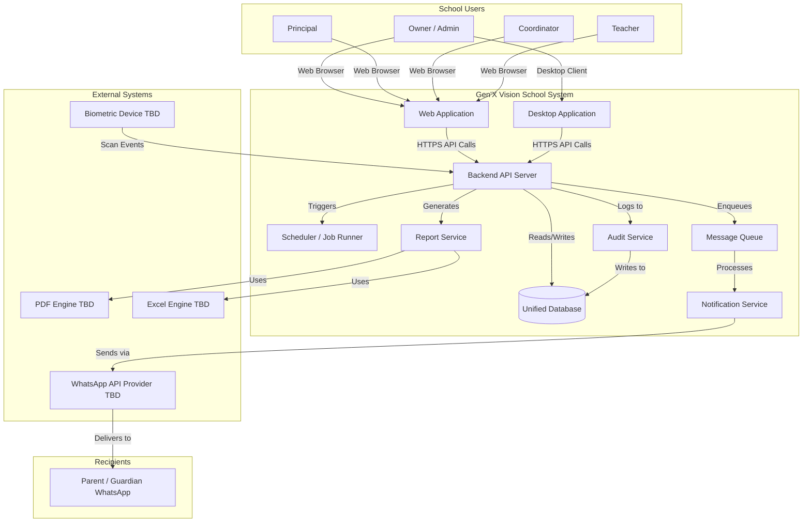
```mermaid
graph TB
    subgraph "School Users"
        A[Owner / Admin]
        B[Principal]
        C[Coordinator]
        D[Teacher]
    end

    subgraph "Gen'X Vision School System"
        W[Web Application]
        DK[Desktop Application]
        API[Backend API Server]
        DB[(Unified Database)]
        SCHED[Scheduler / Job Runner]
        QUEUE[Message Queue]
        NOTIF[Notification Service]
        REPORT[Report Service]
        AUDIT[Audit Service]
    end

    subgraph "External Systems"
        BIO[Biometric Device TBD]
        WA[WhatsApp API Provider TBD]
        PDF[PDF Engine TBD]
        EXCEL[Excel Engine TBD]
    end

    subgraph "Recipients"
        PARENT[Parent / Guardian WhatsApp]
    end

    A -->|Web Browser| W
    B -->|Web Browser| W
    C -->|Web Browser| W
    D -->|Web Browser| W
    A -->|Desktop Client| DK
    W -->|HTTPS API Calls| API
    DK -->|HTTPS API Calls| API
    API -->|Reads/Writes| DB
    API -->|Triggers| SCHED
    API -->|Enqueues| QUEUE
    QUEUE -->|Processes| NOTIF
    NOTIF -->|Sends via| WA
    WA -->|Delivers to| PARENT
    BIO -->|Scan Events| API
    API -->|Generates| REPORT
    REPORT -->|Uses| PDF
    REPORT -->|Uses| EXCEL
    API -->|Logs to| AUDIT
    AUDIT -->|Writes to| DB
```

### 2.3 Component Diagram

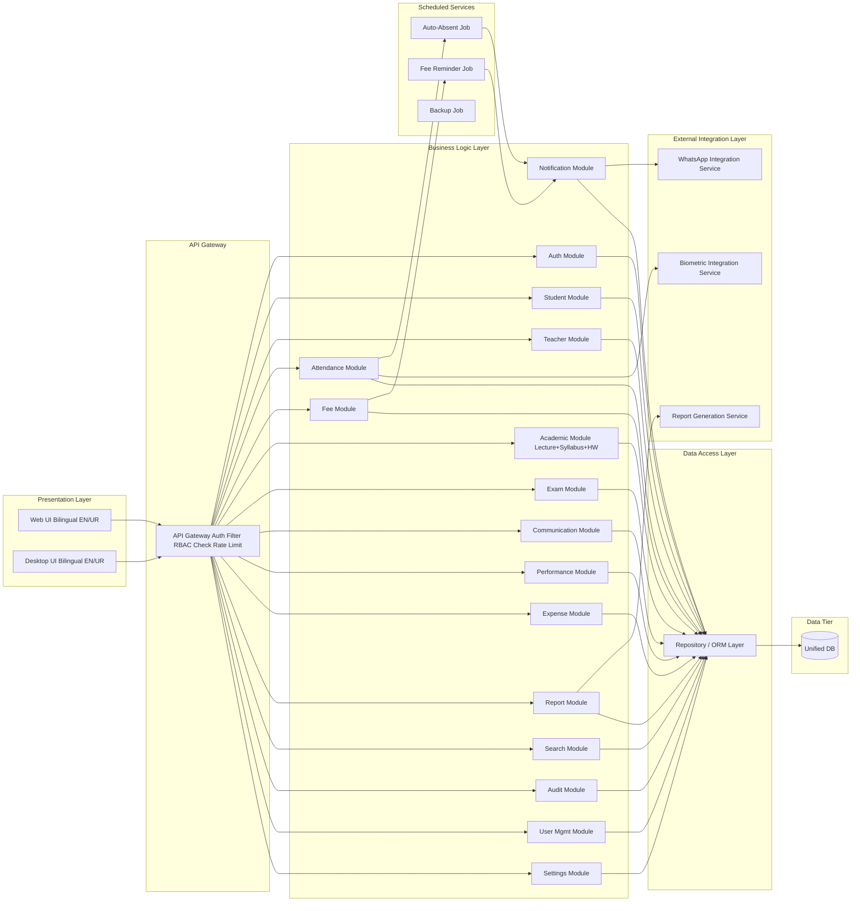
```mermaid
graph LR
    subgraph "Presentation Layer"
        WEB[Web UI Bilingual EN/UR]
        DESK[Desktop UI Bilingual EN/UR]
    end

    subgraph "API Gateway"
        GW[API Gateway Auth Filter RBAC Check Rate Limit]
    end

    subgraph "Business Logic Layer"
        AUTH[Auth Module]
        STUD[Student Module]
        TEACH[Teacher Module]
        ATT[Attendance Module]
        FEE[Fee Module]
        ACAD[Academic Module Lecture+Syllabus+HW]
        EXAM[Exam Module]
        COMM[Communication Module]
        PERF[Performance Module]
        EXP[Expense Module]
        RPT[Report Module]
        SRCH[Search Module]
        AUDT[Audit Module]
        USRMGMT[User Mgmt Module]
        SETTING[Settings Module]
        NOTIF[Notification Module]
    end

    subgraph "Scheduled Services"
        ABJOB[Auto-Absent Job]
        FEEJOB[Fee Reminder Job]
        BACKUPJOB[Backup Job]
    end

    subgraph "External Integration Layer"
        BIOSERVICE[Biometric Integration Service]
        WASERVICE[WhatsApp Integration Service]
        REPORTSERVICE[Report Generation Service]
    end

    subgraph "Data Access Layer"
        DAL[Repository / ORM Layer]
    end

    subgraph "Data Tier"
        DB[(Unified DB)]
    end

    WEB --> GW
    DESK --> GW
    GW --> AUTH
    GW --> STUD
    GW --> TEACH
    GW --> ATT
    GW --> FEE
    GW --> ACAD
    GW --> EXAM
    GW --> COMM
    GW --> PERF
    GW --> EXP
    GW --> RPT
    GW --> SRCH
    GW --> AUDT
    GW --> USRMGMT
    GW --> SETTING
    ATT --> ABJOB
    FEE --> FEEJOB
    ABJOB --> NOTIF
    FEEJOB --> NOTIF
    NOTIF --> WASERVICE
    ATT --> BIOSERVICE
    RPT --> REPORTSERVICE
    AUTH --> DAL
    STUD --> DAL
    TEACH --> DAL
    ATT --> DAL
    FEE --> DAL
    ACAD --> DAL
    EXAM --> DAL
    COMM --> DAL
    PERF --> DAL
    EXP --> DAL
    RPT --> DAL
    SRCH --> DAL
    AUDT --> DAL
    USRMGMT --> DAL
    SETTING --> DAL
    NOTIF --> DAL
    DAL --> DB
```

### 2.4 Communication Flow

| From | To | Protocol | Notes |
|------|----|----------|-------|
| Web Client | API Server | HTTPS/REST | JSON payloads |
| Desktop Client | API Server | HTTPS/REST | Same API as Web |
| API Server | Database | TCP (DB Driver) | ORM/Query layer only |
| Biometric Device | Biometric Service | **[TBD — depends on device SDK]** | LAN/USB/Cloud API |
| Biometric Service | API Server | Internal service call | Event push |
| API Server | WhatsApp Service | Internal | Via message queue |
| WhatsApp Service | WhatsApp Provider | HTTPS | Provider API calls |
| Scheduler | Business Logic | Internal | Cron-triggered jobs |

---

## 3. Application Architecture

### 3.1 Layered Architecture Detail

```
┌─────────────────────────────────────────────────────┐
│  LAYER 1: PRESENTATION LAYER                         │
│  • Web UI (browser) — renders pages, forms, reports  │
│  • Desktop UI — same screens, packaged client        │
│  • Bilingual (EN/UR) throughout                      │
│  • Role-aware navigation (hides unauthorized items)  │
│  • Branding: Gen'X Vision logo, colors throughout    │
└────────────────────────┬────────────────────────────┘
                         │ HTTP(S) REST calls
┌────────────────────────▼────────────────────────────┐
│  LAYER 2: API GATEWAY LAYER                          │
│  • Routes incoming requests to correct service       │
│  • Validates authentication token on every request   │
│  • Enforces RBAC before forwarding                   │
│  • Returns standardized error responses              │
│  • Rate limiting (configurable)                      │
│  • Request/response logging                          │
└────────────────────────┬────────────────────────────┘
                         │
┌────────────────────────▼────────────────────────────┐
│  LAYER 3: BUSINESS LOGIC LAYER (Services)            │
│  • One service per major business domain             │
│  • Implements all business rules from SRS Section 8  │
│  • All configurable values read from system_settings │
│  • Triggers audit log entries for all state changes  │
│  • Coordinates cross-module operations               │
└────────────────────────┬────────────────────────────┘
                         │
┌────────────────────────▼────────────────────────────┐
│  LAYER 4: DATA ACCESS LAYER                          │
│  • Repository pattern or ORM abstraction             │
│  • All database queries go through this layer        │
│  • Direct DB access by any other layer is forbidden  │
│  • Handles transactions, rollback, connection pooling│
│  • Enforces data-level RBAC (e.g., teacher scope)   │
└────────────────────────┬────────────────────────────┘
                         │
┌────────────────────────▼────────────────────────────┐
│  LAYER 5: DATABASE TIER                              │
│  • Single unified relational database                │
│  • All FK relationships enforced at DB level         │
│  • Transactions atomic (ACID compliance)             │
│  • No stored procedures for business logic           │
│  • Indexes for performance-critical queries          │
└─────────────────────────────────────────────────────┘
```

### 3.2 Cross-Cutting Concerns

These components exist horizontally across all layers:

| Concern | Design |
|---------|--------|
| **Authentication** | Every request carries auth token; validated at API Gateway before any processing |
| **RBAC** | Role check at API level for every endpoint; data-level scoping in DAL for Teacher role |
| **Audit Logging** | Every state-changing operation emits an audit event automatically (not optionally) |
| **Error Handling** | Standardized error format at all levels; no raw stack traces exposed to clients |
| **Configuration** | All runtime-configurable values in `system_settings` table; never hardcoded |
| **Bilingual Support** | Language selection stored in user session; all UI labels from i18n resource files |
| **Soft Delete** | Sensitive records use status flags rather than physical deletion |

---

## 4. Module Architecture

This section defines each system module, its boundaries, responsibilities, and relationships.

---

### MOD-01: Admin Dashboard Module

| Property | Value |
|----------|-------|
| **Module ID** | MOD-01 |
| **SRS References** | FR-001, FR-002, M-01 |
| **Priority** | Critical |
| **Purpose** | Provide real-time operational overview of all school operations |

**Responsibilities:**
- Render all 16 dashboard widgets with live data
- Display all 8 internal notification alert types
- Show recent activity feed from Audit Log
- Provide quick-navigation shortcuts to all modules
- Aggregate data from multiple modules (Attendance, Fee, Syllabus, etc.)

**Widgets (all 16 — SRS FR-001):**
1. Total Students | 2. Total Teachers | 3. Total Staff | 4. Present Students Today
5. Absent Students Today | 6. Late Students (Today) | 7. Present Teachers Today | 8. Absent Teachers Today
9. Today's Fee Collection | 10. Monthly Fee Collection | 11. Pending Fees | 12. Monthly Expenses
13. Syllabus Completion % | 14. Homework Status | 15. Important Notifications | 16. Recent Activities

**Alert Types (all 8 — SRS FR-002):**
1. Students Absent Today | 2. Teachers Absent Today | 3. Late Teachers | 4. Pending Fees
5. Upcoming Exams | 6. Incomplete Homework | 7. Syllabus Behind Schedule | 8. Important School Notices

**Inputs:** Live queries against Attendance, Fee, Syllabus, Homework, Exam tables  
**Outputs:** Rendered dashboard view, alert counts, activity feed  
**Dependencies:** All data modules (reads from all)  
**User Roles:** Admin (full), Principal (full), Coordinator (partial — no financial widgets)  
**Related DB Entities:** `student_attendance`, `teacher_attendance`, `fee_obligations`, `fee_ledger_events`, `syllabus`, `homework`, `exams`, `audit_logs`, `system_settings`

---

### MOD-02: Student Management Module

| Property | Value |
|----------|-------|
| **Module ID** | MOD-02 |
| **SRS References** | FR-003, FR-004, FR-005, FR-006, M-02 |
| **Priority** | Critical |

**Responsibilities:**
- Student registration with all mandatory profile fields (SRS FR-003)
- Auto-generate unique Student ID / Admission Number
- Maintain integrated 10-section student profile view (SRS FR-004)
- Allow Admin-only profile editing with full audit trail
- Record and maintain promotion events and withdrawal events
- Preserve withdrawn student data permanently (SRS BR-018)
- Handle student photo and document uploads

**Profile Fields (SRS FR-003 — all mandatory):**
Student ID, Admission Number, Name, Father/Guardian Name, Guardian CNIC, Contact Numbers (1+), WhatsApp Number, DOB, Gender, Address, Class, Section, Admission Date, Previous School, Photo, Medical/Emergency Info, Documents, Biometric ID

**Integrated Profile Sections (SRS FR-004 — all 10):**
1. Personal Information | 2. Parent Information | 3. Attendance History | 4. Fee History
5. Homework Record | 6. Lecture/Academic Records | 7. Results History | 8. Teacher Remarks
9. Documents | 10. Complete Academic History

**User Roles:** Admin (full CRUD), Principal (view), Coordinator (view only), Teacher (own assigned class, view only). Student profile editing remains Admin-only per SRS FR-005.  
**Related DB Entities:** `students`, `student_documents`, `student_promotions`, `student_withdrawals`, `student_attendance`, `fee_obligations`, `fee_ledger_events`, `fee_payments`, `results`, `homework`

---

### MOD-03: Biometric Attendance Module

| Property | Value |
|----------|-------|
| **Module ID** | MOD-03 |
| **SRS References** | FR-007, FR-008, FR-009, FR-010, FR-040, M-03 |
| **Priority** | Critical |

**Responsibilities:**
- Receive biometric scan events from device integration layer
- Identify student or teacher from biometric ID
- Determine class automatically for students (SRS FR-007)
- Mark attendance status (Present/Late) with exact timestamp
- Calculate late status based on configured late threshold (SRS BR-003, BR-004)
- Run scheduled auto-absent job at attendance closing time (SRS FR-008, BR-001)
- Record teacher departure time on second scan (SRS BR-008)
- Generate and maintain all 10 mandatory attendance reports (SRS FR-010)
- Handle duplicate scan prevention
- Trigger notification events for absent/late status (delegates to MOD-12)
- Detect repeated absences and trigger dashboard alerts (SRS BR-007)

**Attendance Reports (SRS FR-010 — all 10):**
1. Daily Attendance Report | 2. Monthly Attendance Report | 3. Class-wise Attendance Report
4. Student-wise Attendance Report | 5. Teacher Attendance Report | 6. Late Arrivals Report
7. Early Departures Report | 8. Leave Record Report | 9. Attendance Percentage Report | 10. Absent Students List

**User Roles:** System (automated), Admin (manage), Principal/Coordinator (view all), Teacher (view assigned class only)  
**Related DB Entities:** `student_attendance`, `teacher_attendance`, `students`, `teachers`, `system_settings`

---

### MOD-04: Teacher Management Module

| Property | Value |
|----------|-------|
| **Module ID** | MOD-04 |
| **SRS References** | FR-011, M-04 |
| **Priority** | Critical |

**Teacher Profile Fields (SRS FR-011 — all 18):**
Teacher ID, Name, Father/Guardian Name, Contact Number, WhatsApp Number, Qualification, Experience, Joining Date, Assigned Classes, Assigned Subjects, Biometric ID, Salary, Advances, Deductions, Leave Record, Attendance (linked), Performance Record (linked), Remarks

**User Roles:** Admin (full CRUD including financial), Principal/Coordinator (view, no financial), Teacher (cannot access other teachers)

---

### MOD-05: Daily Lecture Record Module

| Property | Value |
|----------|-------|
| **Module ID** | MOD-05 |
| **SRS References** | FR-012, M-05 |
| **Priority** | High |

**Lecture Record Fields (SRS FR-012 — all 14):**
Date, Class, Section, Subject, Chapter, Topic, Lecture Details, Learning Objectives, Classwork, Homework, Students Present, Students Absent, Copies Checked, Teacher Remarks

**Key Behavior:** Saving a lecture record automatically updates syllabus tracking for the entered Chapter/Topic.

**User Roles:** Teacher (create/view own), Coordinator/Principal/Admin (view all)

---

### MOD-06: Syllabus Tracking Module

| Property | Value |
|----------|-------|
| **Module ID** | MOD-06 |
| **SRS References** | FR-013, M-06 |
| **Priority** | High |

**Topic Statuses (SRS FR-013 — all 3):** Not Started | In Progress | Completed

**Formula (SRS BR-010):** Syllabus Completion % = (Completed Topics ÷ Total Topics) × 100

**Progress Views (SRS FR-013 — all 5):**
1. Class-wise syllabus progress | 2. Subject-wise progress | 3. Teacher-wise progress
4. Overall school syllabus progress | 5. Remaining chapters/topics

**User Roles:** Teacher (update assigned subjects), Coordinator/Principal/Admin (view all)

---

### MOD-07: Homework / Diary Module

| Property | Value |
|----------|-------|
| **Module ID** | MOD-07 |
| **SRS References** | FR-014, M-07 |
| **Priority** | High |

**Homework Fields (SRS FR-014 — all 7):**
Date, Class, Subject, Topic, Homework Description, Submission Date, Teacher Remarks

**Note:** Parent and student access through the application/portal is confirmed by the Owner Decision Register. The exact portal/authentication implementation remains a design dependency and must not expand current scope.

**User Roles:** Teacher (create/view own assigned), Coordinator/Principal/Admin (view all)

---

### MOD-08: Fee Management Module

| Property | Value |
|----------|-------|
| **Module ID** | MOD-08 |
| **SRS References** | FR-015, FR-016, FR-017, FR-018, FR-019, M-08 |
| **Priority** | Critical |

**Fee Fields (SRS FR-015 — all 11):**
Admission Fee, Monthly Fee, Annual Charges, Examination Fee, Transport Fee, Other Charges, Discount, Fine, Previous Dues, Paid Amount, Remaining Amount (auto-calculated)

**Formula (SRS BR-014):** Remaining Amount = Previous Dues + All Charges + Fine − Discount − Paid Amount

**Fee Reports (SRS FR-018 — all 6):**
1. Monthly Collection Report | 2. Class-wise Collection Report | 3. Pending Fees Report
4. Defaulters List | 5. Payment History Report | 6. Monthly Financial Reports

**Owner clarification layer:** The initial class-wise structure is Admission Fee, Tuition Fee, and Annual Charges, revised at the start of each new session. Advance credit, refund conditions, discount categories, and WhatsApp reminder timing are confirmed by the Owner Decision Register. Original SRS fee fields remain preserved; unresolved due date, payment methods, receipt format, fine calculation, currency, transport status, and exact monetary values remain TBD.

**User Roles:** Admin (full), Principal (**[TBD]**), Coordinator (none), Teacher (none)

---

### MOD-09: Examinations and Results Module

| Property | Value |
|----------|-------|
| **Module ID** | MOD-09 |
| **SRS References** | FR-020, FR-021, FR-022, FR-023, M-09 |
| **Priority** | High |

**Result Fields (SRS FR-021):**
Total Marks, Obtained Marks, Percentage (auto: Obtained ÷ Total × 100), Grade (TBD logic), Position (TBD logic), Teacher Remarks

**Owner clarification layer:** Initial exam types are 1st Term, 2nd Term, and Final/Annual. Results show percentage and letter grades; pass requires at least 33% in every subject and 33% overall; position is percentage-based with Joint Position for equal marks. Subject weighting is Homework 10%, Quizzes/Class Tests 20%, Mid-Term 30%, Final Exam 40%. Results require Principal plus Vice Principal joint approval before final/public release; Vice Principal is the confirmed academic-head equivalent (Owner Decision TBD-043). Report cards include personal information, attendance, subject-wise marks, grades, teacher remarks, and co-curricular activities. These owner clarifications do not modify SRS.md.

**User Roles:** Admin/Principal (create exams, finalize results), Teacher (marks entry — assigned only), Coordinator (view)

---

### MOD-10: Timetable Management Module

| Property | Value |
|----------|-------|
| **Module ID** | MOD-10 |
| **SRS References** | FR-024, FR-025, M-10 |
| **Priority** | High |

**Timetable Fields (SRS FR-024 — all 5):** Day, Period Number, Subject, Teacher, Room

**Owner clarification layer:** Admin or an Authorized Coordinator manages the timetable; unauthorized teachers cannot change it. Period count, duration, room assignment, and working days remain TBD.

**User Roles:** Admin (create/edit), Principal (view all), Coordinator (view), Teacher (own schedule only)

---

### MOD-11: Expense Management Module

| Property | Value |
|----------|-------|
| **Module ID** | MOD-11 |
| **SRS References** | FR-026, FR-027, M-11 |
| **Priority** | High |

**Expense Categories (SRS FR-026 — all 9):**
Salaries | Electricity | Rent | Stationery | Maintenance | Furniture | Transport | Events | Other Expenses

**Expense Reports (SRS FR-027 — all 5):**
1. Daily Expenses Report | 2. Monthly Expenses Report | 3. Category-wise Expenses Report
4. Monthly Income vs. Expense Report | 5. Annual Financial Report

**User Roles:** Admin (full), Principal (**[TBD]**), Coordinator (none), Teacher (none)

---

### MOD-12: Parent Communication Module (WhatsApp) — MANDATORY CURRENT

| Property | Value |
|----------|-------|
| **Module ID** | MOD-12 |
| **SRS References** | FR-028, FR-029, FR-030, M-12 |
| **Priority** | Critical — MANDATORY CURRENT REQUIREMENT |

**Automated Notification Types (SRS FR-028 — all 7):**
1. Student Absent (unconditionally automatic — SRS BR-005)
2. Student Late (feature mandatory; auto-trigger **[CONFIGURABLE/TBD]** — SRS BR-006)
3. Fee Reminder (mandatory; trigger timing TBD)
4. Homework Notification (mandatory)
5. Result Notification (mandatory)
6. Exam Reminder (mandatory)
7. Important Announcement (mandatory)

**Manual Targeting Options (SRS FR-029 — all 4):**
1. Individual parent | 2. Class-wise | 3. Section-wise | 4. All-school announcement

**Message Log Fields (SRS FR-030 — all 5 mandatory):**
Message Type, Recipient Number, Message Content, Sent Date/Time, Message Status, Delivery Status (if provider supports)

**Key Security:** WhatsApp credentials stored server-side only (SRS SEC-10)  
**User Roles:** Admin/Principal/Coordinator (manual messaging), Teacher (CANNOT send — SRS AC-029.3), System (automated)

---

### MOD-13: Teacher Performance Monitoring Module

| Property | Value |
|----------|-------|
| **Module ID** | MOD-13 |
| **SRS References** | FR-031, M-13 |
| **Priority** | High |

**Performance Criteria (SRS FR-031 — all 9, all auto-pulled from live data):**
1. Attendance (MOD-03) | 2. Punctuality (MOD-03) | 3. Lectures Completed (MOD-05)
4. Syllabus Completion % (MOD-06) | 5. Homework Assigned (MOD-07)
6. Copies Checked (MOD-05) | 7. Student Results (MOD-09)
8. Leave Record (MOD-03) | 9. Coordinator Remarks (type TBD)

**User Roles:** Admin/Principal/Coordinator (view all), Coordinator (add remarks)

---

### MOD-14: Class Management Module

| Property | Value |
|----------|-------|
| **Module ID** | MOD-14 |
| **SRS References** | FR-032, M-14 |
| **Priority** | High |

**Class Profile Sections (SRS FR-032 — all 10):**
1. Students (enrolled list) | 2. Class Teacher | 3. Subjects | 4. Subject Teachers
5. Timetable | 6. Attendance (class-wise) | 7. Homework | 8. Syllabus
9. Results | 10. Class Performance

---

### MOD-15: Reports Center Module

| Property | Value |
|----------|-------|
| **Module ID** | MOD-15 |
| **SRS References** | FR-033, M-15 |
| **Priority** | High |

**Mandatory Reports (SRS FR-033 — all 16):**

| # | Report | Primary Access |
|---|--------|---------------|
| R-01 | Student Profile Report | Admin, Principal |
| R-02 | Student Attendance Report | Admin, Principal, Coordinator |
| R-03 | Teacher Attendance Report | Admin, Principal, Coordinator |
| R-04 | Daily Attendance Report | Admin, Principal, Coordinator |
| R-05 | Monthly Attendance Report | Admin, Principal, Coordinator |
| R-06 | Fee Collection Report | Admin; Principal (selected financial reports confirmed) |
| R-07 | Fee Defaulters Report | Admin; Principal (selected financial reports confirmed) |
| R-08 | Student Ledger Report | Admin only |
| R-09 | Teacher Performance Report | Admin, Principal, Coordinator |
| R-10 | Syllabus Progress Report | Admin, Principal, Coordinator |
| R-11 | Homework Report | Admin, Principal, Coordinator |
| R-12 | Exam Result Report | Admin, Principal, Coordinator |
| R-13 | Class Performance Report | Admin, Principal, Coordinator |
| R-14 | Expenses Report | Admin; Principal (selected financial reports confirmed) |
| R-15 | Income vs. Expenses Report | Admin only |
| R-16 | Salary Report | Admin only |

**Export Formats (both mandatory):** PDF and Excel (.xlsx)  
**All reports must carry:** School logo, school name, report title, generated date/time, generated-by user (SRS Section 9.5)

---

### MOD-16: Search System Module

| Property | Value |
|----------|-------|
| **Module ID** | MOD-16 |
| **SRS References** | FR-034, M-16 |
| **Priority** | High |

**Search Criteria (SRS FR-034 — all 8):**
Student Name | Father/Guardian Name | Admission Number | Student ID | Phone Number | Class | Teacher Name | Teacher ID

**User Roles:** Admin (confirmed); Principal/Coordinator (**[TBD per SRS FR-034]**)

---

### MOD-17: Audit Log Module

| Property | Value |
|----------|-------|
| **Module ID** | MOD-17 |
| **SRS References** | FR-035, M-17 |
| **Priority** | Critical |

**Mandatory Logged Events (SRS FR-035 — minimum 8):**
1. User login | 2. Student added | 3. Student info edited (with old/new values)
4. Attendance changed | 5. Marks entered | 6. Fee changed
7. Record deleted or modified | 8. Any other significant system action

**Confirmed Items (Owner Decision Register):** Retention period 3 years for audit logs (TBD-065); Admin and Principal receive audit-log viewing access (Sections 40/43).  
**Still TBD:** Exact retention archival process, storage methodology.
**Key Rule:** Audit log is IMMUTABLE — no user can edit or delete entries (SRS BR-023)

---

### MOD-18: User Account and Role Management Module

| Property | Value |
|----------|-------|
| **Module ID** | MOD-18 |
| **SRS References** | FR-036, FR-037, M-18 |
| **Priority** | Critical |

**Responsibilities:** Create/edit/activate/deactivate accounts; assign roles; enforce role changes immediately system-wide.  
**User Roles:** Admin only

---

### MOD-19: Notification System Module (Internal Dashboard)

| Property | Value |
|----------|-------|
| **Module ID** | MOD-19 |
| **SRS References** | FR-002, M-19 |
| **Priority** | High |
| **Note** | This module is DISTINCT from MOD-12 (WhatsApp) — internal staff only (SRS AC-002.3) |

---

### MOD-20: Security and Backup Module

| Property | Value |
|----------|-------|
| **Module ID** | MOD-20 |
| **SRS References** | FR-038, FR-039, M-20 |
| **Priority** | Critical |

**Responsibilities:** Secure authentication, failed login logging, dual-authorization deletion workflow, automated backup, data recovery capability.  
**Confirmed Items (Owner Decision Register):** Password policy — minimum 8 characters, letters+numbers+symbols; Admin password expiry every 90 days; non-Admin no automatic expiry; session timeout 30 minutes inactivity; backup daily at midnight; backup storage cloud + secure local copy; full and point-in-time restore; 99.5% uptime target. Encryption at rest applies to sensitive financial data and student personal records; exact cryptographic method remains a technical design decision.

---

## 5. Database Architecture

### 5.1 Database Design Principles

1. Single unified relational database — all modules share one schema
2. All tables have primary keys (UUID format — [DESIGN DECISION — REQUIRES APPROVAL])
3. All foreign key relationships enforced at database level
4. Timestamps (`created_at`, `updated_at`) on all major tables
5. All configurable values in `system_settings` — never hardcoded
6. Soft-delete via `status` fields for sensitive records
7. ACID compliance mandatory for all transactions
8. No business logic in stored procedures

### 5.2 ER Diagram

> **LEGACY / NON-OPERATIVE — DO NOT IMPLEMENT**
>
> This historical ER diagram contains superseded single-teacher subject and combined-fee structures. Use Sections 35–47 only.


```mermaid
erDiagram
    users {
        UUID user_id PK
        VARCHAR username UK
        VARCHAR password_hash
        VARCHAR full_name
        ENUM role
        UUID teacher_id FK
        BOOLEAN is_active
        TIMESTAMP last_login
        UUID created_by FK
        TIMESTAMP created_at
        TIMESTAMP updated_at
    }

    students {
        UUID student_id PK
        VARCHAR admission_number UK
        VARCHAR student_name
        VARCHAR guardian_name
        VARCHAR guardian_cnic
        VARCHAR contact_number_1
        VARCHAR contact_number_2
        VARCHAR whatsapp_number
        DATE date_of_birth
        ENUM gender
        TEXT address
        UUID class_id FK
        VARCHAR section
        DATE admission_date
        VARCHAR previous_school
        VARCHAR photo_path
        TEXT medical_info
        TEXT emergency_info
        VARCHAR biometric_id UK
        ENUM status
        UUID created_by FK
        TIMESTAMP created_at
        TIMESTAMP updated_at
    }

    student_documents {
        UUID document_id PK
        UUID student_id FK
        VARCHAR document_name
        VARCHAR document_type
        VARCHAR file_path
        UUID uploaded_by FK
        TIMESTAMP uploaded_at
    }

    student_promotions {
        UUID promotion_id PK
        UUID student_id FK
        UUID from_class_id FK
        UUID to_class_id FK
        VARCHAR academic_year
        DATE promotion_date
        UUID performed_by FK
        TIMESTAMP created_at
    }

    student_withdrawals {
        UUID withdrawal_id PK
        UUID student_id FK
        DATE withdrawal_date
        TEXT reason
        UUID performed_by FK
        TIMESTAMP created_at
    }

    teachers {
        UUID teacher_id PK
        VARCHAR name
        VARCHAR guardian_name
        VARCHAR contact_number
        VARCHAR whatsapp_number
        VARCHAR qualification
        VARCHAR experience
        DATE joining_date
        VARCHAR biometric_id UK
        DECIMAL salary
        DECIMAL advances
        DECIMAL deductions
        ENUM status
        UUID created_by FK
        TIMESTAMP created_at
        TIMESTAMP updated_at
    }

    classes {
        UUID class_id PK
        VARCHAR class_name
        UUID class_teacher_id FK
        VARCHAR academic_year
    }

    subjects {
        UUID subject_id PK
        VARCHAR subject_name
        UUID class_id FK
        UUID teacher_id FK
        BOOLEAN is_active
        TIMESTAMP created_at
    }

    student_attendance {
        UUID attendance_id PK
        UUID student_id FK
        UUID class_id FK
        DATE attendance_date
        ENUM status
        TIME arrival_time
        BOOLEAN is_late
        ENUM marked_by
        TIMESTAMP created_at
    }

    teacher_attendance {
        UUID attendance_id PK
        UUID teacher_id FK
        DATE attendance_date
        TIME arrival_time
        TIME departure_time
        BOOLEAN is_late
        BOOLEAN is_early_departure
        ENUM status
        TIMESTAMP created_at
    }

    fees {
        UUID fee_id PK
        UUID student_id FK
        VARCHAR fee_month
        INTEGER fee_year
        DECIMAL admission_fee
        DECIMAL monthly_fee
        DECIMAL annual_charges
        DECIMAL examination_fee
        DECIMAL transport_fee
        DECIMAL other_charges
        DECIMAL discount
        DECIMAL fine
        DECIMAL previous_dues
        DECIMAL paid_amount
        DECIMAL remaining_amount
        VARCHAR payment_method
        DATE payment_date
        UUID recorded_by FK
        TIMESTAMP created_at
        TIMESTAMP updated_at
    }

    lecture_records {
        UUID record_id PK
        UUID teacher_id FK
        UUID class_id FK
        UUID subject_id FK
        DATE record_date
        VARCHAR chapter
        VARCHAR topic
        TEXT lecture_details
        TEXT learning_objectives
        TEXT classwork
        TEXT homework
        INTEGER students_present
        INTEGER students_absent
        VARCHAR copies_checked
        TEXT teacher_remarks
        TIMESTAMP created_at
    }

    syllabus {
        UUID syllabus_id PK
        UUID class_id FK
        UUID subject_id FK
        VARCHAR chapter_name
        VARCHAR topic_name
        ENUM status
        UUID updated_by FK
        TIMESTAMP updated_at
    }

    homework {
        UUID homework_id PK
        UUID teacher_id FK
        UUID class_id FK
        UUID subject_id FK
        DATE homework_date
        VARCHAR topic
        TEXT homework_description
        DATE submission_date
        TEXT teacher_remarks
        TIMESTAMP created_at
    }

    exams {
        UUID exam_id PK
        VARCHAR exam_name
        VARCHAR exam_type
        UUID class_id FK
        DATE exam_date
        UUID created_by FK
        TIMESTAMP created_at
    }

    exam_subjects {
        UUID exam_subject_id PK
        UUID exam_id FK
        UUID subject_id FK
        DECIMAL total_marks
    }

    results {
        UUID result_id PK
        UUID exam_id FK
        UUID student_id FK
        UUID subject_id FK
        DECIMAL total_marks
        DECIMAL obtained_marks
        DECIMAL percentage
        VARCHAR grade
        INTEGER position
        TEXT teacher_remarks
        UUID entered_by FK
        TIMESTAMP created_at
    }

    timetable {
        UUID timetable_id PK
        UUID class_id FK
        VARCHAR day
        INTEGER period_number
        UUID subject_id FK
        UUID teacher_id FK
        VARCHAR room
    }

    expenses {
        UUID expense_id PK
        ENUM expense_category
        DECIMAL amount
        DATE expense_date
        TEXT description
        UUID recorded_by FK
        TIMESTAMP created_at
    }

    whatsapp_messages {
        UUID message_id PK
        ENUM message_type
        UUID recipient_student_id FK
        VARCHAR recipient_number
        TEXT message_content
        DATE sent_date
        TIME sent_time
        ENUM message_status
        ENUM delivery_status
        UUID sent_by FK
        TIMESTAMP created_at
    }

    audit_logs {
        UUID log_id PK
        VARCHAR event_type
        UUID user_id FK
        VARCHAR affected_entity_type
        VARCHAR affected_entity_id
        TEXT description
        TEXT old_value
        TEXT new_value
        TIMESTAMP event_timestamp
    }

    system_settings {
        VARCHAR setting_key PK
        TEXT setting_value
        TEXT description
        UUID updated_by FK
        TIMESTAMP updated_at
    }

    teacher_performance_remarks {
        UUID remark_id PK
        UUID teacher_id FK
        UUID coordinator_id FK
        TEXT remarks
        DATE remark_date
        TIMESTAMP created_at
    }

    users ||--o{ students : "created_by"
    users ||--o{ teachers : "created_by"
    users ||--o{ audit_logs : "user_id"
    users ||--o{ fees : "recorded_by"
    users ||--o{ expenses : "recorded_by"
    users ||--o{ whatsapp_messages : "sent_by"
    users ||--o| teachers : "teacher_id"
    students }o--|| classes : "class_id"
    students ||--o{ student_attendance : "student_id"
    students ||--o{ fees : "student_id"
    students ||--o{ results : "student_id"
    students ||--o{ student_documents : "student_id"
    students ||--o{ student_promotions : "student_id"
    students ||--o{ student_withdrawals : "student_id"
    students ||--o{ whatsapp_messages : "recipient"
    teachers ||--o{ teacher_attendance : "teacher_id"
    teachers ||--o{ lecture_records : "teacher_id"
    teachers ||--o{ timetable : "teacher_id"
    teachers ||--o{ homework : "teacher_id"
    teachers ||--o{ teacher_performance_remarks : "teacher_id"
    classes ||--o{ student_attendance : "class_id"
    classes ||--o{ timetable : "class_id"
    classes ||--o{ syllabus : "class_id"
    classes ||--o{ homework : "class_id"
    classes ||--o{ exams : "class_id"
    classes ||--o{ subjects : "class_id"
    classes ||--o{ lecture_records : "class_id"
    subjects ||--o{ syllabus : "subject_id"
    subjects ||--o{ lecture_records : "subject_id"
    subjects ||--o{ results : "subject_id"
    subjects ||--o{ homework : "subject_id"
    subjects ||--o{ timetable : "subject_id"
    subjects ||--o{ exam_subjects : "subject_id"
    exams ||--o{ results : "exam_id"
    exams ||--o{ exam_subjects : "exam_id"
```

### 5.3 Key Table Designs

> **LEGACY / NON-OPERATIVE — DO NOT IMPLEMENT**
>
> These historical table examples are retained for traceability only. They are superseded by the canonical data model in Sections 35–47.

#### Table: `students`
**Soft Delete:** Yes — via `status` field (Active / Withdrawn / Promoted)  
**Unique Constraints:** `admission_number` (UNIQUE), `biometric_id` (UNIQUE, NULLABLE)

| Column | Type | Constraint | Notes |
|--------|------|-----------|-------|
| student_id | UUID | PRIMARY KEY | Auto-generated |
| admission_number | VARCHAR(20) | UNIQUE, NOT NULL | Auto-generated |
| student_name | VARCHAR(150) | NOT NULL | |
| guardian_name | VARCHAR(150) | NOT NULL | |
| guardian_cnic | VARCHAR(15) | NULLABLE | Optional entry |
| contact_number_1 | VARCHAR(20) | NOT NULL | |
| contact_number_2 | VARCHAR(20) | NULLABLE | |
| whatsapp_number | VARCHAR(20) | NOT NULL | For notifications |
| date_of_birth | DATE | NOT NULL | |
| gender | ENUM('Male','Female','Other') | NOT NULL | |
| address | TEXT | NOT NULL | |
| class_id | UUID | FK → classes, NOT NULL | |
| section | VARCHAR(10) | NOT NULL | |
| admission_date | DATE | NOT NULL | |
| previous_school | VARCHAR(200) | NULLABLE | |
| photo_path | VARCHAR(500) | NULLABLE | |
| medical_info | TEXT | NULLABLE | SENSITIVE |
| emergency_info | TEXT | NULLABLE | SENSITIVE |
| biometric_id | VARCHAR(50) | UNIQUE, NULLABLE | Enrollment process TBD |
| status | ENUM('Active','Withdrawn','Promoted') | NOT NULL, DEFAULT 'Active' | |
| created_by | UUID | FK → users, NOT NULL | |
| created_at | TIMESTAMP | NOT NULL | |
| updated_at | TIMESTAMP | NOT NULL | |

**Index Strategy:**
- `idx_students_admission_number` UNIQUE
- `idx_students_class_id`
- `idx_students_guardian_name` (search)
- `idx_students_contact_number_1` (search)
- `idx_students_status`
- `idx_students_name` (search)

---

#### Table: `student_attendance`
**Unique Constraint:** (student_id, attendance_date) — one record per student per day

| Column | Type | Constraint | Notes |
|--------|------|-----------|-------|
| attendance_id | UUID | PRIMARY KEY | |
| student_id | UUID | FK → students, NOT NULL | |
| class_id | UUID | FK → classes, NOT NULL | |
| attendance_date | DATE | NOT NULL | |
| status | ENUM('Present','Absent','Late') | NOT NULL | |
| arrival_time | TIME | NULLABLE | Null if Absent |
| is_late | BOOLEAN | NOT NULL, DEFAULT FALSE | |
| marked_by | ENUM('Biometric','Manual','System') | NOT NULL | |
| created_at | TIMESTAMP | NOT NULL | |

**Index Strategy:** On (student_id, attendance_date) UNIQUE; on attendance_date; on (class_id, attendance_date); on status

---

#### Table: `teacher_attendance`
**Unique Constraint:** (teacher_id, attendance_date)

| Column | Type | Constraint | Notes |
|--------|------|-----------|-------|
| attendance_id | UUID | PRIMARY KEY | |
| teacher_id | UUID | FK → teachers, NOT NULL | |
| attendance_date | DATE | NOT NULL | |
| arrival_time | TIME | NULLABLE | |
| departure_time | TIME | NULLABLE | Set on second scan |
| is_late | BOOLEAN | NOT NULL, DEFAULT FALSE | |
| is_early_departure | BOOLEAN | NOT NULL, DEFAULT FALSE | Rule TBD |
| status | ENUM('Present','Absent') | NOT NULL | |
| created_at | TIMESTAMP | NOT NULL | |

---

#### Table: `fees`
**Formula:** `remaining_amount = previous_dues + admission_fee + monthly_fee + annual_charges + examination_fee + transport_fee + other_charges + fine - discount - paid_amount`

| Column | Type | Constraint | Notes |
|--------|------|-----------|-------|
| fee_id | UUID | PRIMARY KEY | |
| student_id | UUID | FK → students, NOT NULL | |
| fee_month | VARCHAR(3) | NOT NULL | Jan–Dec |
| fee_year | INTEGER | NOT NULL | |
| admission_fee | DECIMAL(10,2) | DEFAULT 0 | |
| monthly_fee | DECIMAL(10,2) | DEFAULT 0 | |
| annual_charges | DECIMAL(10,2) | DEFAULT 0 | |
| examination_fee | DECIMAL(10,2) | DEFAULT 0 | |
| transport_fee | DECIMAL(10,2) | DEFAULT 0 | |
| other_charges | DECIMAL(10,2) | DEFAULT 0 | |
| discount | DECIMAL(10,2) | DEFAULT 0 | Types TBD |
| fine | DECIMAL(10,2) | DEFAULT 0 | Rule TBD |
| previous_dues | DECIMAL(10,2) | DEFAULT 0 | |
| paid_amount | DECIMAL(10,2) | DEFAULT 0 | |
| remaining_amount | DECIMAL(10,2) | NOT NULL | Auto-calculated |
| payment_method | VARCHAR(50) | NULLABLE | TBD |
| payment_date | DATE | NULLABLE | |
| recorded_by | UUID | FK → users, NOT NULL | |
| created_at | TIMESTAMP | NOT NULL | |
| updated_at | TIMESTAMP | NOT NULL | |

---

#### Table: `results`
**Unique Constraint:** (exam_id, student_id, subject_id)

| Column | Type | Constraint | Notes |
|--------|------|-----------|-------|
| result_id | UUID | PRIMARY KEY | |
| exam_id | UUID | FK → exams, NOT NULL | |
| student_id | UUID | FK → students, NOT NULL | |
| subject_id | UUID | FK → subjects, NOT NULL | |
| total_marks | DECIMAL(6,2) | NOT NULL | |
| obtained_marks | DECIMAL(6,2) | NOT NULL | |
| percentage | DECIMAL(5,2) | COMPUTED | obtained ÷ total × 100 |
| grade | VARCHAR(5) | NULLABLE | TBD grading scale |
| position | INTEGER | NULLABLE | TBD method |
| teacher_remarks | TEXT | NULLABLE | |
| entered_by | UUID | FK → users, NOT NULL | |
| created_at | TIMESTAMP | NOT NULL | |

---

#### Table: `whatsapp_messages`
**Revision rule:** Immutable message-intent/history record. Delivery state is represented by append-only `whatsapp_message_events`; no message-history row is updated or deleted (SRS AC-030.3).

| Column | Type | Constraint | Notes |
|--------|------|-----------|-------|
| message_id | UUID | PRIMARY KEY | |
| message_type | ENUM('Absent','Late','FeeReminder','Homework','Result','ExamReminder','Announcement','Manual') | NOT NULL | |
| recipient_student_id | UUID | FK → students, NULLABLE | |
| recipient_number | VARCHAR(20) | NOT NULL | |
| message_content | TEXT | NOT NULL | |
| sent_date | DATE | NULLABLE | NULL until provider submission succeeds |
| sent_time | TIME | NULLABLE | NULL until provider submission succeeds |
| message_status | ENUM('Sent','Failed','Pending') | NOT NULL | |
| delivery_status | ENUM('Delivered','Read','Unknown') | NULLABLE | Provider-dependent |
| sent_by | UUID | FK → users, NULLABLE | NULL for automated |
| batch_id | UUID | NULLABLE | Class/section/all-school batch reference |
| provider_message_id | VARCHAR | NULLABLE | Provider response identifier; provider TBD |
| created_at | TIMESTAMP | NOT NULL | |

#### Table: `whatsapp_message_events`
Append-only lifecycle events for queued, submitted, failed, delivered, read, and retry attempts. Each event stores `event_id`, `message_id` FK, `event_type`, `event_timestamp`, `attempt_number`, provider reference/status, and provider payload metadata. Provider callbacks and retry operations insert events; they never update or delete message history. Provider selection remains TBD.

---

#### Table: `audit_logs`
**Note:** Append-only — no UPDATE or DELETE permitted (SRS BR-023)

| Column | Type | Constraint | Notes |
|--------|------|-----------|-------|
| log_id | UUID | PRIMARY KEY | |
| event_type | VARCHAR(50) | NOT NULL | |
| user_id | UUID | FK → users, NULLABLE | NULL for automated events |
| actor_type | ENUM | NOT NULL | USER / SYSTEM / DEVICE / SCHEDULER / PROVIDER |
| actor_reference | VARCHAR | NULLABLE | Service, device, job, or provider reference |
| affected_entity_type | VARCHAR(50) | NULLABLE | student / teacher / fee / etc. |
| affected_entity_id | VARCHAR(50) | NULLABLE | |
| description | TEXT | NOT NULL | Human-readable |
| old_value | TEXT | NULLABLE | Before change |
| new_value | TEXT | NULLABLE | After change |
| event_timestamp | TIMESTAMP | NOT NULL | |

---

#### Table: `system_settings`

**Required Settings (per SRS Section 10.2):**

| Key | Status |
|-----|--------|
| attendance_closing_time | 9:00 AM (initial default; configurable via System Settings; historical records immutable — TBD-012 confirmed) |
| student_late_threshold | 7:30 AM start + 15 min grace (TBD-011 confirmed; configurable) |
| teacher_late_threshold | 7:30 AM start + 15 min grace (TBD-011 confirmed; configurable) |
| repeated_absence_threshold | Configurable (threshold value configurable; exact default TBD) |
| currency | PKR (TBD-017 confirmed) |
| academic_year_start_month | March ✅ |
| academic_year_end_month | February ✅ |
| financial_year_start | July 1 (governance decision; distinct from academic year) |
| financial_year_end | June 30 (governance decision; distinct from academic year) |
| school_name | Gen'X Vision School System ✅ |
| school_logo_path | Configured at setup ✅ |
| whatsapp_api_provider | Official Meta WhatsApp Business API (TBD-008 confirmed) |
| fee_due_date | 10th of each month (TBD-035 confirmed; configurable) |
| working_days | Mon–Thu full; Friday half-day+activities; Saturday full; Sunday closed (TBD-018 confirmed; configurable) |
| late_notification_auto_trigger | Admin-configurable ON/OFF (TBD-055 confirmed; capability mandatory) |
| fee_reminder_schedule | 3 days before due date, on due date, 3 days after due date (TBD-040 confirmed; configurable) |
| repeated_absence_dashboard_threshold | Configurable (exact default TBD) |

---

### 5.4 Data Integrity Rules

| Rule | Implementation |
|------|---------------|
| One attendance record per student per day | UNIQUE (student_id, attendance_date) |
| One attendance record per teacher per day | UNIQUE (teacher_id, attendance_date) |
| One result per student per subject per exam | UNIQUE (exam_id, student_id, subject_id) |
| One timetable slot per class per period per day | UNIQUE (class_id, day, period_number) |
| Student deletion must not silently cascade | App-level cascade control + Admin confirmation |
| Audit log immutable | No UPDATE/DELETE on audit_logs |
| WhatsApp log immutable | No UPDATE/DELETE on whatsapp_messages |
| Admission number unique | UNIQUE constraint on students.admission_number |
| Biometric ID unique per person | UNIQUE on students.biometric_id and teachers.biometric_id |

### 5.5 Master Index Strategy

| Index | Table | Columns | Purpose |
|-------|-------|---------|---------|
| IDX_student_name | students | student_name | Name search |
| IDX_student_guardian | students | guardian_name | Guardian name search |
| IDX_student_contact | students | contact_number_1 | Phone search |
| IDX_student_class | students | class_id | Class listing |
| IDX_student_status | students | status | Active filter |
| UK_att_student_date | student_attendance | (student_id, attendance_date) | Uniqueness + history |
| IDX_att_date | student_attendance | attendance_date | Daily reports |
| IDX_att_class_date | student_attendance | (class_id, attendance_date) | Class reports |
| IDX_teach_att | teacher_attendance | (teacher_id, attendance_date) | Teacher reports |
| IDX_fees_student | fees | student_id | Fee history |
| IDX_fees_month_year | fees | (fee_month, fee_year) | Monthly reports |
| IDX_results_exam | results | exam_id | Exam results |
| IDX_results_student | results | student_id | Student history |
| IDX_audit_user | audit_logs | user_id | User activity |
| IDX_audit_timestamp | audit_logs | event_timestamp | Date-range queries |
| IDX_audit_event | audit_logs | event_type | Event filtering |
| IDX_lecture_teacher | lecture_records | teacher_id | Teacher history |
| IDX_syllabus_class_subject | syllabus | (class_id, subject_id) | Completion queries |
| IDX_whatsapp_date | whatsapp_messages | sent_date | Message history |
| IDX_whatsapp_status | whatsapp_messages | message_status | Failed messages |

---

## 6. API Architecture

### 6.1 API Design Standards

1. **Style:** RESTful API with JSON request/response bodies
2. **Versioning:** All APIs under `/api/v1/` prefix **[DESIGN DECISION — REQUIRES APPROVAL]**
3. **Authentication:** Every request must carry a valid authentication token (method TBD with tech stack)
4. **RBAC:** Every endpoint validates caller role before processing
5. **Standard Error Format:**
   ```json
   { "success": false, "error": { "code": "ERR_CODE", "message": "Human-readable message" } }
   ```
6. **Standard Success Format:**
   ```json
   { "success": true, "data": {}, "meta": { "page": 1, "total": 100 } }
   ```
7. **All state-changing operations** trigger audit log entries automatically

### 6.2 Authentication APIs

| API-ID | Method | Endpoint | Purpose | Roles |
|--------|--------|----------|---------|-------|
| AUTH-001 | POST | /api/v1/auth/login | Authenticate; return token | All |
| AUTH-002 | POST | /api/v1/auth/logout | Invalidate session | All |
| AUTH-003 | POST | /api/v1/auth/change-password | Change / reset password | **Coordinator, Principal, Owner/Admin/Director only** (TBD-068 confirmed — regular users cannot self-change/reset) |
| AUTH-004 | GET | /api/v1/auth/me | Get current user profile | All |

**AUTH-001 Error Responses:** 401 (invalid credentials), 423 (account deactivated), 429 (rate limited)  
**Validation:** Failed attempts logged in audit log

### 6.3 Student APIs

| API-ID | Method | Endpoint | Purpose | Roles |
|--------|--------|----------|---------|-------|
| STU-001 | GET | /api/v1/students | List students (filterable) | Admin, Principal, Coordinator, Teacher (own class) |
| STU-002 | POST | /api/v1/students | Create student | Admin only |
| STU-003 | GET | /api/v1/students/{id} | Complete profile (10 sections) | RBAC per section |
| STU-004 | PUT | /api/v1/students/{id} | Update profile | **Admin only** (SRS FR-005 — Admin-only edit; Principal may not update student profile) |
| STU-005 | DELETE | /api/v1/students/{id} | Soft-delete (Admin confirm) | Admin only |
| STU-006 | GET | /api/v1/students/{id}/attendance | Attendance history | Admin, Principal, Coordinator, Teacher (own class) |
| STU-007 | GET | /api/v1/students/{id}/fees | Fee history | Admin; Principal (selected financial/fee access confirmed) |
| STU-008 | GET | /api/v1/students/{id}/results | Result history | Admin, Principal, Coordinator, Teacher (own) |
| STU-009 | GET | /api/v1/students/{id}/homework | Homework records | Admin, Principal, Coordinator, Teacher (own) |
| STU-010 | POST | /api/v1/students/{id}/promote | Record promotion | Admin only |
| STU-011 | POST | /api/v1/students/{id}/withdraw | Record withdrawal | Admin only |
| STU-012 | POST | /api/v1/students/{id}/documents | Upload document | Admin only |
| STU-013 | GET | /api/v1/students/{id}/documents | List documents | Admin only |

**Security:** Medical info excluded from STU-003 response for non-Admin roles at API level; Parent CNIC excluded for non-Admin roles.

### 6.4 Teacher APIs

| API-ID | Method | Endpoint | Purpose | Roles |
|--------|--------|----------|---------|-------|
| TCH-001 | GET | /api/v1/teachers | List teachers | Admin, Principal, Coordinator |
| TCH-002 | POST | /api/v1/teachers | Create teacher | Admin only |
| TCH-003 | GET | /api/v1/teachers/{id} | Get profile | Admin (full incl. financial); Principal/Coordinator (no financial) |
| TCH-004 | PUT | /api/v1/teachers/{id} | Update profile | Admin only |
| TCH-005 | GET | /api/v1/teachers/{id}/attendance | Attendance history | Admin, Principal, Coordinator |
| TCH-006 | GET | /api/v1/teachers/{id}/performance | Performance summary | Admin, Principal, Coordinator |
| TCH-007 | GET | /api/v1/teachers/{id}/lectures | Lecture history | Admin, Principal, Coordinator |
| TCH-008 | GET | /api/v1/teachers/{id}/timetable | Teacher timetable | Admin, Principal, Coordinator, Teacher (own only) |

**Security:** Salary, advances, deductions EXCLUDED from TCH-003 response for non-Admin roles at API/service level (SRS FR-037, SEC-13)

### 6.5 Attendance APIs

| API-ID | Method | Endpoint | Purpose | Roles |
|--------|--------|----------|---------|-------|
| ATT-001 | POST | /api/v1/attendance/biometric | Receive biometric scan event | System/Device token |
| ATT-002 | GET | /api/v1/attendance/students/daily | Daily student attendance | Admin, Principal, Coordinator, Teacher (own class) |
| ATT-003 | GET | /api/v1/attendance/students/monthly | Monthly student attendance | Admin, Principal, Coordinator |
| ATT-004 | GET | /api/v1/attendance/students/class/{classId} | Class-wise attendance | Admin, Principal, Coordinator, Teacher (own) |
| ATT-005 | GET | /api/v1/attendance/teachers/daily | Daily teacher attendance | Admin, Principal, Coordinator |
| ATT-006 | GET | /api/v1/attendance/teachers/monthly | Monthly teacher attendance | Admin, Principal, Coordinator |
| ATT-007 | POST | /api/v1/attendance/absent/process | Manually trigger auto-absent job | Admin only |
| ATT-008 | GET | /api/v1/attendance/reports/{type} | All 10 attendance report types | Admin, Principal, Coordinator |
| ATT-009 | PUT | /api/v1/attendance/students/{id}/manual | Manual correction | Admin only — audit logged |

**ATT-001 Payload:**
```json
{ "biometric_id": "string", "scan_timestamp": "ISO8601", "device_id": "string" }
```

### 6.6 Fee APIs

> **LEGACY / NON-OPERATIVE — DO NOT IMPLEMENT**
>
> These fee endpoints reference the retired combined fee model. Use the canonical obligation, account, ledger, payment, receipt, adjustment, advance, and refund boundaries in Sections 35–47.

| API-ID | Method | Endpoint | Purpose | Roles |
|--------|--------|----------|---------|-------|
| FEE-001 | GET | /api/v1/fees/student/{id} | Student fee records | Admin; Principal TBD |
| FEE-002 | POST | /api/v1/fees | Record fee payment | Admin only |
| FEE-003 | PUT | /api/v1/fees/{id} | Update fee record | Admin only (audit logged) |
| FEE-004 | GET | /api/v1/fees/receipt/{id} | Generate PDF receipt | Admin only |
| FEE-005 | GET | /api/v1/fees/defaulters | Students with remaining_amount > 0 | Admin; Principal TBD |
| FEE-006 | GET | /api/v1/fees/collection/monthly | Monthly collection report | Admin; Principal TBD |
| FEE-007 | GET | /api/v1/fees/collection/class | Class-wise collection | Admin; Principal TBD |
| FEE-008 | GET | /api/v1/fees/ledger/{studentId} | Student fee ledger | Admin only |
| FEE-009 | POST | /api/v1/fees/reminder/send | Trigger fee reminder WhatsApp | Admin only |

**Security:** All fee endpoints return 403 Forbidden for Teacher and Coordinator roles (SRS FR-037, AC-015.4)

### 6.7 Academic APIs

| API-ID | Method | Endpoint | Purpose | Roles |
|--------|--------|----------|---------|-------|
| LEC-001 | GET | /api/v1/lectures | Get lecture records | Admin, Principal, Coordinator; Teacher (own) |
| LEC-002 | POST | /api/v1/lectures | Create lecture record | Teacher (assigned); Admin, Principal |
| SYL-001 | GET | /api/v1/syllabus | Get syllabus entries | Admin, Principal, Coordinator; Teacher (assigned) |
| SYL-002 | POST | /api/v1/syllabus | Create syllabus topic | Admin, Principal |
| SYL-003 | PUT | /api/v1/syllabus/{id} | Update topic status | Teacher (assigned); Admin, Principal |
| SYL-004 | GET | /api/v1/syllabus/progress | Progress views (all 5) | Admin, Principal, Coordinator |
| HW-001 | GET | /api/v1/homework | Get homework records | Admin, Principal, Coordinator; Teacher (assigned) |
| HW-002 | POST | /api/v1/homework | Create homework entry | Teacher (assigned); Admin, Principal |

### 6.8 Exam and Results APIs

| API-ID | Method | Endpoint | Purpose | Roles |
|--------|--------|----------|---------|-------|
| EXM-001 | GET | /api/v1/exams | List exams | Admin, Principal, Coordinator, Teacher (assigned) |
| EXM-002 | POST | /api/v1/exams | Create exam | Admin, Principal |
| EXM-003 | PUT | /api/v1/exams/{id} | Update exam | Admin, Principal |
| RES-001 | GET | /api/v1/results | Get results | Admin, Principal, Coordinator, Teacher (assigned) |
| RES-002 | POST | /api/v1/results | Enter marks | Teacher (assigned); Admin, Principal |
| RES-003 | PUT | /api/v1/results/{id} | Update marks | Admin, Principal (audit logged) |
| RES-004 | GET | /api/v1/results/reportcard/{studentId}/{examId} | Generate report card | Admin, Principal |
| RES-005 | GET | /api/v1/results/class/{classId}/{examId} | Class-wise results | Admin, Principal, Coordinator, Teacher (assigned) |

### 6.9 Timetable, Expense, and Other APIs

| API-ID | Method | Endpoint | Purpose | Roles |
|--------|--------|----------|---------|-------|
| TT-001 | GET | /api/v1/timetable/class/{classId} | Class timetable | All roles |
| TT-002 | GET | /api/v1/timetable/teacher/{teacherId} | Teacher timetable | Admin, Principal, Coord; Teacher (own) |
| TT-003 | POST | /api/v1/timetable | Create timetable entry | Admin |
| EXP-001 | GET | /api/v1/expenses | Get expenses | Admin; Principal (selected financial reports confirmed) |
| EXP-002 | POST | /api/v1/expenses | Record expense | Admin only |
| EXP-003 to EXP-007 | GET | /api/v1/expenses/report/* | All 5 expense reports | Admin; Principal (selected financial reports confirmed) |
| WA-001 | POST | /api/v1/notifications/whatsapp/send | Automated WhatsApp (system) | System only |
| WA-002 | POST | /api/v1/notifications/whatsapp/manual | Manual WhatsApp message | Admin, Principal, Coordinator (NOT Teacher) |
| WA-003 | GET | /api/v1/notifications/whatsapp/history | Message history | Admin only |
| WA-004 | GET | /api/v1/notifications/whatsapp/status/{id} | Delivery status | Admin |
| WA-005 | POST | /api/v1/notifications/whatsapp/retry/{id} | Retry failed message | Admin only |
| RPT-001 | GET | /api/v1/reports/{reportType} | Generate report | Role-dependent |
| RPT-002 | GET | /api/v1/reports/{reportType}/export/pdf | Export PDF | Role-dependent |
| RPT-003 | GET | /api/v1/reports/{reportType}/export/excel | Export Excel | Role-dependent |
| SRCH-001 | GET | /api/v1/search | Global search | Admin, Principal, Coordinator (role-scoped results; confirmed Section 40) |
| AUD-001 | GET | /api/v1/audit-logs | Get audit log | Admin, Principal (audit access confirmed Section 40) |
| USR-001 to USR-005 | Various | /api/v1/users/* | User management | Admin only |
| SET-001 | GET | /api/v1/settings | Get settings | Admin only |
| SET-002 | PUT | /api/v1/settings | Update settings | Admin only |
| DASH-001 | GET | /api/v1/dashboard | All 16 widget data | Admin, Principal |
| NOTIF-001 | GET | /api/v1/notifications/internal | Internal dashboard alerts | Admin, Principal, Coordinator |

---

## 7. Authentication and Authorization Architecture

### 7.1 Authentication Flow

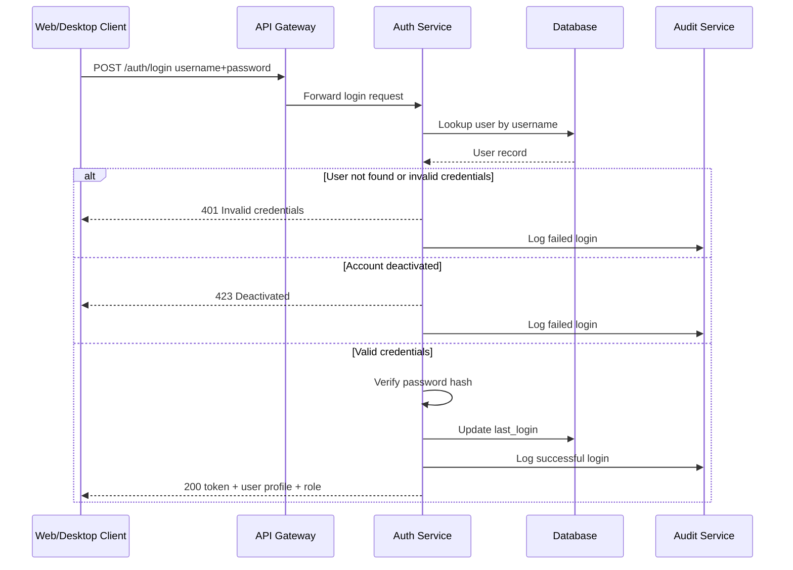
```mermaid
sequenceDiagram
    participant Client as Web/Desktop Client
    participant GW as API Gateway
    participant AUTH as Auth Service
    participant DB as Database
    participant AUDIT as Audit Service

    Client->>GW: POST /auth/login username+password
    GW->>AUTH: Forward login request
    AUTH->>DB: Lookup user by username
    DB-->>AUTH: User record

    alt User not found or invalid credentials
        AUTH-->>Client: 401 Invalid credentials
        AUTH->>AUDIT: Log failed login
    else Account deactivated
        AUTH-->>Client: 423 Deactivated
        AUTH->>AUDIT: Log failed login
    else Valid credentials
        AUTH->>AUTH: Verify password hash
        AUTH->>DB: Update last_login
        AUTH->>AUDIT: Log successful login
        AUTH-->>Client: 200 token + user profile + role
    end
```

### 7.2 Per-Request Authorization Flow

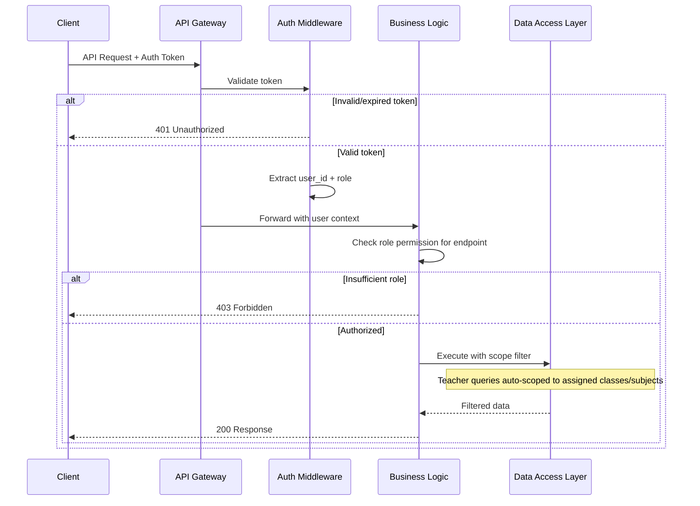
```mermaid
sequenceDiagram
    participant Client
    participant GW as API Gateway
    participant AUTH as Auth Middleware
    participant BLL as Business Logic
    participant DAL as Data Access Layer

    Client->>GW: API Request + Auth Token
    GW->>AUTH: Validate token

    alt Invalid/expired token
        AUTH-->>Client: 401 Unauthorized
    else Valid token
        AUTH->>AUTH: Extract user_id + role
        GW->>BLL: Forward with user context
        BLL->>BLL: Check role permission for endpoint

        alt Insufficient role
            BLL-->>Client: 403 Forbidden
        else Authorized
            BLL->>DAL: Execute with scope filter
            note over DAL: Teacher queries auto-scoped to assigned classes/subjects
            DAL-->>BLL: Filtered data
            BLL-->>Client: 200 Response
        end
    end
```

### 7.3 RBAC Three-Level Enforcement (SRS Section 12.2)

**Level 1 — UI Level:** Navigation items, buttons, and sensitive fields hidden for unauthorized roles  
**Level 2 — API Level (Mandatory):** Every endpoint validates role before processing; unauthorized requests return 403 even if UI is bypassed (SRS AC-037.1)  
**Level 3 — Data Level:** Teacher queries auto-scoped to assigned classes/subjects; financial fields excluded from query results for non-Admin roles

### 7.4 Detailed Role-Permission Matrix

> **LEGACY / NON-OPERATIVE — DO NOT IMPLEMENT**
>
> This historical matrix contains superseded permission examples. Use the canonical role and authorization boundaries in Sections 35–47.

| Resource / Action | Admin | Principal | Coordinator | Teacher |
|-------------------|:-----:|:---------:|:-----------:|:-------:|
| **Dashboard — Full 16 Widgets** | ✅ | ✅ | Partial (no financial) | ❌ |
| **Students — Create** | ✅ | ❌ | ❌ | ❌ |
| **Students — Read (All)** | ✅ | ✅ | View only | Own class only |
| **Students — Read (Medical/CNIC)** | ✅ | Authorized staff scope TBD | Authorized staff scope TBD | ❌ |
| **Students — Update** | ✅ | ✅ | ❌ | ❌ |
| **Students — Delete/Withdraw/Promote** | ✅ (confirm) | ❌ | ❌ | ❌ |
| **Teachers — Read (Full incl. Salary)** | ✅ | ❌ | ❌ | ❌ |
| **Teachers — Read (No Salary)** | ✅ | ✅ | View only | Own profile only |
| **Teachers — Create/Update** | ✅ | ✅ manage (non-financial scope) | View only | ❌ |
| **Attendance — Create (Biometric)** | System | System | System | System |
| **Attendance — Create (Manual)** | ✅ | ✅ | ❌ | Assigned only |
| **Attendance — Read** | ✅ | ✅ | ✅ | Assigned class |
| **Fee Records — All** | ✅ | [TBD] | ❌ | ❌ |
| **Student Ledger** | ✅ | ❌ | ❌ | ❌ |
| **Expenses — All** | ✅ | [TBD] | ❌ | ❌ |
| **Salary Report** | ✅ | ❌ | ❌ | ❌ |
| **Lecture Records — Create** | ✅ | ✅ | ❌ | Own classes |
| **Lecture Records — Read** | ✅ | ✅ | ✅ | Own only |
| **Syllabus — Update Status** | ✅ | ✅ | ✅ | Assigned subjects |
| **Homework — Create** | ✅ | ✅ | ❌ | Assigned classes |
| **Homework — Read** | ✅ | ✅ | ✅ | Assigned classes |
| **Exams — Create** | ✅ | ✅ | ❌ | ❌ |
| **Results — Enter Marks** | ✅ | ✅ | ❌ | Assigned classes |
| **Report Cards** | ✅ | ✅ | ❌ | ❌ |
| **Timetable — Create/Edit** | ✅ | ✅ | ❌ | ❌ |
| **Timetable — View** | ✅ | ✅ | View | Own schedule |
| **WhatsApp — Manual Message** | ✅ | ✅ | ✅ | ❌ |
| **WhatsApp — Message History** | ✅ | ❌ | ❌ | ❌ |
| **Teacher Performance — View** | ✅ | ✅ | ✅ | ❌ |
| **Teacher Performance — Add Remarks** | ✅ | ❌ | ✅ | ❌ |
| **Reports — Financial** | ✅ | [TBD] | ❌ | ❌ |
| **Reports — Academic** | ✅ | ✅ | ✅ | ❌ |
| **Global Search** | ✅ | [TBD] | [TBD] | ❌ |
| **Audit Log — View** | ✅ | [TBD] | ❌ | ❌ |
| **User Management** | ✅ | ❌ | ❌ | ❌ |
| **System Settings** | ✅ | ❌ | ❌ | ❌ |
| **Permanent Deletion** | ✅ (confirm) | ❌ | ❌ | ❌ |

### 7.5 Session Management Design

| Item | Design |
|------|--------|
| Token type | **[TECHNOLOGY DECISION — REQUIRES APPROVAL]**: JWT or server-side session |
| Session timeout | **30 minutes inactivity** (Owner Decision TBD-069 confirmed; configurable in system_settings) |
| Token on logout | Blacklisted or session destroyed |
| Failed login lockout | **[DESIGN DECISION — REQUIRES APPROVAL]** |
| 2FA | **[SUGGESTED — REQUIRES CLIENT APPROVAL per SRS SEC-15]** |

### 7.6 Sensitive Data Access Control

Per SRS Section 17.2:

| Data | Sensitivity | Restriction |
|------|-------------|------------|
| Parent CNIC | High | Admin only |
| Medical/emergency info | High | Admin and authorized staff only; exact staff scope TBD |
| Biometric ID | High | System only; Admin for enrollment |
| Teacher salary/advances/deductions | High | Admin only |
| Fee records | High | Admin; Principal (selected financial reports access confirmed) |
| Audit log | High | Admin; Principal (audit-log viewing access confirmed) |
| Parent contact/WhatsApp | High | Admin + system |

---

## 8. Biometric Attendance Architecture

### 8.1 Device-Agnostic Integration Design

The biometric integration is designed to be **device-agnostic** — device brand and model are **[TBD per SRS A-05]**.

```
BIOMETRIC DEVICE(S) (Brand/Model TBD)
        |
        | Raw scan event (fingerprint identification)
        v
DEVICE ADAPTER / SDK LAYER
  • Translates device-specific format to standard internal scan event
  • One adapter per device brand (pluggable)
  • Raw fingerprint data stays on device — NEVER stored in application DB (SEC-11)
  • Only Biometric ID (reference string) passes to application
        |
        | Standard Scan Event {biometric_id, timestamp, device_id}
        v
BIOMETRIC EVENT SERVICE
  • Looks up biometric_id in students or teachers table
  • Routes to Student Attendance Processor or Teacher Attendance Processor
        |
        |
  ┌─────┴──────┐
  v            v
STUDENT ATT.  TEACHER ATT.
PROCESSOR     PROCESSOR
```

### 8.2 Student Attendance Processing Flow

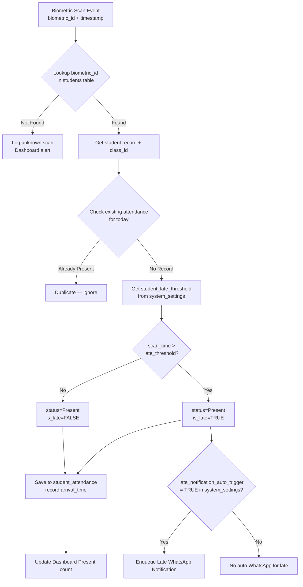
```mermaid
flowchart TD
    A[Biometric Scan Event\nbiometric_id + timestamp] --> B{Lookup biometric_id\nin students table}
    B -->|Not Found| C[Log unknown scan\nDashboard alert]
    B -->|Found| D[Get student record + class_id]
    D --> E{Check existing attendance\nfor today}
    E -->|Already Present| F[Duplicate — ignore]
    E -->|No Record| G[Get student_late_threshold\nfrom system_settings]
    G --> H{scan_time >\nlate_threshold?}
    H -->|Yes| I[status=Present\nis_late=TRUE]
    H -->|No| J[status=Present\nis_late=FALSE]
    I --> K[Save to student_attendance\nrecord arrival_time]
    J --> K
    K --> L[Update Dashboard Present count]
    I --> M{late_notification_auto_trigger\n= TRUE in system_settings?}
    M -->|Yes| N[Enqueue Late WhatsApp Notification]
    M -->|No| O[No auto WhatsApp for late]
```

**SRS Acceptance Criteria Satisfied:**
- AC-007.1: Biometric scan identifies student and class ✅
- AC-007.2: Attendance set to PRESENT ✅
- AC-007.3: Exact arrival time recorded ✅
- AC-007.4: Late status calculated once threshold configured ✅
- AC-040.2: Step 1 within 5 seconds of scan ✅

### 8.3 Automatic Absent Marking Flow

> **LEGACY / NON-OPERATIVE — DO NOT IMPLEMENT**
>
> This historical flow is superseded by the canonical attendance workflow in Sections 38 and 43.

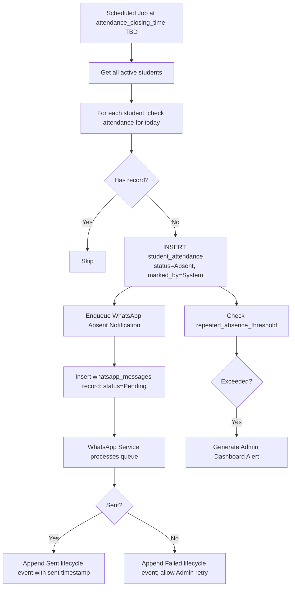
```mermaid
flowchart TD
    A[Scheduled Job at attendance_closing_time TBD] --> B[Get all active students]
    B --> C[For each student: check attendance for today]
    C --> D{Has record?}
    D -->|Yes| E[Skip]
    D -->|No| F[INSERT student_attendance\nstatus=Absent, marked_by=System]
    F --> G[Enqueue WhatsApp Absent Notification]
    G --> H[Insert whatsapp_messages record: status=Pending]
    H --> I[WhatsApp Service processes queue]
    I --> J{Sent?}
    J -->|Yes| K[Append Sent lifecycle event with sent timestamp]
    J -->|No| L[Append Failed lifecycle event; allow Admin retry]
    F --> M[Check repeated_absence_threshold]
    M --> N{Exceeded?}
    N -->|Yes| O[Generate Admin Dashboard Alert]
```

**SRS Criteria:** AC-008.1 (all absent marked) ✅; AC-008.3 (WhatsApp within 2 minutes) ✅; AC-040.3, AC-040.4 ✅

### 8.4 Teacher Attendance Flow

**First scan (Arrival):** Records arrival_time; calculates is_late vs. teacher_late_threshold from system_settings  
**Second scan (Departure):** Records departure_time; calculates is_early_departure (rule TBD — BR-009)  
**Third+ scan:** Ignored (departure already recorded)  

**Monthly summary:** System automatically maintains monthly teacher attendance summary per teacher (SRS AC-009.4)

### 8.5 Device Failure Handling

| Scenario | Response |
|----------|---------|
| Device disconnected | Dashboard alert displayed (SRS Section 18.4) |
| Fallback process | **[TBD per SRS NFR-022, A-05]** |
| Multiple devices | Architecture supports multiple device adapters, each with device_id |
| Duplicate scans | (student_id, attendance_date) UNIQUE prevents duplicate records |

---

## 9. WhatsApp Integration Architecture

### 9.1 Provider-Agnostic Design

The WhatsApp integration is designed so **the provider can be changed without redesigning the system** (SRS Section 9.3).

```
NOTIFICATION SERVICE
  |  Receives events from all modules
  |  Builds message from template
  |  Enqueues message
  v
MESSAGE QUEUE
  |  Decouples generation from sending
  |  Handles burst (up to 160+ messages)
  |  Supports retry for failures (NFR-017)
  v
WHATSAPP PROVIDER ADAPTER LAYER
  |  Abstract interface (pluggable)
  |
  ├── Meta Official WhatsApp API Adapter (TBD)
  └── 3rd Party Provider Adapter (TBD)
  v
WHATSAPP PROVIDER API (TBD)
  v
PARENT/GUARDIAN WHATSAPP
  v
MESSAGE LOG (DB: whatsapp_messages) — Immutable
```

### 9.2 Message Types and Triggers

| Message Type | Trigger | Auto/Manual | SRS Reference |
|-------------|---------|------------|---------------|
| Absent Notification | Auto-absent job | **Unconditionally Automatic** | FR-028, BR-005 |
| Late Notification | Late flag set | **Mandatory feature; auto-trigger CONFIGURABLE/TBD** | FR-028, BR-006 |
| Fee Reminder | Scheduled/manual (TBD) | Automated (timing TBD) | FR-019, FR-028 |
| Homework Notification | Homework entry | Automated | FR-028 |
| Result Notification | Result published | Automated | FR-028 |
| Exam Reminder | Upcoming exam | Automated | FR-028 |
| Important Announcement | Automated capability and manual capability; scheduling TBD | Supported automated or manual capability | FR-028, FR-029 |
| Individual Message | Manual | Manual | FR-029 |
| Class-wise Message | Manual | Manual | FR-029 |
| Section-wise Message | Manual | Manual | FR-029 |
| All-school Message | Manual | Manual | FR-029 |

### 9.3 Late Notification — Approved Resolution (SRS Section 24)

> **Late notification feature is MANDATORY.** Whether it automatically triggers a WhatsApp message is **CONFIGURABLE / TBD**.

**Design:** `system_settings.late_notification_auto_trigger` = configurable TRUE/FALSE  
- TRUE → Late attendance event automatically enqueues WhatsApp notification  
- FALSE → Late event recorded; no automatic WhatsApp sent  

This is configurable by Admin without code changes.

### 9.4 Credential Security (SRS SEC-10)

All WhatsApp API credentials (API key, phone number ID, access token) are:
- Stored in server-side environment configuration or encrypted secrets store
- NEVER stored in the database in plain text
- NEVER exposed to client-side code (Web or Desktop)
- NEVER returned in any API response

### 9.5 WhatsApp Throughput (SRS NFR-017)

At current scale: up to 160 messages simultaneously at closing time.

| Design Element | Approach |
|---------------|----------|
| Message Queue | Async queue decouples generation from sending |
| Rate Limiting | Queue respects provider API rate limits |
| No Message Loss | Queue persists until sent or explicitly failed |
| Scalability | Queue scales as student count grows to 500–1,000+ |

---

## 10. Notification Architecture

### 10.1 Two Distinct Notification Channels (SRS AC-002.3)

```
CHANNEL A: INTERNAL DASHBOARD NOTIFICATIONS (In-app — Staff Only)
  • 8 alert types (FR-002)
  • Visible to Admin, Principal, Coordinator ONLY
  • Real-time queries from live database
  • No external API calls

CHANNEL B: EXTERNAL WHATSAPP NOTIFICATIONS (Parents)
  • 7 automated + manual types (FR-028, FR-029)
  • Via WhatsApp Provider API (TBD)
  • Full message log maintained (FR-030)
  • Audience: Parents/Guardians ONLY
```

### 10.2 Internal Dashboard Alert Triggers

| Alert | Trigger | Data Source |
|-------|---------|-------------|
| Students Absent Today | Auto-absent job | student_attendance (today, Absent) |
| Teachers Absent Today | Teacher check-in period | teacher_attendance (today, Absent) |
| Late Teachers | Late flag set | teacher_attendance (today, is_late=TRUE) |
| Pending Fees | Real-time | fee_ledger_events / fee_obligations (outstanding balance > 0) |
| Upcoming Exams | Approaching date (threshold configurable) | exams (exam_date within N days) |
| Incomplete Homework | Tracking method TBD | homework |
| Syllabus Behind Schedule | Completion % below expected | syllabus |
| Important School Notices | Manually entered | system notices |

---

## 11. Security Architecture

### 11.1 Seven Security Layers

```
LAYER 1: TRANSPORT SECURITY
  • HTTPS/TLS for all client-server communication
  • [SUGGESTED — REQUIRES CLIENT APPROVAL per SRS SEC-06]

LAYER 2: AUTHENTICATION
  • Username + password (mandatory)
  • Passwords as bcrypt hash — never plain text (SEC-03)
  • Password policy: min 8 characters, letters+numbers+symbols; Admin expiry 90 days; non-Admin no auto-expiry (TBD-068 confirmed)
  • Password change/reset authority: Coordinator, Principal, Owner/Admin/Director only (TBD-068 confirmed)
  • Session timeout: 30 minutes inactivity (TBD-069 confirmed; configurable)
  • 2FA: SUGGESTED (SEC-15)
  • Failed logins logged in audit log (SEC-14)

LAYER 3: AUTHORIZATION (RBAC)
  • Three-level enforcement: UI + API + Data
  • Financial data restricted from Teacher/Coordinator
  • Teacher access scoped to assigned classes
  • Dual authorization (Owner/Admin + Principal) required for permanent deletion; Admin confirmation required for soft-delete and general controlled actions (SEC-08; TBD-067 confirmed)

LAYER 4: DATA SECURITY
  • Biometric raw data NEVER in application DB (SEC-11)
  • WhatsApp credentials NEVER client-side (SEC-10)
  • Medical/emergency info restricted at data layer
  • Encryption at rest: TBD (SEC-12)

LAYER 5: AUDIT TRAIL
  • All significant actions logged automatically
  • Audit log is IMMUTABLE (SEC-07, BR-023)
  • No user can edit or delete audit entries

LAYER 6: DELETION CONTROLS
  • Permanent deletion restricted to temporary logs, system cache, and accidental duplicate non-financial records (TBD-066 confirmed)
  • Permanent deletion requires dual authorization by Owner/Admin and Principal (TBD-067 confirmed)
  • Financial and academic history is ARCHIVED, not permanently deleted (TBD-066 confirmed)
  • All deletion actions logged in audit trail
  • Soft-delete preferred for sensitive records

LAYER 7: DATABASE SECURITY
  • Direct DB access by end users not permitted
  • All access through DAL only
  • DB credentials stored server-side securely
  • Application DB user lacks DELETE/UPDATE privileges on audit_logs and whatsapp_messages
```

### 11.2 Security Requirements Coverage

| SEC-ID | Requirement | Status | Design |
|--------|-------------|--------|--------|
| SEC-01 | Username/password auth | ✅ Mandatory | Auth service + login flow |
| SEC-02 | RBAC at 3 levels | ✅ Mandatory | Three-level RBAC |
| SEC-03 | Bcrypt password hash | ✅ Mandatory | Auth service |
| SEC-04 | Password policy | ✅ Confirmed (TBD-068) | Min 8 chars, letters+numbers+symbols; Admin 90-day expiry; non-Admin no auto-expiry |
| SEC-05 | Session timeout | ✅ Confirmed (TBD-069) | 30 minutes inactivity; configurable in system_settings |
| SEC-06 | SSL/HTTPS | ⚠️ SUGGESTED | Architecture ready |
| SEC-07 | Immutable audit log | ✅ Mandatory | No UPDATE/DELETE on audit_logs |
| SEC-08 | Deletion controls | ✅ Mandatory | Dual authorization (Owner/Admin + Principal) for permanent deletion (TBD-067 confirmed) |
| SEC-09 | Restricted deletion scope | ✅ Confirmed (TBD-066) | Temporary logs, cache, accidental duplicate non-financial records only; financial/academic history archived |
| SEC-10 | WhatsApp creds server-side only | ✅ Mandatory | Server config only |
| SEC-11 | Biometric raw data not in DB | ✅ Mandatory | Only biometric_id stored |
| SEC-12 | Encryption at rest | ✅ Confirmed required (TBD-070) | Required for sensitive financial data and student personal records; exact cryptographic method remains technical design decision |
| SEC-13 | Teachers blocked from financial | ✅ Mandatory | API + data level RBAC |
| SEC-14 | Failed login logged | ✅ Mandatory | Audit log on failure |
| SEC-15 | 2FA for Admin | ⚠️ SUGGESTED | Auth service extendable |

### 11.3 Admin Deletion Confirmation Workflow

> **LEGACY / NON-OPERATIVE — DO NOT IMPLEMENT**
>
> This historical workflow is superseded by the archive and dual-authorization model in Section 40.

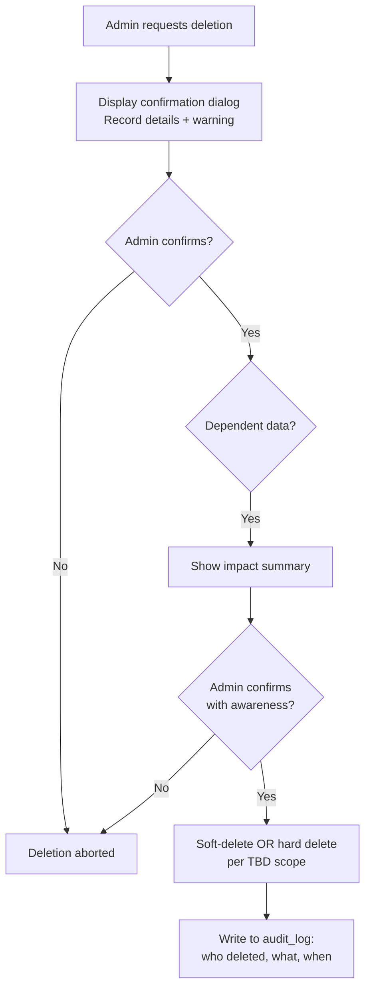
```mermaid
flowchart TD
    A[Admin requests deletion] --> B[Display confirmation dialog\nRecord details + warning]
    B --> C{Admin confirms?}
    C -->|No| D[Deletion aborted]
    C -->|Yes| E{Dependent data?}
    E -->|Yes| F[Show impact summary]
    F --> G{Admin confirms\nwith awareness?}
    G -->|No| D
    G -->|Yes| H[Soft-delete OR hard delete\nper TBD scope]
    H --> I[Write to audit_log:\nwho deleted, what, when]
```

---

## 12. Reporting Architecture

### 12.1 Report Generation Pipeline

```
1. REQUEST — User selects report type + filter parameters
       ↓
2. AUTHORIZATION CHECK — Role verified for this report type
       ↓
3. DATA QUERY — Report Service queries unified DB with filters
                All calculations performed from live data (NFR-023)
       ↓
4. METADATA INJECTION — School logo + name + report title
                        Generated date + time + generated-by user
                        Currency symbol: PKR (TBD-017 confirmed)
       ↓
5. FORMAT SELECTION — Screen view OR PDF OR Excel
       ↓
6. OUTPUT — PDF and Excel exports complete within 15 seconds for the agreed standard dataset and environment (NFR-018). Any additional target requires approval.
```

### 12.2 Report Specifications

| Report ID | Report | Key Calculations | Financial? |
|-----------|--------|-----------------|-----------|
| R-01 | Student Profile Report | None | No |
| R-02 | Student Attendance Report | Attendance % | No |
| R-03 | Teacher Attendance Report | Late count, Attendance % | No |
| R-04 | Daily Attendance Report | Present/Absent counts | No |
| R-05 | Monthly Attendance Report | Monthly % | No |
| R-06 | Fee Collection Report | Total collected, outstanding | Admin; Principal (selected financial reports confirmed) |
| R-07 | Fee Defaulters Report | Outstanding balance > 0 (from fee_ledger_events / fee_obligations) | Admin; Principal (financial reports access confirmed) |
| R-08 | Student Ledger Report | Chronological transactions | Admin only |
| R-09 | Teacher Performance Report | All 9 criteria aggregated | No |
| R-10 | Syllabus Progress Report | Completion % per subject | No |
| R-11 | Homework Report | Homework list | No |
| R-12 | Exam Result Report | Results + % per student | No |
| R-13 | Class Performance Report | Average results | No |
| R-14 | Expenses Report | Total by category | Admin; Principal (selected financial reports confirmed) |
| R-15 | Income vs. Expenses Report | Fee income vs. expenses | Admin only |
| R-16 | Salary Report | Salary, advances, deductions | Admin only |

---

## 13. Search Architecture

### 13.1 Global Search Design

```
User enters search query
        ↓
RBAC Check: Determine which entities user can view
  • Admin: all students + teachers
  • Principal/Coordinator: TBD per SRS FR-034
  • Teacher: no global search access
        ↓
MULTI-FIELD SEARCH across all 8 criteria simultaneously:
  1. student_name (LIKE)
  2. guardian_name (LIKE)
  3. admission_number (EXACT + LIKE)
  4. student_id (EXACT)
  5. contact_number_1 / contact_number_2 (LIKE)
  6. class_name (JOIN with classes)
  7. teacher name (LIKE)
  8. teacher_id (EXACT)
        ↓
Paginated results: entity_type, entity_id, summary
        ↓
User clicks → Full profile (Student or Teacher per RBAC)
```

**Performance:** ≤ 2 seconds per SRS NFR-001; achieved via database indexes on all 8 search fields

---

## 14. Audit and Logging Architecture

### 14.1 Design Principles

1. **Completeness:** 100% of defined events logged — none silently dropped (SRS NFR-014)
2. **Immutability:** No UPDATE/DELETE on `audit_logs` — enforced at application AND database privilege level (SRS BR-023)
3. **Automatic:** Triggered by business logic; not optional
4. **Separate:** Audit logs separate from system error logs (SRS Section 18.2)
5. **Searchable:** Filter by date range, user, event type (SRS AC-035.3)

### 14.2 Audit Event Catalog

> **LEGACY / NON-OPERATIVE — DO NOT IMPLEMENT**
>
> This historical catalog is superseded by the actor-aware audit model in Sections 37 and 40.

| Event Type | Trigger | Key Data |
|------------|---------|---------|
| USER_LOGIN | Successful auth | user_id, timestamp |
| USER_LOGIN_FAILED | Failed auth | username attempted, timestamp |
| STUDENT_CREATED | New student saved | created_by, student_id, name, class |
| STUDENT_UPDATED | Profile field changed | user_id, student_id, field, old_value, new_value |
| STUDENT_DELETED | Student withdrawn/deleted | user_id, student_id |
| STUDENT_PROMOTED | Promotion recorded | user_id, student_id, from/to class |
| ATTENDANCE_CHANGED | Manual attendance edit | user_id, entity_id, date, old/new status |
| MARKS_ENTERED | Exam marks submitted | user_id, student_id, exam_id, subject_id |
| MARKS_UPDATED | Marks changed | user_id, student_id, old/new values |
| FEE_RECORDED | Payment recorded | user_id, student_id, fee_id, amount |
| FEE_UPDATED | Fee record modified | user_id, student_id, field, old/new values |
| RECORD_DELETED | Record permanently deleted | user_id, entity_type, entity_id |
| TEACHER_CREATED | New teacher saved | created_by, teacher_id |
| TEACHER_UPDATED | Teacher profile changed | user_id, teacher_id, field, old/new |
| USER_CREATED | System user created | created_by, user_id, role |
| USER_ROLE_CHANGED | User role modified | admin_id, target_user_id, old/new role |
| USER_DEACTIVATED | Account deactivated | admin_id, target_user_id |
| SETTINGS_CHANGED | System settings modified | user_id, setting_key, old/new value |
| WHATSAPP_SENT | Manual WhatsApp sent | user_id, recipient, message_type |
| BACKUP_COMPLETED | Backup job finished | timestamp, location |
| BACKUP_FAILED | Backup job failed | timestamp, error |

---

## 15. Backup and Recovery Architecture

### 15.1 Backup Design

Per SRS Section 19, automatic database backup is MANDATORY.

```
AUTOMATED BACKUP JOB
  • Frequency: Daily at midnight (TBD-073 confirmed; configurable)
  • Trigger: Scheduled cron job (off-school hours — midnight)
  • Scope: Full database
         ↓
BACKUP PROCESS
  • Export database to backup file
  • Verify integrity (hash check)
  • Transfer to backup storage
         ↓
BACKUP STORAGE
  • Location: Cloud storage AND secure local backup copy (TBD-074 confirmed)
  • Retention: 3 years for audit log records (TBD-065 confirmed); backup retention period remains a technical operations concern
  • Access: Admin only
         ↓
POST-BACKUP
  • Log BACKUP_COMPLETED to audit_log
  • Admin notification: SUGGESTED — implementation TBD
  • Periodic restoration test: SUGGESTED — TBD
```

### 15.2 Recovery Design

| Item | Design |
|------|--------|
| Recovery capability | MANDATORY (SRS NFR-010) |
| Recovery method | Full restore and point-in-time restore (TBD-075 confirmed) |
| Recovery process | Documented recovery runbook |
| RTO / RPO | TBD — not specified in SRS |

---

## 16. Web and Desktop Architecture

### 16.1 Shared Backend Model

Both Web and Desktop clients connect to the **same backend API and database**. No separate business logic for either client.

```
┌──────────────────┐         ┌──────────────────┐
│   WEB CLIENT     │         │  DESKTOP CLIENT  │
│ Browser-based    │         │ Native/Packaged   │
│ EN/UR bilingual  │         │ EN/UR bilingual  │
│ Mobile-responsive│         │ Technology TBD   │
│ Major browsers   │         │ OS: TBD          │
└────────┬─────────┘         └────────┬─────────┘
         └──────────┬─────────────────┘
                    │ HTTPS + Auth Token
                    ▼
         ┌──────────────────────────────┐
         │  SHARED API GATEWAY          │
         │  Same endpoints              │
         │  Same RBAC rules             │
         │  Same business logic         │
         │  Same audit trail            │
         └────────────┬─────────────────┘
                      ▼
         ┌────────────────────────────────┐
         │  SINGLE UNIFIED DATABASE        │
         └────────────────────────────────┘
```

### 16.2 Web Application Requirements

| Item | Requirement |
|------|-------------|
| Browser Support | Chrome, Firefox, Edge, Safari (SRS NFR-009) |
| Mobile Responsiveness | Fully responsive — all features on mobile (SRS NFR-007) |
| Language | Bilingual EN/UR — i18n resource files |
| Branding | Gen'X Vision logo and colors throughout (SRS NFR-021) |
| Technology | **[TECHNOLOGY DECISION — REQUIRES CLIENT/PROJECT APPROVAL]** |

### 16.3 Desktop Technology Options

| Option | Pros | Cons |
|--------|------|------|
| Electron | ~90% code shared with web; cross-platform | Larger install size (~150MB) |
| Tauri | Lightweight (~5MB); ~90% code shared | More complex build |
| PWA | No install; 100% code shared | Limited OS integration |
| Native (C#/.NET) | Best performance | Separate codebase from web |

> **[TECHNOLOGY DECISION — REQUIRES CLIENT/PROJECT APPROVAL]: Desktop technology**

---

## 17. Data Flow and Business Process Flows

### 17.1 Student Admission Flow

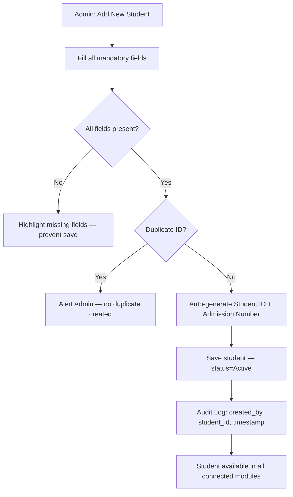
```mermaid
flowchart TD
    A[Admin: Add New Student] --> B[Fill all mandatory fields]
    B --> C{All fields present?}
    C -->|No| D[Highlight missing fields — prevent save]
    C -->|Yes| E{Duplicate ID?}
    E -->|Yes| F[Alert Admin — no duplicate created]
    E -->|No| G[Auto-generate Student ID + Admission Number]
    G --> H[Save student — status=Active]
    H --> I[Audit Log: created_by, student_id, timestamp]
    I --> J[Student available in all connected modules]
```

### 17.2 Student Biometric Attendance and Auto-Absent Flow

> **LEGACY / NON-OPERATIVE — DO NOT IMPLEMENT**
>
> This historical flow is retained for traceability only. Use the canonical attendance, working-calendar, offline-sync, and audit-actor workflow in Sections 35–47.

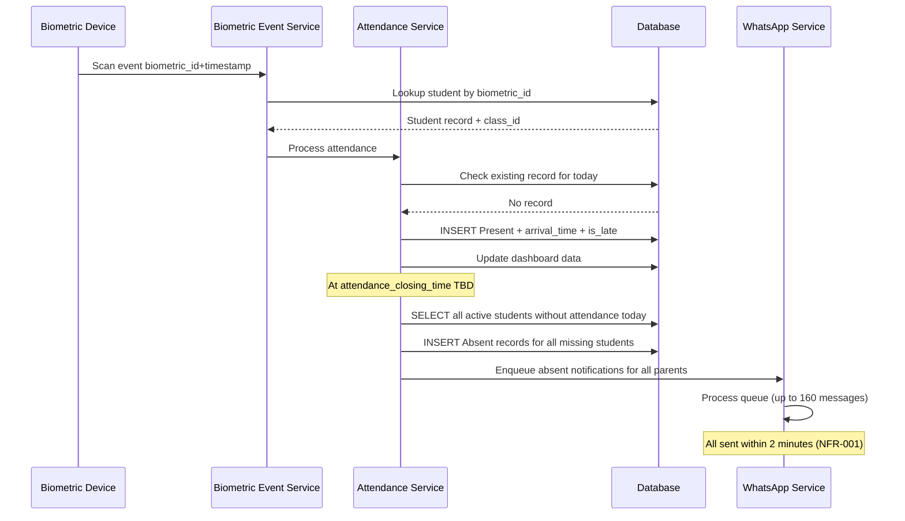
```mermaid
sequenceDiagram
    participant DEVICE as Biometric Device
    participant BIO as Biometric Event Service
    participant ATT as Attendance Service
    participant DB as Database
    participant WA as WhatsApp Service

    DEVICE->>BIO: Scan event biometric_id+timestamp
    BIO->>DB: Lookup student by biometric_id
    DB-->>BIO: Student record + class_id
    BIO->>ATT: Process attendance
    ATT->>DB: Check existing record for today
    DB-->>ATT: No record
    ATT->>DB: INSERT Present + arrival_time + is_late
    ATT->>DB: Update dashboard data

    note over ATT: At attendance_closing_time TBD
    ATT->>DB: SELECT all active students without attendance today
    ATT->>DB: INSERT Absent records for all missing students
    ATT->>WA: Enqueue absent notifications for all parents
    WA->>WA: Process queue (up to 160 messages)
    note over WA: All sent within 2 minutes (NFR-001)
```

### 17.3 Teacher Biometric Attendance Flow

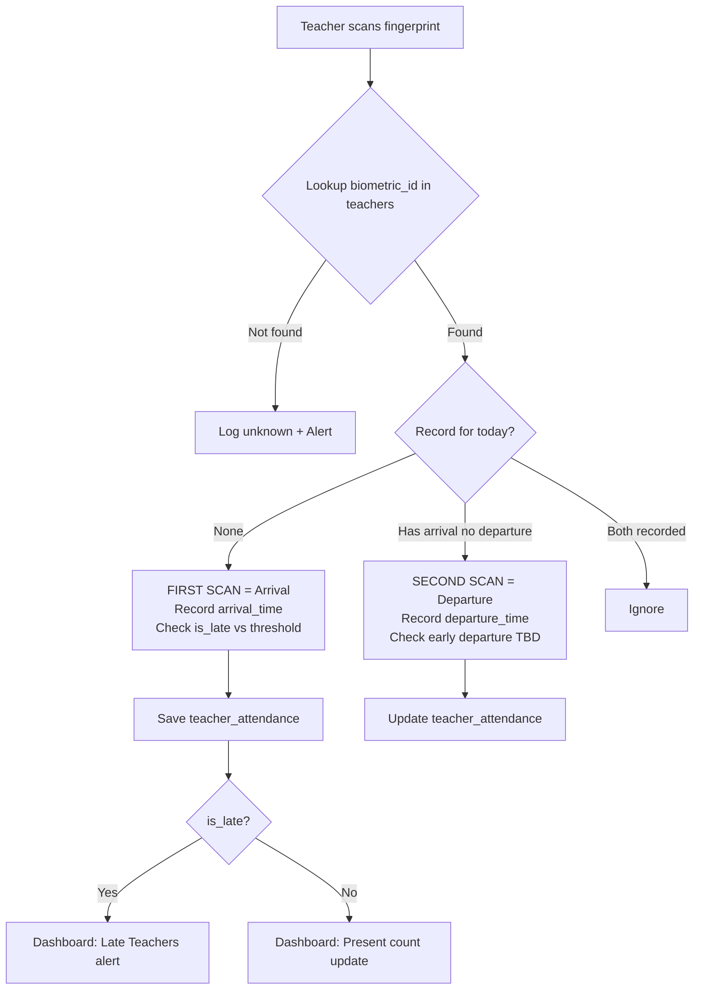
```mermaid
flowchart TD
    A[Teacher scans fingerprint] --> B{Lookup biometric_id in teachers}
    B -->|Not found| C[Log unknown + Alert]
    B -->|Found| D{Record for today?}
    D -->|None| E[FIRST SCAN = Arrival\nRecord arrival_time\nCheck is_late vs threshold]
    D -->|Has arrival no departure| F[SECOND SCAN = Departure\nRecord departure_time\nCheck early departure TBD]
    D -->|Both recorded| G[Ignore]
    E --> H[Save teacher_attendance]
    F --> I[Update teacher_attendance]
    H --> J{is_late?}
    J -->|Yes| K[Dashboard: Late Teachers alert]
    J -->|No| L[Dashboard: Present count update]
```

### 17.4 Fee Collection Flow

> **LEGACY / NON-OPERATIVE — DO NOT IMPLEMENT**
>
> This flow references the retired combined fee/payment model (single-row record with auto-calculated remaining_amount). The canonical model uses separate fee_obligations, fee_payments, fee_ledger_events, fee_receipts, and fee_adjustments entities. See Section 37.3 for the canonical financial model.

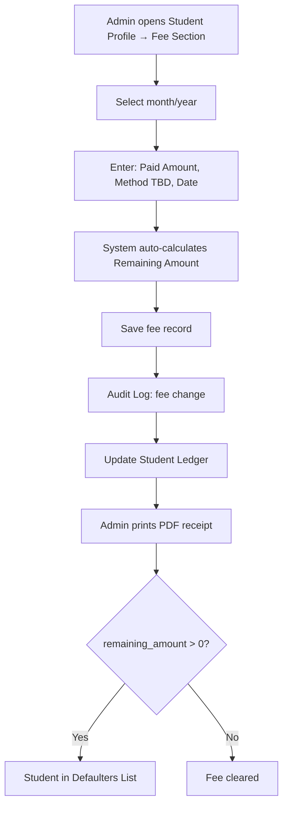
```mermaid
flowchart TD
    A[Admin opens Student Profile → Fee Section] --> B[Select month/year]
    B --> C[Enter: Paid Amount, Method TBD, Date]
    C --> D[System auto-calculates Remaining Amount]
    D --> E[Save fee record]
    E --> F[Audit Log: fee change]
    F --> G[Update Student Ledger]
    G --> H[Admin prints PDF receipt]
    H --> I{remaining_amount > 0?}
    I -->|Yes| J[Student in Defaulters List]
    I -->|No| K[Fee cleared]
```

### 17.5 Homework Entry and Notification Flow

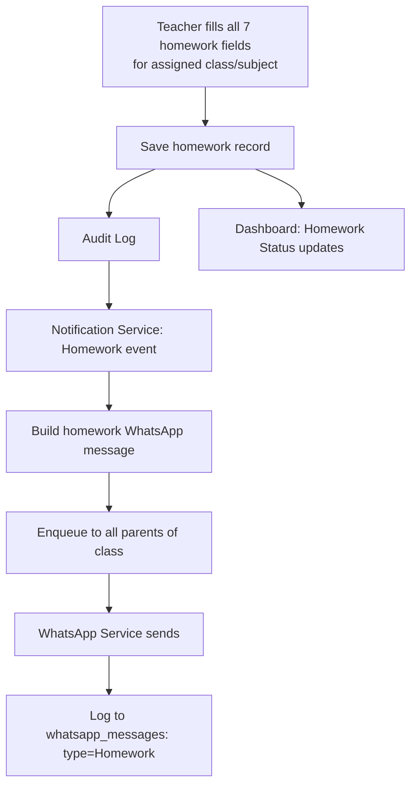
```mermaid
flowchart TD
    A[Teacher fills all 7 homework fields\nfor assigned class/subject] --> B[Save homework record]
    B --> C[Audit Log]
    C --> D[Notification Service: Homework event]
    D --> E[Build homework WhatsApp message]
    E --> F[Enqueue to all parents of class]
    F --> G[WhatsApp Service sends]
    G --> H[Log to whatsapp_messages: type=Homework]
    B --> I[Dashboard: Homework Status updates]
```

### 17.6 Exam and Result Flow

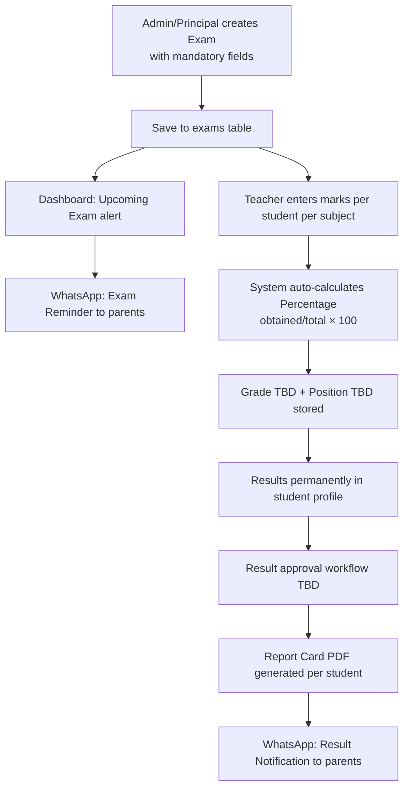
```mermaid
flowchart TD
    A[Admin/Principal creates Exam\nwith mandatory fields] --> B[Save to exams table]
    B --> C[Dashboard: Upcoming Exam alert]
    C --> D[WhatsApp: Exam Reminder to parents]
    B --> E[Teacher enters marks per student per subject]
    E --> F[System auto-calculates Percentage\nobtained/total × 100]
    F --> G[Grade TBD + Position TBD stored]
    G --> H[Results permanently in student profile]
    H --> I[Result approval workflow TBD]
    I --> J[Report Card PDF generated per student]
    J --> K[WhatsApp: Result Notification to parents]
```

### 17.7 Syllabus Tracking Flow

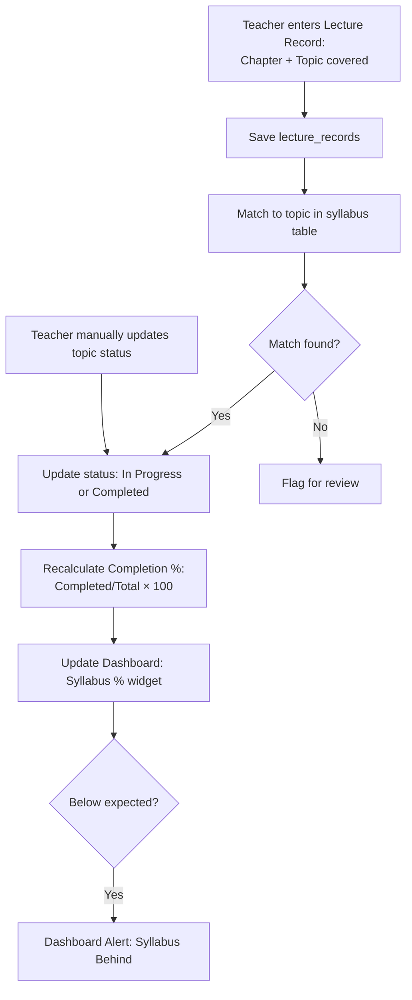
```mermaid
flowchart TD
    A[Teacher enters Lecture Record:\nChapter + Topic covered] --> B[Save lecture_records]
    B --> C[Match to topic in syllabus table]
    C --> D{Match found?}
    D -->|Yes| E[Update status: In Progress or Completed]
    D -->|No| F[Flag for review]
    E --> G[Recalculate Completion %:\nCompleted/Total × 100]
    G --> H[Update Dashboard: Syllabus % widget]
    H --> I{Below expected?}
    I -->|Yes| J[Dashboard Alert: Syllabus Behind]
    
    K[Teacher manually updates topic status] --> E
```

### 17.8 Teacher Performance Flow

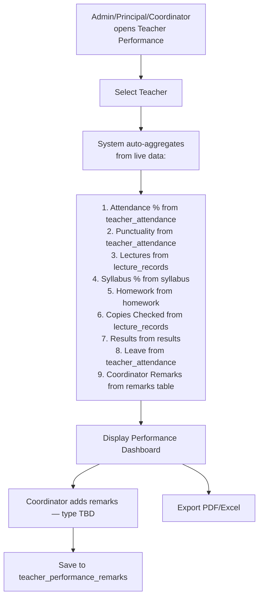
```mermaid
flowchart TD
    A[Admin/Principal/Coordinator\nopens Teacher Performance] --> B[Select Teacher]
    B --> C[System auto-aggregates\nfrom live data:]
    C --> D[1. Attendance % from teacher_attendance\n2. Punctuality from teacher_attendance\n3. Lectures from lecture_records\n4. Syllabus % from syllabus\n5. Homework from homework\n6. Copies Checked from lecture_records\n7. Results from results\n8. Leave from teacher_attendance\n9. Coordinator Remarks from remarks table]
    D --> E[Display Performance Dashboard]
    E --> F[Coordinator adds remarks — type TBD]
    F --> G[Save to teacher_performance_remarks]
    E --> H[Export PDF/Excel]
```

### 17.9 Report Generation Flow

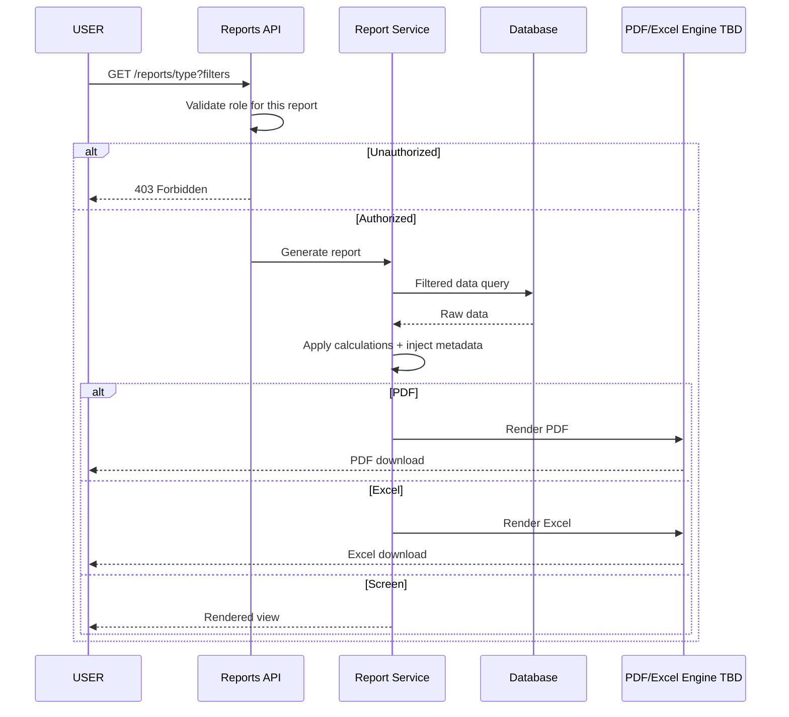
```mermaid
sequenceDiagram
    participant USER
    participant API as Reports API
    participant RPT as Report Service
    participant DB as Database
    participant ENG as PDF/Excel Engine TBD

    USER->>API: GET /reports/type?filters
    API->>API: Validate role for this report
    alt Unauthorized
        API-->>USER: 403 Forbidden
    else Authorized
        API->>RPT: Generate report
        RPT->>DB: Filtered data query
        DB-->>RPT: Raw data
        RPT->>RPT: Apply calculations + inject metadata
        alt PDF
            RPT->>ENG: Render PDF
            ENG-->>USER: PDF download
        else Excel
            RPT->>ENG: Render Excel
            ENG-->>USER: Excel download
        else Screen
            RPT-->>USER: Rendered view
        end
    end
```

### 17.10 Student Promotion Flow

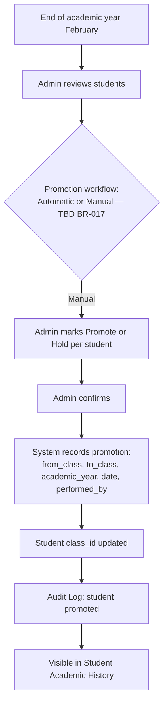
```mermaid
flowchart TD
    A[End of academic year February] --> B[Admin reviews students]
    B --> C{Promotion workflow:\nAutomatic or Manual — TBD BR-017}
    C -->|Manual| D[Admin marks Promote or Hold per student]
    D --> E[Admin confirms]
    E --> F[System records promotion:\nfrom_class, to_class, academic_year, date, performed_by]
    F --> G[Student class_id updated]
    G --> H[Audit Log: student promoted]
    H --> I[Visible in Student Academic History]
```

### 17.11 User Login and Authorization Flow

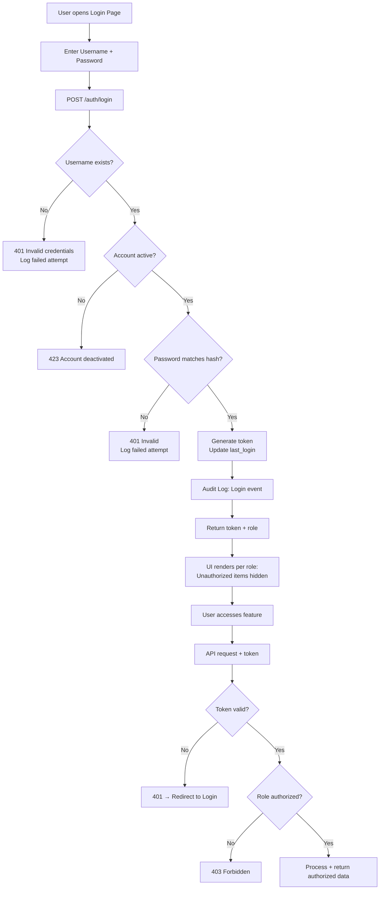
```mermaid
flowchart TD
    A[User opens Login Page] --> B[Enter Username + Password]
    B --> C[POST /auth/login]
    C --> D{Username exists?}
    D -->|No| E[401 Invalid credentials\nLog failed attempt]
    D -->|Yes| F{Account active?}
    F -->|No| G[423 Account deactivated]
    F -->|Yes| H{Password matches hash?}
    H -->|No| I[401 Invalid\nLog failed attempt]
    H -->|Yes| J[Generate token\nUpdate last_login]
    J --> K[Audit Log: Login event]
    K --> L[Return token + role]
    L --> M[UI renders per role:\nUnauthorized items hidden]
    M --> N[User accesses feature]
    N --> O[API request + token]
    O --> P{Token valid?}
    P -->|No| Q[401 → Redirect to Login]
    P -->|Yes| R{Role authorized?}
    R -->|No| S[403 Forbidden]
    R -->|Yes| T[Process + return authorized data]
```

### 17.12 Backup Flow

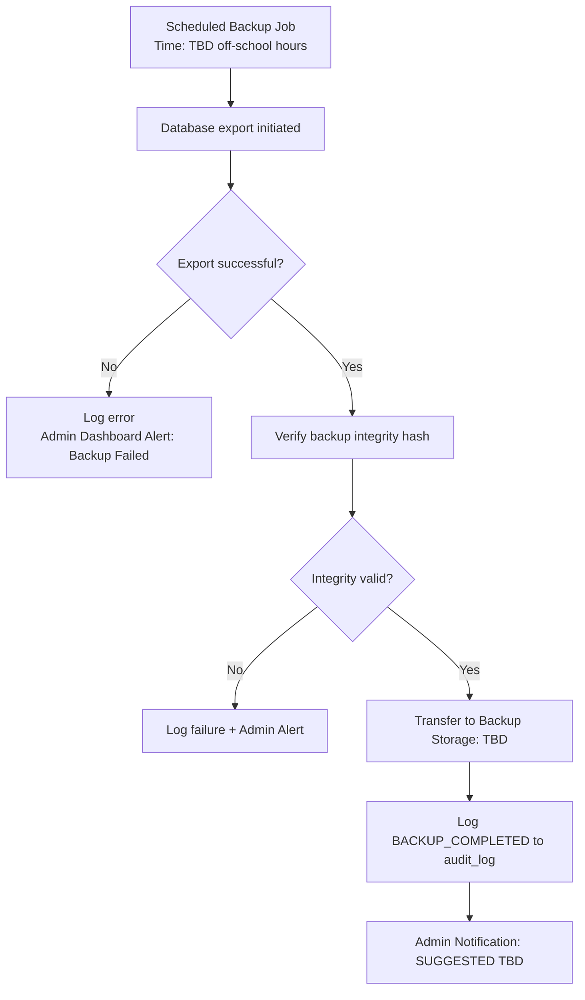
```mermaid
flowchart TD
    A[Scheduled Backup Job\nTime: TBD off-school hours] --> B[Database export initiated]
    B --> C{Export successful?}
    C -->|No| D[Log error\nAdmin Dashboard Alert: Backup Failed]
    C -->|Yes| E[Verify backup integrity hash]
    E --> F{Integrity valid?}
    F -->|No| G[Log failure + Admin Alert]
    F -->|Yes| H[Transfer to Backup Storage: TBD]
    H --> I[Log BACKUP_COMPLETED to audit_log]
    I --> J[Admin Notification: SUGGESTED TBD]
```

---

## 18. Deployment Architecture

### 18.1 Deployment Overview

> **Note:** Hosting details, cloud provider, and hosting model are **[TBD per SRS Section 2.4]**. Architecture below is provider-agnostic.

```
HOSTING ENVIRONMENT (TBD)
┌────────────────────────────────────────────────────────┐
│  WEB TIER: Reverse Proxy / Web Server                  │
│    • Serves Web Application static assets              │
│    • Routes API requests to Application Server         │
│    • SSL/TLS termination [SUGGESTED]                   │
│                ↓                                       │
│  APPLICATION TIER: Application Server(s)               │
│    • Backend API (all business logic)                  │
│    • Authentication service                            │
│    • Notification/WhatsApp service                     │
│    • Scheduled job runner (auto-absent, fee, backup)   │
│    • Report generation service                         │
│    • Biometric event listener                          │
│                ↓                                       │
│  DATA TIER: Database Server (Tech TBD)                 │
│    • Single unified relational database                │
│    • Automated backups to: TBD                         │
│                ↓                                       │
│  FILE STORAGE: Student photos, documents, exports TBD  │
└────────────────────────────────────────────────────────┘

SCHOOL PREMISES (On-site)
  • Biometric Devices → Connected to network → API
  • Desktop Clients → Connect to API via HTTPS
```

### 18.2 Environment Separation

| Environment | Purpose | Special Notes |
|-------------|---------|--------------|
| Development | Developer local work | Local DB, mock biometric, WhatsApp sandbox |
| Staging / Testing | QA, UAT, integration | Staging DB, real device testing |
| Production | Live school operations | Production DB, real biometric, real WhatsApp |

### 18.3 Configuration Management

| Item | Approach |
|------|----------|
| Environment-specific values | Environment variables or config files — never hardcoded |
| Sensitive credentials | Never in source code; stored in secrets management |
| Application settings | `system_settings` database table — Admin-configurable at runtime |
| Version control | Source code in Git; secrets excluded |

---

## 19. Scalability Design

### 19.1 Scalability Requirements

Per SRS NFR-002: Scale from ~160 students to 500–1,000+ without architectural redesign.

### 19.2 Database Scalability

| Strategy | Design |
|----------|--------|
| Schema | No restructuring needed as student count grows — proper FK + indexes |
| Indexes | Pre-defined on all high-frequency query fields |
| Archiving | Historical records grow linearly; indexes maintain performance |
| Partitioning | **[DESIGN DECISION — REQUIRES APPROVAL]**: Date-based partitioning for attendance/audit tables |

### 19.3 Application Scalability

| Strategy | Design |
|----------|--------|
| Stateless API | Allows horizontal scaling of application servers |
| Message queue | Handles WhatsApp burst load independently |
| Report service | Can be scaled independently |
| Background jobs | Isolated from main request handling |

### 19.4 WhatsApp Scalability

| Scenario | Current | Future | Design |
|----------|---------|--------|--------|
| Absent notifications | ~160 messages | ~500-1,000+ | Queue scales automatically |
| Fee reminders | ~160 | ~500-1,000+ | Batched processing |

### 19.5 Future Module Scalability

New modules added as new services consuming the same API gateway — no core rebuild required. Database extended with new tables. RBAC extended with new permissions. API new endpoints under same versioned namespace.

---

## 20. Future Expansion Architecture

The following modules are **explicitly designated as future expansion** per SRS Section 23. They are NOT current requirements.

| Module | ID | Key Architectural Provision |
|--------|----|-----------------------------|
| School Transport | FE-01 | New transport tables; new Transport API |
| Library Management | FE-02 | New library tables; Library API |
| Inventory | FE-03 | New inventory tables; Inventory API |
| Online Fee Payment | FE-04 | Payment gateway integration service |
| Parent Login Portal | FE-05 | Parent user accounts; scoped read-only APIs |
| Student Login Portal | FE-06 | Student user accounts; scoped read-only APIs |
| Mobile Application | FE-07 | Same API consumed by mobile clients — no backend change |
| Online Tests | FE-08 | New test/submission tables; Test API |
| Digital Report Cards | FE-09 | Extend report card delivery via portal/WhatsApp |
| SMS Integration | FE-10 | New SMS adapter in Notification Service |
| Advanced WhatsApp | FE-11 | Extend WhatsApp Adapter with new capabilities |
| Multiple Branches | FE-12 | Add `branch_id` FK to all student/teacher/class tables; extend RBAC |

---

## 21. Technology Stack Analysis

### 21.1 Technology Requirements from SRS

The technology stack is **[TBD per SRS C-07]** and must satisfy:

| Requirement | Must Support |
|-------------|-------------|
| Web application | Browser-based; major browsers; mobile-responsive; bilingual EN/UR |
| Desktop application | School computers; OS TBD |
| Backend / API | RESTful; RBAC; scheduled jobs; background processing |
| Database | Relational; ACID; single unified schema; scalable to 500–1,000+ |
| Biometric | Device SDK integration (device TBD) |
| WhatsApp | Provider API; message queue; delivery tracking |
| PDF | Server-side rendering |
| Excel | .xlsx generation |
| File storage | Photos, documents |

### 21.2 Backend Technology Comparison

| Technology | Scalability | Security | Biometric | Maintainability | Complexity |
|------------|------------|----------|-----------|-----------------|-----------|
| Node.js / NestJS | High | High | SDK bridge | High (structured) | Moderate |
| Python / Django | High | High | SDK bridge | High | Moderate |
| Python / FastAPI | High | High | SDK bridge | Moderate | Low |
| PHP / Laravel | Moderate | High | SDK bridge | High | Low |
| .NET / ASP.NET Core | High | Very High | Native Windows SDK | High | Moderate |
| Java / Spring Boot | Very High | Very High | SDK bridge | High | High |

> **[TECHNOLOGY DECISION — REQUIRES CLIENT/PROJECT APPROVAL]: Backend technology**

### 21.3 Database Technology Comparison

| Technology | Type | Scalability | ACID | Open Source | Maturity |
|------------|------|------------|------|-------------|---------|
| **PostgreSQL** | Relational | Very High | ✅ | ✅ | Very High |
| **MySQL / MariaDB** | Relational | High | ✅ | ✅ | Very High |
| **SQL Server** | Relational | High | ✅ | ❌ (paid) | Very High |
| SQLite | Relational | ❌ Not for production | ✅ | ✅ | High |

> **[TECHNOLOGY DECISION — REQUIRES CLIENT/PROJECT APPROVAL]: Database (PostgreSQL or MySQL/MariaDB recommended)**

### 21.4 Desktop Technology Comparison

| Technology | Code Sharing | Install Size | Platform | Complexity |
|------------|-------------|-------------|----------|-----------|
| Electron | ~90% shared | ~150MB | Windows/Mac/Linux | Low |
| Tauri | ~90% shared | ~5MB | Windows/Mac/Linux | Moderate |
| PWA | 100% shared | None | Any browser | Very Low |
| Native C#/.NET | 0% (separate) | Moderate | Windows | High |

> **[TECHNOLOGY DECISION — REQUIRES CLIENT/PROJECT APPROVAL]: Desktop technology**

### 21.5 WhatsApp Provider Comparison

| Provider | Type | Official | Cost | Delivery Status |
|----------|------|---------|------|----------------|
| Meta Cloud API | Direct | ✅ Official | Pay/msg | ✅ |
| Twilio WhatsApp | 3rd Party BSP | ✅ BSP | Pay/msg | ✅ |
| 360dialog | 3rd Party BSP | ✅ BSP | Subscription | ✅ |

> **[TECHNOLOGY DECISION — REQUIRES CLIENT/PROJECT APPROVAL]: WhatsApp provider**

---

## 22. Design Traceability Matrix

> **LEGACY / NON-OPERATIVE — DO NOT IMPLEMENT**
>
> This historical matrix is retained for traceability only. The factual active traceability matrices are in Sections 43–44.

| SRS Req ID | Requirement | Design Component | DB Entity | API | Module | Security Control | Coverage |
|-----------|-------------|-----------------|-----------|-----|--------|-----------------|---------|
| FR-001 | Real-Time Admin Dashboard | MOD-01 | All entities | DASH-001 | Dashboard UI | RBAC: Admin/Principal | 🟢 |
| FR-002 | Dashboard Notification Alerts | MOD-01, MOD-19 | att/fee/syllabus/exam/hw | NOTIF-001 | Dashboard Alert Panel | RBAC: Admin/Principal/Coord | 🟢 |
| FR-003 | Student Registration | MOD-02 | students, student_documents | STU-002 | Registration Form | Admin only; Audit log | 🟢 |
| FR-004 | Complete Student Profile View | MOD-02 | All student-linked | STU-003 | Profile (10 sections) | RBAC per section | 🟢 |
| FR-005 | Student Profile Edit | MOD-02 | students | STU-004 | Edit Form | Admin only; Audit (old/new) | 🟢 |
| FR-006 | Student Promotion/Withdrawal | MOD-02 | student_promotions, student_withdrawals | STU-010, STU-011 | Profile Actions | Admin only; Data preserved | 🟢 |
| FR-007 | Student Biometric Attendance | MOD-03 | student_attendance | ATT-001 | Attendance (auto) | Device token auth | 🟢 |
| FR-008 | Auto Student Absent Marking | MOD-03 | student_attendance | ATT-007 (scheduler) | Dashboard (auto) | System-triggered; audit | 🟢 |
| FR-009 | Teacher Biometric Attendance | MOD-03 | teacher_attendance | ATT-001 | Teacher Attendance | Device token auth | 🟢 |
| FR-010 | Attendance Reports (10) | MOD-15, MOD-03 | student_attendance, teacher_attendance | ATT-008, RPT-001/002/003 | Reports Center | RBAC: Admin/Principal/Coord | 🟢 |
| FR-011 | Teacher Profile Management | MOD-04 | teachers | TCH-001 to TCH-008 | Teacher Profile | Admin only for financial; Audit | 🟢 |
| FR-012 | Daily Lecture Record | MOD-05 | lecture_records | LEC-001, LEC-002 | Lecture Record Form | Teacher (assigned); Audit | 🟢 |
| FR-013 | Syllabus Tracking | MOD-06 | syllabus | SYL-001 to SYL-004 | Syllabus UI | Teacher (assigned subjects) | 🟢 |
| FR-014 | Homework Entry | MOD-07 | homework | HW-001, HW-002 | Homework Form | Teacher (assigned); Audit | 🟢 |
| FR-015 | Fee Record Management | MOD-08 | fees | FEE-001 to FEE-008 | Fee Management UI | Admin only; RBAC blocks Teacher | 🟢 |
| FR-016 | Fee Receipt Generation | MOD-08 | fees | FEE-004 | Receipt View/Print | Admin only | 🟢 |
| FR-017 | Student Ledger | MOD-08 | fees | FEE-008 | Ledger View | Admin only | 🟢 |
| FR-018 | Fee Reports (6) | MOD-15 | fees | RPT-001/002/003 | Reports Center | Admin; Principal TBD | 🟢 |
| FR-019 | WhatsApp Fee Reminders | MOD-12 | whatsapp_messages, fees | WA-001, FEE-009 | Comm Center | Admin only; trigger TBD | 🟡 TBD |
| FR-020 | Exam Creation | MOD-09 | exams, exam_subjects | EXM-001 to EXM-003 | Exam UI | Admin/Principal | 🟢 |
| FR-021 | Marks Entry + Calculation | MOD-09 | results | RES-001 to RES-005 | Results Entry | Teacher (assigned); Admin/Principal | 🟢 |
| FR-022 | Report Card Generation | MOD-09 | results, exams, students | RES-004 | Report Card | Admin/Principal; PDF Engine | 🟢 |
| FR-023 | Result History | MOD-09, MOD-02 | results | STU-008, RES-001 | Student Profile — Results | RBAC per role | 🟢 |
| FR-024 | Class-wise Timetable | MOD-10 | timetable | TT-001 to TT-005 | Timetable UI | Admin; TBD who manages | 🟢 |
| FR-025 | Teacher-wise Timetable | MOD-10 | timetable | TT-002 | Teacher Schedule | Teacher (own only) | 🟢 |
| FR-026 | Expense Recording | MOD-11 | expenses | EXP-001, EXP-002 | Expense Form | Admin only; Audit | 🟢 |
| FR-027 | Expense Reports (5) | MOD-15 | expenses, fees | EXP-003 to EXP-007 | Reports Center | Admin; Principal TBD | 🟢 |
| FR-028 | Automated WhatsApp Notifications | MOD-12 | whatsapp_messages | WA-001 | Comm Center (auto) | WhatsApp Provider; provider TBD | 🟡 TBD |
| FR-029 | Manual WhatsApp Messaging | MOD-12 | whatsapp_messages | WA-002 | Comm Center (manual) | Admin/Principal/Coord; NOT Teacher | 🟡 TBD |
| FR-030 | Message History | MOD-12 | whatsapp_messages | WA-003 | Message Log | Admin only; Immutable | 🟢 |
| FR-031 | Teacher Performance Dashboard | MOD-13 | teachers + all linked | TCH-006 | Performance UI | Admin/Principal/Coord; Coord adds remarks | 🟢 |
| FR-032 | Class Management | MOD-14 | classes, subjects + linked | Multiple | Class Profile UI | RBAC per section | 🟢 |
| FR-033 | Reports Center (16 reports) | MOD-15 | All tables | RPT-001 to RPT-003 | Reports Center | Role-based per report | 🟢 |
| FR-034 | Global Search | MOD-16 | students, teachers | SRCH-001 | Search Bar | Admin confirmed; Principal/Coord TBD | 🟡 TBD |
| FR-035 | Audit Log | MOD-17 | audit_logs | AUD-001 | Audit Log View | Immutable; Admin confirmed; retention TBD | 🟡 TBD |
| FR-036 | User Account Management | MOD-18 | users | USR-001 to USR-005 | User Management UI | Admin only | 🟢 |
| FR-037 | RBAC Enforcement | Three-level RBAC | — | All APIs enforce RBAC | UI hides; API enforces | API-level + data-level | 🟢 |
| FR-038 | Secure Login | MOD-20 | users | AUTH-001 to AUTH-004 | Login Page | bcrypt; failed login logged | 🟢 |
| FR-039 | Deletion Controls | MOD-20 | All deletable entities | STU-005 + others | Confirm Dialog | Admin confirm; Audit; Non-admin blocked | 🟢 |
| FR-040 | Automated Attendance Workflow | MOD-03, MOD-12 | student_attendance, whatsapp_messages | ATT-007, WA-001 | Dashboard (auto) | System-automated; closing time TBD | 🟡 TBD |
| NFR-001 | Performance | All modules | Indexes on hot tables | Response time enforced | Efficient UI | — | 🟢 |
| NFR-002 | Scalability | Section 19 | Schema + indexes | Stateless API | — | — | 🟢 |
| NFR-003 | Security | Section 11 | DB constraints | RBAC at all APIs | UI hides | bcrypt; audit; deletion | 🟢 |
| NFR-007 | Mobile Responsiveness | Web App | — | — | Responsive framework | — | 🟡 TBD |
| NFR-008 | Maintainability | Modular; system_settings | system_settings | Versioned API | — | — | 🟢 |
| NFR-010 | Backup & Recovery | Section 15, Section 41 | — | — | Admin backup UI | Admin only | 🟢 Daily midnight; cloud+local; full+point-in-time restore (TBD-073/074/075 confirmed) |
| NFR-013 | Bilingual Support | i18n design | — | — | EN/UR resource files | — | 🟡 TBD |
| NFR-014 | Audit Completeness | Section 14 | audit_logs | AUD-001 | Audit view | Immutable | 🟢 |
| NFR-015 | Data Integrity | FK + unique constraints | All FK relationships | DAL transactions | — | Cascade controls | 🟢 |
| NFR-017 | WhatsApp Throughput | Message queue (Section 9.5) | whatsapp_messages | WA-001 | — | — | 🟢 |
| NFR-019 | Single Integrated DB | Single schema | All in one DB | Single DAL | — | DB integrity | 🟢 |
| NFR-020 | Future Expansion | Section 20; Modular design | Extensible schema | Extensible versioned API | — | — | 🟢 |
| SEC-01 to SEC-15 | Security Requirements | Section 11 | users, audit_logs | AUTH-001 | Login page | All security controls | 🟡 SEC-04/05/06/12/15 TBD/Suggested |

**Coverage:** 🟢 Fully Covered | 🟡 Partially Covered (TBD items remain) | 🔴 Missing

---

## 23. Design Decision Register

> **LEGACY / NON-OPERATIVE — DO NOT IMPLEMENT**
>
> This historical decision register is superseded by Sections 35–47.

### 23.1 Approved Design Decisions

| DD-ID | Decision | Reason | Status |
|-------|----------|--------|--------|
| DD-001 | API-first architecture — both clients use same REST API | Single business logic; consistency; supports both platforms | ✅ Approved |
| DD-002 | Layered architecture (5 layers) | Separation of concerns; testability; maintainability (NFR-008) | ✅ Approved |
| DD-003 | Single unified relational database | Required by SRS C-02, NFR-019 | ✅ Required by SRS |
| DD-004 | All configurable values in `system_settings` | Required by SRS NFR-008 — no hardcoded values | ✅ Required by SRS |
| DD-005 | Soft-delete via `status` field for student records | SRS BR-018: data preserved permanently | ✅ Required by SRS |
| DD-006 | Audit log append-only pattern | SRS BR-023: immutable audit log | ✅ Required by SRS |
| DD-007 | WhatsApp message log append-only | SRS FR-030, AC-030.3: not editable | ✅ Required by SRS |
| DD-008 | Biometric raw data stays on device; only biometric_id in DB | SRS SEC-11 | ✅ Required by SRS |
| DD-009 | WhatsApp credentials server-side only | SRS SEC-10 | ✅ Required by SRS |
| DD-010 | Three-level RBAC: UI + API + Data | SRS Section 12.2, FR-037 | ✅ Required by SRS |
| DD-011 | Device-agnostic Biometric Adapter Layer | SRS A-05: device TBD; allows later device selection | ✅ Design decision |
| DD-012 | Provider-agnostic WhatsApp Adapter Layer | SRS Section 9.3: provider TBD; allows later provider selection | ✅ Design decision |
| DD-013 | Message queue for WhatsApp notifications | SRS NFR-017: 160 simultaneous messages | ✅ Design decision |
| DD-014 | `late_notification_auto_trigger` in system_settings | SRS BR-006: configurable/TBD | ✅ Required by SRS resolution |
| DD-015 | Separate `student_promotions` and `student_withdrawals` tables | SRS FR-006: permanent history required | ✅ Design decision |
| DD-016 | UUID primary keys | Security; scalability; distributed future | 🟡 **[DESIGN DECISION — REQUIRES APPROVAL]** |
| DD-017 | `exam_subjects` junction table for per-subject total marks | Supports multiple subjects per exam | ✅ Design decision |
| DD-018 | `teacher_performance_remarks` separate table | Multiple remarks with dates and attribution | ✅ Design decision |

### 23.2 Design Decisions Requiring Approval

| DDR-ID | Decision Required | Options | Affected |
|--------|-------------------|---------|---------|
| DDR-001 | UUID vs. integer primary keys | UUID / Integer | All tables |
| DDR-002 | JWT vs. server-side session tokens | JWT / Session | Auth |
| DDR-003 | Single vs. concurrent sessions per user | Single / Multiple | Auth |
| DDR-004 | Failed login lockout threshold | TBD | Auth |
| DDR-005 | Desktop technology | Electron / Tauri / PWA / Native | Desktop |
| DDR-006 | Desktop offline capability | Online-only / Offline sync | Desktop, MOD-03 |
| DDR-007 | Report PDF generation: server-side vs. client-side | Server / Client | MOD-15 |
| DDR-008 | Principal access to financial data | Full / Limited / None | MOD-08, MOD-11 |
| DDR-009 | Principal/Coordinator access to Global Search | Same as Admin / Restricted | MOD-16 |
| DDR-010 | Principal access to Audit Log | Same as Admin / Limited / None | MOD-17 |
| DDR-011 | Table partitioning strategy | Partition / No partition | attendance, audit_logs |

### 23.3 TBD Items from SRS (Key Items)

> **LEGACY / NON-OPERATIVE — DO NOT IMPLEMENT**
>
> This historical TBD summary predates the finalized Owner Decision Register. Use Sections 35, 43, 44, and 45 for current decision state.

All 75 TBD items from the SRS are preserved. Key TBDs affecting design:

| Key | TBD Item | Design Impact |
|-----|----------|--------------|
| TBD-01 | Attendance closing time | Auto-absent job trigger time |
| TBD-02 | Student late threshold | is_late calculation |
| TBD-03 | Teacher late threshold | Teacher is_late calculation |
| TBD-04 | Repeated absence threshold | Dashboard alert trigger |
| TBD-05 | Working days | Attendance processing days |
| TBD-06 | Currency | Fee display, report formatting |
| TBD-07 | WhatsApp API provider | WhatsApp Adapter implementation |
| TBD-08 | Late notification auto-trigger | system_settings.late_notification_auto_trigger |
| TBD-09 | Fee due date | Fine calculation trigger |
| TBD-10 | Fine calculation rule | fees.fine logic |
| TBD-11 | Payment methods | fees.payment_method values |
| TBD-12 | Fee reminder trigger timing | Fee reminder scheduler |
| TBD-13 | Grading scale | results.grade logic |
| TBD-14 | Pass/fail criteria | Result processing |
| TBD-15 | Position calculation method | results.position logic |
| TBD-16 | Result approval workflow | Result publishing flow |
| TBD-17 | Exam type values | exams.exam_type ENUM |
| TBD-18 | Report card format | Report card template |
| TBD-19 | Biometric device | Device Adapter implementation |
| TBD-20 | Password policy | Auth service validation rules |
| TBD-21 | Session timeout | Session management config |
| TBD-22 | Backup frequency | Backup scheduler |
| TBD-23 | Backup storage location | Backup service config |
| TBD-24 | Recovery method | Recovery runbook |
| TBD-25 | Hosting/deployment model | Deployment architecture details |
| TBD-26 | Technology stack | All implementation choices |
| TBD-27 | Subjects per class | subjects table; class setup |
| TBD-28 | Biometric fallback process | Manual attendance fallback |
| TBD-29 | Audit log retention | Database archival strategy |
| TBD-30 | Audit log access by role | RBAC for audit log |
| TBD-31 | Deletion scope | Deletion control implementation |
| TBD-32 | Financial year type | Expense report date ranges |
| TBD-33 | Early departure rule | teacher_attendance.is_early_departure |
| TBD-34 | Internet dependency | Online-only or offline tolerance |
| TBD-35 | Concurrent user count | Server capacity planning |
| TBD-36 | Data encryption at rest | DB and file encryption |
| TBD-37 | Promotion workflow | Auto vs. manual promotion |
| TBD-38 | Withdrawal workflow | Withdrawal process |

### 23.4 Suggested Requirements (Not Mandatory)

| S-ID | Suggestion | SRS Reference | Design Provision |
|------|-----------|--------------|-----------------|
| S-01 | SSL/HTTPS enforcement | SRS SEC-06, NFR-024 | Architecture ready; needs client approval |
| S-02 | Data encryption at rest | SRS SEC-12 | DB encryption layer extendable |
| S-03 | Session auto-expiry / timeout | SRS NFR-024 | system_settings ready when approved |
| S-04 | Two-factor authentication (2FA) | SRS SEC-15 | Auth service designed for 2FA extension |

---

## 24. Risk Register

> **LEGACY / NON-OPERATIVE — DO NOT IMPLEMENT**
>
> This historical risk register is retained for traceability only. It is not an implementation authority.

| Risk ID | Risk | Probability | Impact | Mitigation |
|---------|------|-------------|--------|-----------|
| R-01 | Biometric device selection delayed — Sprint 4 blocked | High | Critical | Prioritize in Pre-Sprint 0; adapter layer ready for any device |
| R-02 | WhatsApp provider selection delayed — Sprint 6 blocked | High | Critical | Prioritize in Pre-Sprint 0; provider-agnostic adapter design |
| R-03 | WhatsApp API policy changes block delivery | Medium | High | Use BSP; support multiple provider adapters |
| R-04 | Technology stack TBDs not resolved before development | Medium | Critical | All tech decisions must be made in Pre-Sprint 0 |
| R-05 | 75 TBD items not resolved before corresponding sprints | Medium | High | Assign TBD resolution timeline per sprint dependency |
| R-06 | Biometric device SDK complexity higher than expected | Medium | High | Request SDK docs early; 3-week sprint allocated |
| R-07 | WhatsApp message failures at scale (160 simultaneous) | Low-Medium | High | Message queue; retry logic; failure logging |
| R-08 | DB performance as records grow over years | Low | Medium | Proper indexes; partitioning plan; query monitoring |
| R-09 | Report generation exceeds 15-second SLA | Low-Medium | Medium | Async generation; caching; progress indicator |
| R-10 | Desktop tech adds significant development cost | Medium | Medium | PWA option reduces cost; evaluate Electron/Tauri |
| R-11 | Urdu support requires specialized fonts/libraries | Medium | Medium | Test Urdu rendering early; Urdu-compatible PDF library |
| R-12 | Biometric device offline during school hours | Medium | High | Fallback process TBD — resolve in Pre-Sprint 0 |
| R-13 | Backup storage failure — unrecoverable data | Low | Critical | Multiple backup locations; regular restore testing |
| R-14 | WhatsApp Business account rejected by Meta | Low-Medium | High | Apply early; maintain 3rd party BSP alternative |
| R-15 | Principal/Coordinator TBD access requires design changes | Medium | Medium | Design with maximum restriction first; open up when resolved |
| R-16 | Audit log table growth — very large over years | Medium | Low-Medium | Partitioning or archival; timestamp index |
| R-17 | School branding assets not provided at start | Medium | Low | Placeholder branding; replace when provided |
| R-18 | Fee structure per class not confirmed — may affect design | Medium | Medium | Design supports per-class fee structure; confirm before Sprint 7 |

---

## 25. Design Coverage Summary

### 25.1 Functional Requirements Coverage Summary

> **LEGACY / NON-OPERATIVE — DO NOT IMPLEMENT**
>
> This historical summary is not an approval claim. Use the row-level factual traceability in Section 43 and the NFR matrix in Section 44.

| Category | Requirements | Coverage |
|----------|-------------|---------|
| Admin Dashboard (FR-001 to FR-002) | All 16 widgets + 8 alerts designed | Historical summary — non-operative |
| Student Management (FR-003 to FR-006) | All fields, sections, promotion/withdrawal tables | Historical summary — non-operative |
| Biometric Attendance (FR-007 to FR-010, FR-040) | Full flow designed; TBDs preserved | 🟡 Design complete; TBDs |
| Teacher Management (FR-011) | All 18 fields, financial restriction | Historical summary — non-operative |
| Lecture Records (FR-012) | All 14 fields, syllabus link | Historical summary — non-operative |
| Syllabus Tracking (FR-013) | Hierarchy, 3 statuses, 5 views, % formula | Historical summary — non-operative |
| Homework (FR-014) | All 7 fields, notification trigger | Historical summary — non-operative |
| Fee Management (FR-015 to FR-019) | All 11 fields, 6 reports; TBD details preserved | 🟡 Design complete; TBDs |
| Exams and Results (FR-020 to FR-023) | Marks entry, % calculation; TBD grading | 🟡 Design complete; TBDs |
| Timetable (FR-024 to FR-025) | All 5 fields, class/teacher views | Historical summary — non-operative |
| Expense Management (FR-026 to FR-027) | All 9 categories, 5 reports | Historical summary — non-operative |
| WhatsApp Communication (FR-028 to FR-030) | Provider-agnostic; queue; 7 auto + 4 manual | 🟡 Design complete; provider TBD |
| Teacher Performance (FR-031) | All 9 criteria auto-aggregated | Historical summary — non-operative |
| Class Management (FR-032) | All 10 sections | Historical summary — non-operative |
| Reports Center (FR-033) | All 16 reports, PDF/Excel | Historical summary — non-operative |
| Global Search (FR-034) | All 8 criteria; Principal/Coord access TBD | 🟡 Design complete; access TBD |
| Audit Log (FR-035) | All events, immutable; retention TBD | 🟡 Design complete; TBDs |
| User Management (FR-036 to FR-037) | RBAC three-level enforcement | Historical summary — non-operative |
| Security (FR-038 to FR-039) | Auth flow, deletion controls | Historical summary — non-operative |

### 25.2 Missing Design Items

> **LEGACY / NON-OPERATIVE — DO NOT IMPLEMENT**
>
> This historical summary predates the canonical integrated model in Sections 35–47.

No items are silently missing. The following cannot be detailed until TBDs are resolved:

1. Biometric Device Adapter implementation — TBD-19 (device selection)
2. WhatsApp Provider Adapter implementation — TBD-07 (provider selection)
3. Auto-absent job trigger time — TBD-01 (closing time value)
4. Late status calculation — TBD-02, TBD-03 (threshold values)
5. Fee fine calculation logic — TBD-10 (fine rule)
6. Grading and position logic — TBD-13, TBD-15 (grading scale and method)
7. Report card layout — TBD-18 (format TBD)
8. Password policy enforcement — TBD-20 (policy details)
9. Backup scheduler configuration — TBD-22 (frequency)
10. Recovery runbook — TBD-24 (method)
11. All technology-specific implementations — TBD-26 (tech stack)

### 25.3 Design Decisions Requiring Approval (Summary)

> **LEGACY / NON-OPERATIVE — DO NOT IMPLEMENT**
>
> This historical approval summary is superseded by Sections 35–47.

DDR-001: UUID vs. integer PKs | DDR-002: JWT vs. session | DDR-003: Session concurrency  
DDR-004: Login lockout | DDR-005: Desktop technology | DDR-006: Offline capability  
DDR-007: Report PDF approach | DDR-008: Principal financial access | DDR-009: Search access by role  
DDR-010: Audit log access | DDR-011: Table partitioning

### 25.4 Technology Decisions Requiring Approval

> **LEGACY / NON-OPERATIVE — DO NOT IMPLEMENT**
>
> This historical technology summary is superseded by Section 36.

| Tech Area | Decision |
|-----------|---------|
| Backend | Node.js/NestJS / Python/Django/FastAPI / .NET / Laravel / Spring Boot |
| Frontend | React / Next.js / Vue / Nuxt / Angular |
| Database | PostgreSQL / MySQL / SQL Server |
| Desktop | Electron / Tauri / PWA / Native |
| WhatsApp | Meta Cloud API / Twilio / 360dialog |
| Hosting | TBD — not selected per SRS |
| PDF library | Follows tech stack selection |
| Excel library | Follows tech stack selection |

### 25.5 Recommended Next Phase

> **LEGACY / NON-OPERATIVE — DO NOT IMPLEMENT**
>
> This historical planning section is superseded by Section 47. No implementation phase is authorized by this document.

Upon approval of this System Design Document, the recommended next phase is:

**Pre-Sprint 0 — Foundation and Setup** (per SRS Section 21):

1. **Resolve all Pre-Sprint 0 TBDs** — tech stack, hosting, biometric device, WhatsApp provider
2. **Finalize Technology Stack** — obtain client/project approval on all technology decisions
3. **Finalize WhatsApp Provider** — account setup, API access, message template approval
4. **Finalize Biometric Device** — device selection, SDK documentation
5. **Resolve Priority TBDs** — closing time, late thresholds, working days, currency, grading scale
6. **UI/UX Design** — wireframes + high-fidelity mockups (bilingual, Gen'X branding)
7. **OpenAPI Specification** — complete API contract document from this design
8. **Database Migration Scripts** — DDL scripts from this logical design
9. **Development Environment Setup** — Git, CI/CD, dev/staging environments
10. **Sprint 1 Planning** — using this System Design as the technical foundation

---

# Final Corrected Design Authority — 2026-09-22

This final block is authoritative over every earlier section and addendum in this file. It confirms the correction audit was performed against the frozen SRS and the supplied Owner Decision Integration & Resolution Register. Earlier conflicting examples are superseded by Sections 35 and 36.

## 36.1 Final Correction Checklist

- Frozen SRS.md was not modified.
- Current scope remains Play Group–Class 8, one section per class.
- Matric/O-Level remains future expansion only; no current records are designed for it.
- Current timing remains 7:30 AM–1:00 PM; 8:00 AM is not adopted.
- The 15-minute late grace period is reflected as configurable.
- Attendance closing time remains TBD.
- Confirmed owner decisions are applied without changing TBD IDs.
- Partial decisions preserve their unresolved portions.
- Still-TBD decisions are not assigned invented values.
- WhatsApp remains mandatory current functionality; SMS is not mandatory current scope.
- WhatsApp provider, account, templates, throttling, delivery capability, and announcement scheduling remain TBD where unresolved.
- Late WhatsApp automatic triggering is Admin-controlled ON/OFF.
- Mandatory exam and fee alerts cannot be opted out of; permitted general non-mandatory broadcasts may support opt-out.
- Admin Head, System Super Admin, Director, and Authorized Coordinator are not silently created as application roles.
- Student/subject/teacher relationships use assignment entities rather than a single teacher on a subject.
- Fee obligations, payments, receipts, adjustments, ledger events, advances, refunds, discounts, and fines are separated logically.
- Pending WhatsApp messages do not require sent timestamps; lifecycle events are append-only.
- Automated actions use system/device/scheduler/provider actor attribution rather than requiring a human user ID.
- Financial and academic history is not permanently deleted and configurable policy changes do not retroactively reinterpret it.
- Export performance is stated only as the SRS NFR-018 requirement of 15 seconds for the agreed standard dataset/environment; no unsupported 10–15 second target remains authoritative.

## 36.2 Verified Traceability Scope

- Functional requirements: FR-001 through FR-040 are individually identified in the original module/API matrix and governed by the corrected models and workflows in Sections 35 and 36.
- Non-functional requirements: NFR-001 through NFR-024 each have an explicit design response or an explicit TBD/approval dependency in Section 35.6.
- Security requirements: SEC-01 through SEC-15 remain individually classified as mandatory, TBD, or suggested according to SRS authority.
- Owner decisions: confirmed and partially confirmed decisions are explicitly listed in Section 35.2; unresolved decisions remain in the frozen TBD register.
- No percentage coverage claim is made. Design presence does not mean owner resolution or implementation readiness.

## 36.3 Remaining Blocking Decisions

Development and implementation approval remain blocked by the unresolved owner/technology decisions, including technology stack, hosting, biometric device/provider, attendance closing time, working days, unresolved authorization-role mappings, payment/receipt/fine/currency details, WhatsApp account/templates/throttling/delivery/scheduling details, password/session/encryption/SLA/concurrency settings, and backup/recovery settings.

## 36.4 Final Design Audit Status

**NOT APPROVED**

The design corrections are recorded, but the document remains non-approved for implementation because the frozen SRS and Owner Decision Register still contain unresolved owner and project-approval dependencies. No code, schema migration, API implementation, or architecture selection is authorized by this document.

---

*End of System Design Document*

---

## Document Control

| Version | Date | Changes |
|---------|------|---------|
| 1.0 | 2026-09-17 | Initial System Design based on SRS v1.0 (approved 2026-09-16) |
| 1.1 | 2026-09-18 | Revision 1 Correction Addendum (AUD-001–AUD-039 applied); canonical assignment and fee entities introduced |
| 1.2 | 2026-09-22 | Final Corrected Design Authority and Normative Reconciliation Addendum; Final Integrated Design Baseline with owner decisions applied |
| 1.3 | 2026-09-23 | Final Canonicalization and Contradiction-Removal Update: all active-section active-looking obsolete models removed or LEGACY-marked; confirmed owner decisions applied throughout; sec-04/05/08/09/12, backup, session, currency, working-days, WhatsApp provider, late threshold, fee reminder, financial year, report access, deletion model, and result-approval references updated to canonical state |

## Design Review Signatures

| Role | Name | Signature | Date |
|------|------|-----------|------|
| System Architect / Lead Designer | ________________ | ________________ | ________ |
| Database Architect | ________________ | ________________ | ________ |
| API Architect | ________________ | ________________ | ________ |
| Security Architect | ________________ | ________________ | ________ |
| Technical Lead | ________________ | ________________ | ________ |
| Project Manager | ________________ | ________________ | ________ |
| Client / School Owner | Gen'X Vision School System | ________________ | ________ |

---

*This System Design Document is based exclusively on the approved SRS v1.0 for Gen'X Vision School System (dated 2026-09-16). Every design decision is traceable to an SRS requirement. No requirement has been silently added, removed, changed, or assumed. All TBD items from the SRS are preserved and documented. All design decisions not mandated by the SRS are explicitly marked as requiring approval.*

---

# Normative Reconciliation Addendum — 2026-09-22

This addendum is the active correction layer for this design document. It applies the frozen SRS baseline and the later Owner Decision Integration & Resolution Register without modifying SRS.md. Where an earlier section conflicts with this addendum, this addendum governs. Earlier ER diagrams, key-table examples, API summaries, role matrices, and process flows remain historical design notes only where they conflict with the canonical model below.

## 35.1 Scope and Configuration Baseline

- Current implementation scope is Play Group through Class 8, with one section per class.
- Current school timing is 7:30 AM–1:00 PM. The initial late grace period is 15 minutes, so lateness is evaluated after configured school start plus 15 minutes.
- Academic year is March–February.
- Matric/O-Level and higher classes are future expansion only. No current classes, subjects, exams, fees, or records are created for them.
- Class, subject, timetable, attendance, fee, examination, grading, WhatsApp, and other operational values remain configurable where the Owner Decision Register permits configuration.
- A configuration change must not rewrite or reinterpret historical records. Historical records must retain the policy context applicable when they were created; the exact versioning implementation remains a design detail and must not be invented as an owner decision.

## 35.2 Owner Decision Application

The following confirmed decisions are active design inputs. They do not change the original SRS wording or TBD numbering:

| TBD | Active design input |
|---|---|
| TBD-011 | 7:30 AM initial start plus 15-minute configurable grace period for student and teacher lateness. |
| TBD-012 | Biometric/RFID failure permits manual register entry. If manual verification or Principal approval has not updated status by day end, the person is absent. Exact closing clock time remains TBD. RFID card or unique PIN is the first fingerprint fallback; repeated failure may proceed to manual register entry with admin-verified signature. |
| TBD-013 | Initial subjects: English, Urdu, Mathematics, Science/General Knowledge, Islamiyat, and Computer. Subject assignments are class-wise and configurable. |
| TBD-014 | 1st Term, 2nd Term, and Final/Annual exams. |
| TBD-015 | Percentage and letter grades, including grades such as A+, A, and B. |
| TBD-016 | At least 33% in every subject and at least 33% overall aggregate. |
| TBD-025 | Core subjects should be cleared; more than two failed subjects may lead to supplementary exam or detention/repeat. Treatment of one or two failed subjects remains TBD. |
| TBD-026 | Withdrawal requires Parent/Guardian written application, Principal/Director final approval, and cleared dues. |
| TBD-029 | Early departure requires written application or parent verbal/written verification plus Principal approval; record as Half-day Leave or Early Exit. |
| TBD-030 | Both Parent and Student access homework through the application/portal. |
| TBD-032 | Discount categories: orphan students, deserving cases, school staff children, and exceptional academic merit; approval by Principal/Management. |
| TBD-033 | One-time fixed PKR 500 late fee after the 10th for the billing cycle; not daily. No separate discipline fine is modeled. |
| TBD-034 | Current class-wise structure includes Admission Fee, Tuition Fee, and Annual Charges, revisable at the start of each new session. Future higher-class structures are configurable when formally added. |
| TBD-037 | Advance payment becomes student account credit and is automatically adjusted against future months. |
| TBD-038 | Admission fee is non-refundable. Tuition/advance refund may be requested within one week of leaving, subject to Management approval; calculation remains TBD. |
| TBD-040 | WhatsApp fee reminders: 3 days before due date, on due date, and 3 days after due date. SMS is not added as a mandatory current integration. |
| TBD-041 | Homework 10%, Quizzes/Class Tests 20%, Mid-Term 30%, Final Exam 40%; total 100%. |
| TBD-042 | Position is based on percentage; equal marks produce Joint Position. |
| TBD-043 | Results require Principal plus Vice Principal joint approval before final/public release. Vice Principal is the confirmed academic-head equivalent (Owner Decision TBD-043). The final application-role mapping for Vice Principal remains subject to approval. |
| TBD-044 | Report card includes personal information, attendance, subject-wise marks, grades, teacher remarks, and co-curricular activities. |
| TBD-045 | Admin or Authorized Coordinator manages timetables; unauthorized teachers cannot change them. Authorized Coordinator mapping remains subject to the existing role model. |
| TBD-053 | WhatsApp language is English and Urdu (Roman Urdu). |
| TBD-055 | Automatic late WhatsApp messaging is an Admin-controlled ON/OFF configuration; late messaging capability remains mandatory. |
| TBD-057 | Manual WhatsApp recipients: individual student/parent, class, section, and all-school. |
| TBD-058 | Exam and fee alerts cannot be opted out of. General non-mandatory broadcasts may support opt-out within the existing communication framework. |
| TBD-062 | Teacher performance uses remarks plus configurable KPI-based scoring/rating, including punctuality, syllabus completion, and student feedback. |
| TBD-063 | One dedicated primary class teacher per class/section; subject teachers remain separate. |
| TBD-066 | Permanent deletion is limited to temporary logs, system cache, and accidental duplicate non-financial records. Financial and academic history is archived, not permanently deleted. |
| TBD-067 | Permanent deletion requires System Super Admin or Director approval; mapping to existing application roles remains TBD. |

All other Owner Decision Register items remain unresolved exactly as recorded there. No owner value is inferred for a STILL TBD item.

## 35.3 Canonical Logical Data Model

The following entities supersede the earlier single-teacher subject model and the single-row fee/payment model:

### Academic and assignment entities

- `classes(class_id, class_name, academic_year)` represents current and future class definitions; current seed data is Play Group through Class 8 only.
- `sections(section_id, class_id, section_name, academic_year)` represents the current one-section-per-class baseline and permits future expansion.
- `subjects(subject_id, subject_name, is_active)` is not owned by one teacher and is not directly tied to one class.
- `class_subjects(class_id, subject_id, academic_year, active_from, active_to)` defines class-wise subjects and preserves historical subject structure.
- `class_teachers(class_id, section_id, teacher_id, academic_year, assignment_status, effective_from, effective_to)` stores the one primary class-teacher assignment per class/section.
- `teacher_subject_assignments(teacher_id, class_id, section_id, subject_id, academic_year, assignment_status, effective_from, effective_to)` stores separate subject-teacher assignments.
- Lecture, homework, syllabus, timetable, and result records must validate an effective assignment at their record date. Duplicate active assignments are prohibited by uniqueness rules.

### Attendance and staff entities

- `student_attendance` and `teacher_attendance` retain the recorded class/section, timestamps, status, source, and audit context for the relevant date.
- `teacher_leave_records(leave_id, teacher_id, leave_type, start_date, end_date, status, reason, recorded_by, created_at, updated_at)` supports the SRS leave record/report requirement. Leave workflow and exact leave types remain TBD where not confirmed.
- Automated attendance uses a system/scheduler actor in audit events; it does not require a human user ID.

### Financial entities

- `fee_obligations` records what a student is required to pay for a class/session/period, including the original SRS fee fields and the confirmed current categories.
- `fee_payments` records each actual payment independently with amount, date, unresolved payment method, recorder, and receipt reference.
- `fee_receipts` records immutable receipt identity and generation metadata; receipt format remains TBD.
- `fee_adjustments` records discounts, fines, previous dues, advance credits, refunds, and other approved adjustments.
- `fee_ledger_events` is append-only and records obligation, payment, credit, adjustment, refund, and balance events chronologically.
- Advance credit is applied to future obligations through ledger adjustments. Financial history is never permanently deleted.
- The design retains all original SRS fee categories without treating unconfirmed monetary values or calculation details as approved owner decisions. The confirmed current structure can be represented through the obligation model without erasing the frozen SRS fields.

### Communication and audit entities

- `whatsapp_messages` is an immutable message-intent record. `message_status` supports Pending, Sent, and Failed. Sent date/time are nullable until provider submission succeeds.
- `whatsapp_message_events` is append-only for queued, submitted, sent, failed, retry, delivered, and read events. Retry and provider callbacks insert events; they do not update or delete message history. Delivery details remain provider-dependent.
- `announcements` supports both automated important-announcement capability and manual announcements. Scheduling remains TBD.
- `audit_logs` has nullable `user_id`, required `actor_type` (USER, SYSTEM, DEVICE, SCHEDULER, PROVIDER), optional `actor_reference`, event timestamp, affected entity, and before/after values. It is append-only.

## 35.4 Canonical Workflow Corrections

### Attendance

1. Process attendance only on a configured working day; working days remain TBD.
2. Evaluate lateness using configured school start time plus the confirmed 15-minute grace period.
3. If biometric/RFID scanning fails, permit manual register entry. The status remains subject to manual verification or Principal approval; if not updated by the end of the attendance period, the person is considered absent.
4. The exact attendance closing clock time remains TBD and is never hard-coded.
5. Repeated-absence alert threshold remains TBD; the alert capability is retained.

### WhatsApp

1. WhatsApp remains mandatory current functionality; SMS remains future expansion only.
2. Absent notifications remain unconditionally automatic.
3. Late capability remains mandatory, while the automatic trigger is Admin-configurable ON/OFF.
4. Fee reminders use the confirmed three-date schedule; provider, account, templates, throttling, delivery, and scheduling details remain TBD where unresolved.
5. Important announcements support both automated capability and manual messaging; scheduling remains TBD.
6. Pending messages do not require sent timestamps. Status changes are represented by append-only lifecycle events.

### Deletion and history

Permanent deletion is restricted to the confirmed temporary/cache/duplicate non-financial scope. Financial and academic historical records are archived and remain queryable. Configurable policy changes must not retroactively recalculate attendance, fees, grades, exams, WhatsApp history, or teacher-performance history.

## 35.5 Role Integrity and Authorization Boundaries

The only current application roles are Admin, Principal, Coordinator, and Teacher from the frozen SRS. Admin Head, System Super Admin, and Director are authorization concepts from owner decisions, not newly created application roles. Their mapping must be approved before implementation.

- Student profile update remains Admin-only per SRS FR-005.
- Principal/Coordinator teacher-management authority must remain within the SRS permissions and owner clarification; no financial access is inferred.
- Medical/emergency information is available to Admin and authorized staff, with exact role scope unresolved where the SRS says TBD.
- Authorized Coordinator, Admin Head, System Super Admin, and Director must map to existing roles or approved permission scopes; no role is silently created.

## 35.6 NFR Traceability Correction

The following design responses are explicit; unresolved values remain dependencies:

| SRS NFR | Design response / dependency |
|---|---|
| NFR-001 | Performance targets are traced to dashboard, search, scan, navigation, and auto-absent workflows. Export timing uses the exact NFR-018 15-second requirement; no 10–15 second target is claimed. |
| NFR-002 | Stateless services, indexed relational data, queue separation, and extensible class/assignment model support the stated scale. |
| NFR-003 | Authentication, three-level RBAC, audit, deletion controls, and sensitive-data boundaries are specified. Password/session/encryption values remain TBD or suggested as marked by SRS. |
| NFR-004 | Atomic transactions, immutable attendance/financial history, and audit events protect reliability. |
| NFR-005 | School-hours availability is required; uptime target and hosting-dependent SLA remain TBD. |
| NFR-006 | Bilingual labels, validation, role-aware UI, and confirmation for critical actions are required. |
| NFR-007 | Responsive web design and mobile interaction remain required. |
| NFR-008 | Modular layers and configurable settings are required; settings changes cannot rewrite historical context. |
| NFR-009 | Browser compatibility is required; desktop OS and technology remain TBD. |
| NFR-010 | Automatic backup and recovery capability are mandatory; frequency, location, and method remain TBD. |
| NFR-011 | Sensitive data classifications and role/permission filtering are required. |
| NFR-012 | Basic accessibility is required; exact WCAG level remains suggested/approval-required. |
| NFR-013 | English/Urdu system support and confirmed Roman Urdu WhatsApp language are represented. |
| NFR-014 | Audit events are complete, append-only, attributable to human or system actors, and searchable. |
| NFR-015 | Foreign keys, uniqueness, assignment validity, controlled deletion, and ledger reconciliation are required. |
| NFR-016 | Concurrent-user capacity remains TBD; stateless services and transaction isolation provide the design extension point. |
| NFR-017 | Persistent queue, retries, provider-rate handling, and no-loss message processing support the stated throughput. |
| NFR-018 | PDF and Excel exports must complete within 15 seconds for an agreed standard dataset/environment; benchmark details require approval. |
| NFR-019 | One unified relational database is required. |
| NFR-020 | Extensible modules, schema, assignments, and APIs support future expansion without current Matric/O-Level records. |
| NFR-021 | Branding and professional bilingual UI are required; visual implementation remains a design concern. |
| NFR-022 | Device adapter and fallback extension point are present; device and fallback details remain TBD except confirmed manual fallback workflow. |
| NFR-023 | Calculations use stored historical inputs and reconciled ledger events; report calculations must be repeatable. |
| NFR-024 | Secure sessions are required; timeout and HTTPS approval status remain exactly as stated in SRS. |

## 35.7 Requirement Traceability Index

All SRS functional requirements FR-001 through FR-040 are mapped to the modules and APIs in Sections 4, 6, and 22, with the canonical entity corrections in this addendum. All SRS non-functional requirements NFR-001 through NFR-024 are mapped individually in Section 35.6. The design does not claim that owner decisions are all resolved.

Owner clarification traceability is explicit in Section 35.2. The remaining owner TBDs are preserved in the existing Section 30 register and in the affected module/API sections. Any earlier table that labels a confirmed owner decision as TBD is superseded by Section 35.2; any genuinely unresolved value remains TBD.

## 35.8 Active Design Status

This corrected design is technically aligned with the frozen SRS and the supplied Owner Decision Register at the logical-design level. Development, migration, API generation, and Sprint 0 remain blocked by unresolved owner and technology decisions, including technology stack, hosting, biometric device/provider, attendance closing time, working days, unresolved role mappings, fee/payment details, template/throttling/delivery/scheduling details, security settings, concurrency, backup settings, and recovery policy.

---

# Revision 1 Correction Addendum — 2026-09-18

> **LEGACY / NON-OPERATIVE — DO NOT IMPLEMENT**
>
> This historical addendum is retained for traceability only. Sections 35–47 are the canonical active design.

This addendum is normative and supersedes earlier conflicting statements. It applies AUD-001 through AUD-039, follows the approved SRS v1.0, and authorizes no coding, migrations, OpenAPI generation, or Sprint 0 setup.

## 26. Corrected Data Model

The former single-teacher-on-subject design is superseded by these logical relationships:

- `classes(class_id, class_name, academic_year)`;
- `sections(section_id, class_id, section_name, academic_year)`;
- `subjects(subject_id, subject_name, is_active)`;
- `class_subjects(class_id, subject_id, academic_year)`;
- `teacher_class_assignments(teacher_id, class_id, academic_year, assignment_status)`;
- `teacher_subject_assignments(teacher_id, class_id, subject_id, academic_year, assignment_status)`; and
- `class_teachers(class_id, teacher_id, academic_year, assignment_status)`.

All relationships require foreign keys, uniqueness for duplicate active assignments, and validation that lecture, homework, syllabus, timetable, and result records use an effective class/subject/teacher assignment. Whether these cross-table checks use database constraints, service validation, or both is **[DESIGN DECISION — REQUIRES APPROVAL]**. Class-teacher multiplicity and subject configuration remain **[TBD]**.

The logical model also includes `teacher_leave_records` with teacher FK, leave type, start/end dates, status, reason, recorded-by user, and timestamps. Leave workflow/type details remain **[TBD]**. Leave is included in the mandatory Leave Record Report and teacher-performance criterion 8, with audited create/update/list/filter/report operations.

The former single-row fee/payment model is superseded by:

- `fee_obligations`: all eleven SRS fee fields and period identity;
- `fee_payments`: one row per payment, amount/date/method/recorded-by/receipt reference;
- `fee_receipts`: immutable receipt identity and generation metadata, format **[TBD]**;
- `fee_adjustments`: discounts, fines, previous dues, advances, refunds, and other adjustments; and
- `fee_ledger_events`: append-only chronological events for the student ledger.

The BR-014 remaining-amount formula is preserved exactly. Fee structure, due date, fine, discount, payment method, advance, refund, transport status, currency, and financial-year rules remain **[TBD]**.

`whatsapp_messages` is an immutable message-intent/history record. The append-only `whatsapp_message_events` entity records queued, submitted, sent, failed, retry, delivered, and read events. Retry creates a new attempt/event and never mutates history. Pending records may have null sent date/time until submission. Provider callback behavior remains provider-dependent and **[TBD]**.

Automated audit events use `actor_type` = USER, SYSTEM, DEVICE, SCHEDULER, or PROVIDER and may have a null human `user_id`; `actor_reference`, timestamp, affected entity, and job/device/provider reference provide attribution.

## 27. Corrected API Coverage

Mandatory API operation groups are: class/section/subject CRUD and class profiles; teacher-class and teacher-subject assignment; teacher leave create/update/view/filter/report; fee obligations, payments, receipts, adjustments, refunds when approved, ledger, and six fee reports; WhatsApp batch creation, recipient resolution, enqueue, provider callbacks, status history, retry, and message history; student and teacher attendance, manual correction, auto-absent, teacher-absence processing, leave-aware reports, and ten attendance reports; performance criteria/remarks; and all sixteen report contracts.

Endpoint style, version prefix, authentication mechanism, queue product, serialization, and provider integration are not selected here. They are **[DESIGN DECISION — REQUIRES APPROVAL]** or **[TECHNOLOGY DECISION — REQUIRES CLIENT/PROJECT APPROVAL]** as applicable.

## 28. WhatsApp and Announcement Rules

The mandatory current scope remains: absent, late capability, fee reminder, homework, result, exam reminder, and important-announcement capability; individual, class-wise, section-wise, and all-school manual messaging; complete message/status history; provider delivery status where supported; retry and batch processing without message loss.

Late notification capability is mandatory. Automatic WhatsApp triggering for late status is **[CONFIGURABLE/TBD]** and is not silently enabled or disabled. Important-announcement capability and manual announcement capability are both represented. Announcement scheduling is **[TBD]**; no schedule is assumed.

Teacher absence processing runs only on confirmed working days, identifies teachers without an arrival record, updates the Teachers Absent Today alert, and contributes to monthly summaries. The check-in/absence timing and leave interaction remain **[TBD]**.

## 29. Report Contracts and Validation

The sixteen mandatory contracts are: R-01 Student Profile; R-02 Student Attendance; R-03 Teacher Attendance including leave; R-04 Daily Attendance; R-05 Monthly Attendance; R-06 Fee Collection; R-07 Fee Defaulters; R-08 Student Ledger; R-09 Teacher Performance with all nine criteria; R-10 Syllabus Progress; R-11 Homework; R-12 Exam Result; R-13 Class Performance; R-14 Expenses; R-15 Income vs. Expenses; and R-16 Salary. Each contract has authorized roles, relevant date/entity filters, source entities, calculations, school metadata, PDF export, and Excel export. Permissions containing SRS TBDs remain TBD.

Export performance is NFR-018: PDF and Excel exports complete within 15 seconds for standard-sized reports. Validation is a repeatable timed test against an agreed standard dataset; dataset and environment selection is **[DESIGN DECISION — REQUIRES APPROVAL]** and does not alter the 15-second requirement.

Required search indexes cover student name, guardian name, admission number, student ID, both contact numbers, class identity/name, teacher name, and teacher ID, plus class and assignment joins. Index implementation is **[DESIGN DECISION — REQUIRES APPROVAL]**. FK actions, assignment validity, class/section/year consistency, controlled deletion, immutable audit history, and fee-ledger reconciliation are required integrity rules.

## 30. Complete SRS TBD Register

This is the one-to-one register of the 75 TBD subjects identified in the SRS/design baseline. Repeated occurrences map to the same entry; no value is resolved here.

| ID | TBD subject | ID | TBD subject | ID | TBD subject |
|---|---|---|---|---|---|
| 001 | Desktop OS | 026 | Withdrawal workflow | 051 | Other income sources |
| 002 | Backend technology | 027 | Unknown fingerprint behavior | 052 | WhatsApp Business account |
| 003 | Frontend/UI technology | 028 | Device offline behavior | 053 | WhatsApp language |
| 004 | Database technology | 029 | Early-departure rule | 054 | WhatsApp template behavior |
| 005 | Hosting/deployment | 030 | Homework access method | 055 | Late auto-trigger behavior |
| 006 | Internet dependency | 031 | Transport-fee status | 056 | WhatsApp throttling/limit |
| 007 | Biometric device | 032 | Discount types | 057 | Manual recipient scope |
| 008 | WhatsApp provider | 033 | Fine calculation | 058 | Notification opt-out |
| 009 | Biometric SDK/API | 034 | Fee structure by class | 059 | Announcement scheduling |
| 010 | Provider setup | 035 | Fee due date | 060 | Delivery capability |
| 011 | Late thresholds | 036 | Payment methods | 061 | Coordinator-remarks type |
| 012 | Attendance closing time | 037 | Advance-payment workflow | 062 | Performance scoring |
| 013 | Subjects per class | 038 | Refund policy | 063 | Class-teacher multiplicity |
| 014 | Exam types | 039 | Receipt format | 064 | Search role access |
| 015 | Grading scale | 040 | Fee-reminder timing | 065 | Audit retention |
| 016 | Pass/fail criteria | 041 | Marks sub-components | 066 | Restricted-deletion scope |
| 017 | Currency | 042 | Position method | 067 | Deletion workflow |
| 018 | Working days | 043 | Result approval | 068 | Password policy |
| 019 | Principal financial access | 044 | Report-card format | 069 | Session timeout |
| 020 | Search access | 045 | Timetable owner | 070 | Encryption at rest |
| 021 | Audit role access | 046 | Periods per day | 071 | Availability/SLA target |
| 022 | Document types | 047 | Period duration | 072 | Concurrent users |
| 023 | Document storage limit | 048 | Room assignment type | 073 | Backup frequency |
| 024 | Biometric enrollment | 049 | Expense approval | 074 | Backup storage |
| 025 | Promotion workflow | 050 | Salary-processing scope | 075 | Recovery method |

All entries are **TBD**. Entry 055 is specifically **CONFIGURABLE/TBD**. Suggested SRS items remain separate and approval-required: SSL/HTTPS, WCAG level, Admin 2FA, backup verification, and backup notification.

## 31. Complete Design Decision Register

> **LEGACY / NON-OPERATIVE — DO NOT IMPLEMENT**
>
> This historical register is superseded by Sections 35–47.

| ID | Decision | Classification |
|---|---|---|
| DEC-001 | Shared backend/database for web and desktop | MANDATED BY SRS |
| DEC-002 | Single unified relational database | MANDATED BY SRS |
| DEC-003 | API-first architecture | [DESIGN DECISION — REQUIRES APPROVAL] |
| DEC-004 | Layered architecture | [DESIGN DECISION — REQUIRES APPROVAL] |
| DEC-005 | REST/JSON style and API versioning | [DESIGN DECISION — REQUIRES APPROVAL] |
| DEC-006 | UUID primary keys | [DESIGN DECISION — REQUIRES APPROVAL] |
| DEC-007 | ORM/repository pattern | [DESIGN DECISION — REQUIRES APPROVAL] |
| DEC-008 | Queue/retry implementation | [TECHNOLOGY DECISION — REQUIRES CLIENT/PROJECT APPROVAL] |
| DEC-009 | Device-agnostic biometric adapter | [DESIGN DECISION — REQUIRES APPROVAL] |
| DEC-010 | Provider-agnostic WhatsApp adapter | [DESIGN DECISION — REQUIRES APPROVAL] |
| DEC-011 | JWT versus server session | [TECHNOLOGY DECISION — REQUIRES CLIENT/PROJECT APPROVAL] |
| DEC-012 | Desktop, backend, frontend, database technologies | [TECHNOLOGY DECISION — REQUIRES CLIENT/PROJECT APPROVAL] |
| DEC-013 | WhatsApp provider and PDF/Excel libraries | [TECHNOLOGY DECISION — REQUIRES CLIENT/PROJECT APPROVAL] |
| DEC-014 | Soft-delete implementation | [DESIGN DECISION — REQUIRES APPROVAL] |
| DEC-015 | Fee entity decomposition | [DESIGN DECISION — REQUIRES APPROVAL] |
| DEC-016 | Immutable WhatsApp event model | [DESIGN DECISION — REQUIRES APPROVAL] |
| DEC-017 | Automated audit actor model | [DESIGN DECISION — REQUIRES APPROVAL] |
| DEC-018 | Assignment junction entities | [DESIGN DECISION — REQUIRES APPROVAL] |
| DEC-019 | Search indexing and partitioning | [DESIGN DECISION — REQUIRES APPROVAL] |
| DEC-020 | HTTPS/TLS, WCAG, 2FA, backup verification/notification | SUGGESTED SRS items; client approval required |

## 32. Updated Traceability and Second Audit

> **LEGACY / NON-OPERATIVE — DO NOT IMPLEMENT**
>
> This historical audit is retained for traceability only. Use Sections 43–44 for active traceability.

The earlier Section 22 matrix is superseded by this status matrix. Detailed coverage is verified against the complete SRS, not inferred from the design summary.

| SRS family | Status | Basis |
|---|---|---|
| FR-001–FR-006 | COVERED | Dashboard and student lifecycle modules/APIs/entities |
| FR-007–FR-010, FR-040 | PARTIALLY COVERED | Core flow present; thresholds, fallback, working days remain TBD |
| FR-011 | PARTIALLY COVERED | Profile, assignments, leave, Principal management added; details TBD |
| FR-012–FR-014 | PARTIALLY COVERED | Core academic models present; parent/student access TBD |
| FR-015–FR-019 | PARTIALLY COVERED | Correct financial model added; financial rules TBD |
| FR-020–FR-023 | PARTIALLY COVERED | Results model present; grading/approval/format TBD |
| FR-024–FR-027 | PARTIALLY COVERED | Timetable/expenses present; unresolved operating rules TBD |
| FR-028–FR-030 | PARTIALLY COVERED | Mandatory current WhatsApp scope and lifecycle corrected; provider TBD |
| FR-031–FR-032 | PARTIALLY COVERED | Performance, leave, class/assignment model present; details TBD |
| FR-033 | COVERED | All 16 named report contracts and exports represented |
| FR-034–FR-040 | PARTIALLY COVERED | Search, audit, RBAC, login, deletion, workflow represented; scopes/TBDs remain |
| NFR-001–NFR-024 | PARTIALLY COVERED | All 24 now mapped; measurable implementation details/TBDs remain |
| BR-001–BR-030 | PARTIALLY COVERED | Rules represented; unresolved values remain TBD |
| SEC-01–SEC-15 | PARTIALLY COVERED | Mandatory controls represented; suggested/TBD items remain |
| Interfaces 9.1–9.6 | PARTIALLY COVERED | Web, desktop, biometric, WhatsApp, DB, export and exclusions mapped |
| AC-001.1–AC-040.5 | PARTIALLY COVERED | Design targets mapped; executable tests are not created in design phase |

**Category results:** Missing Requirements: PARTIALLY COVERED. Incorrect/Changed Requirements: COVERED after correction. Contradictions: COVERED at design level. Unapproved Assumptions: REQUIRES APPROVAL. Database/API/RBAC/biometric/WhatsApp/traceability: PARTIALLY COVERED. TBD/approval accounting: TBD / REQUIRES APPROVAL.

### 32.1 Explicit Traceability ID Index

The following is the complete identifier index for the SRS families; each identifier maps to the corresponding module, corrected data/API model, and status in Section 32. No identifier is intentionally omitted.

| Family | Complete identifiers |
|---|---|
| Functional requirements | FR-001, FR-002, FR-003, FR-004, FR-005, FR-006, FR-007, FR-008, FR-009, FR-010, FR-011, FR-012, FR-013, FR-014, FR-015, FR-016, FR-017, FR-018, FR-019, FR-020, FR-021, FR-022, FR-023, FR-024, FR-025, FR-026, FR-027, FR-028, FR-029, FR-030, FR-031, FR-032, FR-033, FR-034, FR-035, FR-036, FR-037, FR-038, FR-039, FR-040 |
| Non-functional requirements | NFR-001, NFR-002, NFR-003, NFR-004, NFR-005, NFR-006, NFR-007, NFR-008, NFR-009, NFR-010, NFR-011, NFR-012, NFR-013, NFR-014, NFR-015, NFR-016, NFR-017, NFR-018, NFR-019, NFR-020, NFR-021, NFR-022, NFR-023, NFR-024 |
| Business rules | BR-001 through BR-030, including BR-006 late capability/configurable trigger and BR-023 immutable audit history |
| Security requirements | SEC-01, SEC-02, SEC-03, SEC-04, SEC-05, SEC-06, SEC-07, SEC-08, SEC-09, SEC-10, SEC-11, SEC-12, SEC-13, SEC-14, SEC-15 |
| External interfaces | SRS 9.1 User Interface; 9.2 Biometric; 9.3 WhatsApp; 9.4 Database; 9.5 PDF/Excel; 9.6 other interfaces |
| Acceptance criteria | AC-001.1–AC-001.5, AC-002.1–AC-002.3, AC-003.1–AC-003.5, AC-004.1–AC-004.3, AC-005.1–AC-005.3, AC-006.1–AC-006.3, AC-007.1–AC-007.5, AC-008.1–AC-008.4, AC-009.1–AC-009.4, AC-010.1–AC-010.3, AC-011.1–AC-011.4, AC-012.1–AC-012.4, AC-013.1–AC-013.4, AC-014.1–AC-014.4, AC-015.1–AC-015.4, AC-016.1–AC-016.3, AC-017.1–AC-017.2, AC-018.1–AC-018.3, AC-019.1–AC-019.4, AC-020.1–AC-020.2, AC-021.1–AC-021.4, AC-022.1–AC-022.3, AC-023.1–AC-023.2, AC-024.1–AC-024.2, AC-025.1–AC-025.2, AC-026.1–AC-026.2, AC-027.1–AC-027.3, AC-028.1–AC-028.5, AC-029.1–AC-029.3, AC-030.1–AC-030.3, AC-031.1–AC-031.4, AC-032.1–AC-032.3, AC-033.1–AC-033.3, AC-034.1–AC-034.3, AC-035.1–AC-035.3, AC-036.1–AC-036.4, AC-037.1–AC-037.3, AC-038.1–AC-038.3, AC-039.1–AC-039.3, AC-040.1–AC-040.5 |

## 33. Remaining Issues and Development Blockers

> **LEGACY / NON-OPERATIVE — DO NOT IMPLEMENT**
>
> This historical blocker list is superseded by Sections 45–47.

Development remains blocked by: technology stack/database/desktop/hosting; biometric device/provider; attendance closing, working days, thresholds, fallback, and teacher-absence rules; fee/payment/refund/fine/currency/receipt decisions; exam/grading/report-card decisions; timetable/section/assignment decisions; WhatsApp account/language/templates/delivery/throttling/opt-out/scheduling/late-trigger decisions; password/session/encryption/audit/deletion/concurrency/backup/recovery/availability decisions; and approval of every DEC entry requiring approval.

## 34. Final Second Audit Result

> **LEGACY / NON-OPERATIVE — DO NOT IMPLEMENT**
>
> This historical audit result is superseded by Sections 35–47.

**NOT APPROVED.** Corrections AUD-001 through AUD-039 are represented, but SRS TBDs and approval-required decisions remain. No unsupported percentage coverage claim is made. Wait for client approval before any development, migration, OpenAPI generation, or Sprint 0 activity.

---

# Final Design Authority — 2026-09-22

This is the final authoritative correction statement for `SYSTEM_DESIGN.md`. It supersedes any earlier conflicting example, diagram, table, API summary, or addendum in this file. It does not modify `SRS.md` or the Owner Decision Register.

- Current scope is Play Group through Class 8, one section per class. Matric/O-Level is future expansion only.
- Current school timing is 7:30 AM–1:00 PM. The confirmed initial late grace period is 15 minutes. Attendance closing time remains TBD.
- Confirmed owner decisions are applied; partial decisions preserve unresolved portions; still-TBD decisions remain unresolved.
- WhatsApp is mandatory current functionality. SMS is not mandatory current scope. Late automatic messaging is Admin-controlled ON/OFF. Mandatory exam and fee alerts cannot be opted out of.
- Provider, account, templates, throttling, delivery capability, announcement scheduling, and other unresolved WhatsApp values remain TBD.
- Student/section/subject/teacher assignments use junction entities and effective assignment validation. No subject has a single embedded teacher owner.
- Financial obligations, payments, receipts, adjustments, ledger events, advances, refunds, discounts, and fines are separate logical concepts. Financial and academic history is archived rather than permanently deleted.
- Pending WhatsApp messages do not require sent timestamps. Lifecycle changes are append-only events; message history is not mutated or deleted.
- Automated actions use system/device/scheduler/provider audit actors and do not require a human user ID.
- Admin Head, System Super Admin, Director, and Authorized Coordinator are not silently created as application roles; their authorization mapping remains subject to approval.
- Medical/emergency information is available to Admin and authorized staff, with exact role scope unresolved where the SRS says TBD.
- PDF and Excel export timing is exactly the SRS NFR-018 requirement of 15 seconds for an agreed standard dataset/environment. No unsupported 10–15 second target is authoritative.
- FR-001 through FR-040 and NFR-001 through NFR-024 are individually identified in this document; unresolved owner and approval dependencies remain explicit. No unsupported percentage coverage claim is made.

## Final Design Status

**NOT APPROVED**

The design corrections are recorded, but implementation remains blocked by unresolved owner and technology decisions, including technology stack, hosting, biometric device/provider, attendance closing time, working days, unresolved role mappings, fee/payment details, WhatsApp configuration details, security settings, concurrency, and backup/recovery settings. No code, migration, API implementation, or Sprint 0 execution is authorized by this document.

---

# Final Integrated Design Baseline — 2026-09-24

This section is the controlling design baseline for all earlier sections in this file. It is derived from frozen `SRS.md` plus the finalized `Owner Decision Integration & Resolution Register.md`. It does not modify either source. Where an earlier diagram, table, example, or placeholder conflicts with this section, this section controls.

## 35. Authority, Scope, and Owner Decision State

- Current implementation scope: Play Group through Class 8, one section per class.
- Current academic year: March–February.
- Current school timing: 7:30 AM–1:00 PM.
- Late rule: configured school start plus a 15-minute grace period (TBD-011 confirmed).
- Attendance closing: 9:00 AM initial default, configurable via System Settings; historical records strictly immutable and never retroactively modified (TBD-012 confirmed).
- Working schedule: Monday–Thursday full days, Friday half-working day with school activities, Saturday full day, Sunday closed (TBD-018 confirmed).
- Future classes such as Matric/O-Level are not current entities, records, subjects, fees, exams, or workflows.
- Financial year: July 1–June 30; this is a governance decision outside the 75 TBD IDs and is distinct from the March–February academic year.
- Owner status counts: 74 Confirmed, 0 Partially Confirmed, 0 Clarification Required, 0 Still TBD, and 1 Cross-Reference (`TBD-064 -> TBD-020`).

All 74 independent TBD decisions and 1 cross-reference are confirmed and fully integrated into the design baseline. No partial dependencies remain open.

## 36. Final Technology and Deployment Baseline

| Area | Baseline | Status |
|---|---|---|
| Desktop OS | Windows 10/11 | Owner-confirmed (TBD-001) |
| Backend | Python / Django | Owner-confirmed (TBD-002) |
| Database | PostgreSQL | Owner-confirmed (TBD-004) |
| Frontend/UI | Django Templates + Bootstrap / HTMX (Unified Python stack) | Owner-confirmed (TBD-003) |
| Hosting / Deployment | On-premise School Local Server with automated off-site cloud backup | Owner-confirmed (TBD-005) |
| Biometric family | ZKTeco fingerprint device family; exact model decided/provided by technical partner during hardware procurement based on immediate market availability | Owner-confirmed (TBD-007) |
| Biometric connectivity | LAN/network plus manufacturer SDK/API | Owner-confirmed (TBD-009) |
| WhatsApp provider | Official Meta WhatsApp Business API; partner setup with handover of primary administrative ownership to School Management | Owner-confirmed (TBD-008, TBD-010) |

## 37. Canonical Data Model

Earlier single-teacher subject and combined-fee examples are superseded by this logical model.

### 37.1 People, classes, and assignments

- `students(student_id, admission_number, class_id, section_id, guardian_id, biometric_id, status, created_by, created_at, updated_at)`.
- `guardians(guardian_id, name, CNIC/contact fields, WhatsApp number, created_at, updated_at)`.
- `teachers(teacher_id, profile fields, biometric_id, salary fields, status, created_at, updated_at)`.
- `staff(staff_id, profile fields, status, created_at, updated_at)` for non-teacher staff records where required by the SRS; no new application role is implied.
- `classes(class_id, class_name, academic_year)` seeded only for Play Group through Class 8.
- `sections(section_id, class_id, section_name, academic_year)` with one current section per class.
- `subjects(subject_id, subject_name, is_active)` is a reusable subject catalog and has no embedded single teacher owner.
- `class_subjects(class_id, section_id, subject_id, academic_year, active_from, active_to, status)` stores configurable class-wise subject assignment. The confirmed standard grade-band subject distribution (TBD-013) is:
  • **Early Grades (Play Group / Nursery / KG):** English, Urdu, Mathematics, Drawing
  • **Primary (Classes 1–5):** English, Urdu, Mathematics, General Science, Islamiyat, Drawing
  • **Middle (Classes 6–8):** English, Urdu, Mathematics, General Science, Islamiyat, Computer Science, Social Studies/History, Drawing
- `class_teacher_assignments(class_id, section_id, teacher_id, academic_year, assignment_status, effective_from, effective_to)` stores one dedicated primary class teacher per class/section (TBD-063 confirmed).
- `teacher_subject_assignments(teacher_id, class_id, section_id, subject_id, academic_year, assignment_status, effective_from, effective_to)` stores separate subject teachers and permits a teacher to teach multiple classes/subjects.
- Lecture, homework, syllabus, timetable, and result writes validate that the referenced class, section, subject, and teacher assignment was effective on the record date.

### 37.2 Attendance and leave

- `biometric_devices(device_id, vendor, model, serial_reference, connectivity_mode, status)` uses a generic ZKTeco SDK adapter; exact model is assigned during hardware procurement (TBD-007 confirmed).
- `biometric_enrollments(enrollment_id, person_type, person_id, biometric_id, enrolled_by, enrollment_location, enrollment_date, status)` records school IT staff/admin-clerk enrollment during admission at the school administration office (TBD-024 confirmed).
- `student_attendance(attendance_id, student_id, class_id, section_id, attendance_date, arrival_time, status, is_late, source, verified_by, created_at, updated_at)` supports biometric, synchronized offline, and authorized manual entry. Initial cutoff is 9:00 AM (configurable; historical records immutable per TBD-012).
- `teacher_attendance(attendance_id, teacher_id, attendance_date, arrival_time, departure_time, status, is_late, early_departure_type, source, verified_by, created_at, updated_at)` supports attendance reports and leave-aware status.
- `teacher_leave_records(leave_id, teacher_id, leave_type, start_date, end_date, reason, status, approved_by, recorded_by, created_at, updated_at)` links leave to teacher attendance/report logic. Leave on a covered date prevents that date from being treated as an unexplained absence; approval details remain governed by the existing SRS/owner decisions.
- `attendance_sync_events(sync_id, device_id, local_event_reference, received_at, synchronized_at, sync_status)` prevents duplicate offline synchronization and preserves original event time (TBD-006, TBD-028 confirmed).
- Early departure is a separately classified event requiring a valid written application or parent verification and Principal approval, recorded as Half-day Leave or Early Exit; it is not a boolean attendance toggle alone (TBD-029 confirmed).

### 37.3 Financial model

Financial concepts are separate and historical records are not physically deleted.

- `fee_obligations(obligation_id, student_id, class_id, billing_period, admission_fee, tuition_fee, annual_charges, transport_fee, late_fee, other_srs_charges, due_date, status, created_at)` records charges. The active late-fee rule is one-time PKR 500 after the 10th for that billing cycle; no discipline fine is modeled (TBD-017, TBD-033, TBD-034, TBD-035 confirmed).
- `student_fee_accounts(account_id, student_id, currency, current_balance, created_at, updated_at)` represents the student account.
- `fee_ledger_events(event_id, account_id, obligation_id, event_type, amount, effective_date, source_reference, created_at)` is append-only for charges, credits, discounts, advance credits, payments, late fees, refunds, and balance changes.
- `fee_payments(payment_id, account_id, billing_period, amount, payment_date, payment_method, reference_details, recorded_by, created_at)` supports cash at office, bank transfer, Easypaisa, and JazzCash (TBD-036 confirmed).
- `fee_receipts(receipt_id, payment_id, school_name_logo, student_name, roll_id, class_name, month, tuition_breakdown, transport_breakdown, fines_breakdown, total_paid, remaining_balance, receiver_signature_stamp, generated_at)` preserves the confirmed receipt fields (TBD-039 confirmed).
- `discounts(discount_id, account_id, category, amount, approved_by, approval_status, created_at)` supports orphan students, deserving cases, school staff children, and exceptional academic merit with Principal/Management approval (TBD-032 confirmed).
- `advance_credits(advance_id, account_id, amount, credited_at, remaining_amount, status)` is automatically applied to future monthly obligations through ledger events (TBD-037 confirmed).
- `refunds(refund_id, account_id, amount, requested_at, approved_by, approval_status, processed_at)` enforces the confirmed Owner refund rule: written application within 15 calendar days of term start, Principal recommendation, and final Owner/Admin approval (TBD-038 confirmed). No unapproved calculation formulas or exclusions are added.
- Historical financial records, ledger events, payments, receipts, discounts, advances, refunds, and obligations are archived rather than permanently deleted.

### 37.4 Academic and timetable model

- `exams(exam_id, exam_type, class_id, section_id, exam_date, status)` supports 1st Term, 2nd Term, and Final/Annual exams (TBD-014 confirmed).
- `assessment_components(component_id, result_id, component_type, weight, marks, effective_policy_context)` stores Homework 10%, Quizzes/Class Tests 20%, Mid-Term 30%, and Final Exam 40% (TBD-041 confirmed).
- `results(result_id, exam_id, student_id, subject_id, percentage, grade, position, pass_status, teacher_remarks, approval_status, created_at)` supports percentage, letter grades, 33% subject/aggregate rules, percentage-based position, and Joint Position ties (TBD-015, TBD-016, TBD-042 confirmed).
- Result release requires Principal plus Vice Principal approval; Vice Principal is the confirmed academic-head equivalent in the permission matrix (TBD-043 confirmed).
- `report_cards(report_card_id, student_id, exam_id, personal_information, attendance, subject_marks, grades, teacher_remarks, co_curricular_activities, generated_at)` supports the confirmed report-card contents (TBD-044 confirmed).
- `timetable_entries(timetable_id, class_id, section_id, subject_id, teacher_id, day, period_number, period_duration, room_id, effective_from, effective_to)` supports 7 periods/day, approximately 40 minutes/current configurable duration, fixed classroom assignment by section, and Admin/Authorized Coordinator management. Unauthorized teachers cannot modify entries (TBD-045, TBD-046, TBD-047, TBD-048 confirmed).

### 37.5 Documents and performance

- `student_documents(document_id, student_id, document_type, sequence_number, file_type, file_size_bytes, storage_reference, uploaded_by, uploaded_at)` enforces 5 MB maximum and PDF/JPG/PNG formats. Per profile: B-Form/Birth Certificate 1; previous certificate/report card up to 2; photos 2; guardian CNIC 2 (TBD-022, TBD-023 confirmed).
- `teacher_performance_records(record_id, teacher_id, review_period, punctuality, syllabus_completion, student_feedback, kpi_score, created_at, updated_at)` stores KPI results without inventing additional mandatory KPIs (TBD-062 confirmed).
- `teacher_performance_remarks(remark_id, teacher_id, structured_criterion, free_text, recorded_by, created_at)` supports both structured dropdown criteria and free-text comments (TBD-061 confirmed).

## 38. Attendance and Biometric Workflow

1. A generic ZKTeco adapter receives LAN/SDK/API events without assuming a specific device model (TBD-007, TBD-009 confirmed).
2. Offline events are stored locally on the on-premise server/device and synchronized automatically after reconnection using an idempotent event reference (TBD-005, TBD-006, TBD-028 confirmed).
3. A recognized scan creates attendance with the original event timestamp.
4. Lateness is calculated from configured 7:30 AM start plus 15-minute grace (TBD-011 confirmed).
5. An unrecognized fingerprint may be handled by authorized staff through manual attendance entry with confirmation (TBD-027 confirmed).
6. At configured closing time (initially 9:00 AM, configurable via System Settings), the system processes only configured working days and creates absent status according to the SRS workflow. Past historical records are strictly protected from retroactive reinterpretation (TBD-012, TBD-018 confirmed).
7. Automated/system actions use a system or device actor in audit records; human user foreign keys are nullable for automated actions.

## 39. WhatsApp and Announcement Architecture

- WhatsApp provider is the official Meta WhatsApp Business API. Technical partner manages setup and hands over primary administrative ownership and credentials to School Management (TBD-008, TBD-010, TBD-052 confirmed).
- `whatsapp_messages(message_id, type, recipient_scope, recipient_reference, content, status, created_at)` stores message intent. Pending messages may have null sent timestamps.
- `whatsapp_delivery_events(event_id, message_id, event_type, provider_message_id, webhook_payload_reference, occurred_at)` is append-only for Sent, Delivered, Read, Failed, retry, and unavailable outcomes. Missing provider events are recorded as `Unavailable / Not Received` and never block the workflow (TBD-060 confirmed).
- Fixed approved templates are used for official attendance and fee alerts. Admin and Principal can send direct WhatsApp broadcasts for customized/urgent announcements (e.g., weather closures, event updates) without a separate drafting/approval step (TBD-054 confirmed).
- Notification scheduling supports immediate and scheduled announcements. Manual recipient scopes are individual, class, section, and all-school (TBD-057, TBD-059 confirmed).
- Fee reminders are generated 3 days before due date, on the 10th due date, and 3 days after due date (TBD-040 confirmed).
- WhatsApp language supports English and Urdu/Roman Urdu (TBD-053 confirmed).
- Exam and fee alerts cannot be opted out of. General non-mandatory broadcasts may support opt-out (TBD-058 confirmed).
- Late automatic messaging is an Admin-controlled ON/OFF setting; late capability remains mandatory (TBD-055 confirmed).
- Notification throttling uses batch queue sending at approximately 20–30 messages per minute with provider backoff/retry behavior, strictly respecting Meta API / provider limits (TBD-056 confirmed).

## 40. Authorization, Security, and Deletion

Current approved SRS application roles remain: `Owner/Admin`, `Principal`, `Coordinator`, and `Teacher`.

- `Owner/Admin`: full system administration, configuration, reports, audit access, password resets, and permanent deletion dual-authorization.
- `Principal`: teacher-management access permitted by the SRS, academic oversight, selected financial reports and fee dashboards, audit-log access, joint result approval, and permanent deletion dual-authorization.
- `Coordinator`: academic and teacher-performance operations, global search, and manual WhatsApp messaging; no financial modules or system administration.
- `Teacher`: assigned classes/subjects, attendance and academic entry within scope; no financial, administrative, configuration, or manual WhatsApp access.
- `Vice Principal`: confirmed result-approval authority as the academic-head equivalent in the permission matrix (TBD-043 confirmed).
- `Authorized staff`: permission-scoped access to medical/emergency information where authorized; no additional role is created.

| Capability | Admin | Principal | Coordinator | Teacher | Approval Authority |
|---|---|---|---|---|---|
| Student profile editing | Yes | No | No | No | N/A |
| Teacher management | Yes | SRS-permitted management access | SRS-permitted academic access | No | N/A |
| Selected financial reports/fee dashboards | Yes | Yes | No | No | N/A |
| Global search | Yes | Yes | Yes | No | N/A |
| Audit-log viewing | Yes | Yes | No | No | N/A |
| Manual WhatsApp messaging | Yes | Yes | Yes | No | N/A |
| Urgent custom WhatsApp broadcasts | Yes | Yes | No | No | Direct broadcast (TBD-054 confirmed) |
| Result final approval | No | Joint approval participant | No | No | Vice Principal (TBD-043 confirmed) |
| Permanent deletion authorization | Dual Authorization (Owner/Admin + Principal) | Dual Authorization (Owner/Admin + Principal) | No | No | Dual Auth (TBD-067 confirmed) |

- Principal receives full access to selected financial reports and fee dashboards (TBD-019 confirmed).
- Admin, Principal, and Coordinators receive global search access with role-scoped results (TBD-020, TBD-064 confirmed).
- Admin and Principal receive audit-log access (TBD-021 confirmed).
- Passwords require at least 8 characters with letters, numbers, and symbols. Admin passwords expire every 90 days; non-Admin passwords do not expire automatically (TBD-068 confirmed).
- Password change/reset authority is limited to Coordinator, Principal, and Owner/Admin; regular users cannot independently change/reset passwords (TBD-068 confirmed).
- Sessions expire after 30 minutes of inactivity (TBD-069 confirmed).
- Encryption at rest applies to sensitive financial data and student personal records (TBD-070 confirmed).
- Permanent deletion is restricted to temporary logs, cache, and accidental duplicate non-financial records. Financial and academic history is archived (TBD-066 confirmed).
- Permanent deletion requires dual authorization from Owner/Admin and Principal (TBD-067 confirmed). Every deletion action is logged in the immutable audit trail.

## 41. Backup, Recovery, Availability, and Capacity

- Automated database backup runs daily at midnight (TBD-073 confirmed).
- Backup storage uses an on-premise local server storage copy plus a secure off-site cloud backup (TBD-005, TBD-074 confirmed).
- Recovery supports full restore and point-in-time restore (TBD-075 confirmed).
- Availability target is 99.5% (TBD-071 confirmed).
- Formal QA Acceptance Benchmark: The system must support 25 concurrent active users and pass the defined performance test (TBD-072 confirmed).
- Capacity planning provisions support 500–1,000+ students without architectural changes (SRS NFR-002).

## 42. Role and Service Boundaries

| Boundary | Responsibility |
|---|---|
| Identity/Auth service | Authentication, password policy, 30-minute session timeout, reset permissions |
| Student/Class service | Students, guardians, classes, sections, subjects, assignments, documents |
| Attendance service | Biometric events, offline sync, manual confirmation, leave-aware attendance, reports |
| Academic service | Homework, syllabus, exams, assessments, results, report cards, promotion |
| Finance service | Obligations, ledger, payments, receipts, discounts, advances, refunds, late fee |
| Communication service | Meta API adapter, templates, announcements, batching, status events, opt-out rules |
| Audit service | Human/system/device/scheduler/provider actors and immutable audit events |
| Configuration service | Effective operational settings without retroactive historical reinterpretation |
| Backup service | Midnight backup, on-premise local + off-site cloud storage, full and point-in-time recovery |

## 43. Functional Requirement Traceability

The SRS uses semantic `[TBD]` markers rather than numeric TBD labels. Numeric TBD references below are the register IDs and do not alter SRS numbering.

| SRS ID | Requirement | Owner Decision/TBD | Design Component | Status/Notes |
|---|---|---|---|---|
| FR-001 | Real-time dashboard | Confirmed baseline | Dashboard service and read models | Designed (Confirmed) |
| FR-002 | Dashboard alerts | Repeated absence threshold configurable | Notification service | Designed with setting dependency |
| FR-003 | Student registration | TBD-022/023/024 confirmed | Student, guardian, document, enrollment entities | Designed (Confirmed) |
| FR-004 | Integrated student view | Confirmed | Student profile aggregation | Designed (Confirmed) |
| FR-005 | Student profile edit | SRS Admin-only | Admin authorization and audit | Designed (Confirmed) |
| FR-006 | Promotion/withdrawal history | TBD-025/026 confirmed | Promotion and withdrawal records | Designed (Confirmed) |
| FR-007 | Student biometric attendance | TBD-007/009/012/027/028 confirmed | Attendance and biometric services | Designed (Confirmed ZKTeco SDK adapter) |
| FR-008 | Automatic absence | TBD-012 confirmed (9:00 AM initial cutoff) | Scheduler, working calendar, attendance | Designed (Confirmed with immutable history) |
| FR-009 | Teacher attendance | TBD-011, TBD-029 confirmed | Teacher attendance and leave records | Designed (Confirmed) |
| FR-010 | Attendance reports | Confirmed | Attendance reporting service | Designed (Confirmed) |
| FR-011 | Teacher management | SRS roles preserved | Teacher, assignment, leave, performance entities | Designed (Confirmed) |
| FR-012 | Lecture records | TBD-013 confirmed grade-band distribution | Lecture and assignment validation | Designed (Confirmed) |
| FR-013 | Syllabus tracking | TBD-013 confirmed grade-band distribution | Class-subject and syllabus entities | Designed (Confirmed) |
| FR-014 | Homework | TBD-030 confirmed app/portal access | Homework service and history | Designed (Confirmed) |
| FR-015 | Fee records | TBD-017/031/033/034/035/036/037/038 confirmed | Obligations, ledger, payments, adjustments | Designed (Confirmed) |
| FR-016 | Fee receipts | TBD-039 confirmed fields | Receipt entity/template | Designed (Confirmed) |
| FR-017 | Student ledger | TBD-037 confirmed | Append-only ledger events | Designed (Confirmed) |
| FR-018 | Fee reports | TBD-019 confirmed access scope | Finance reporting service | Designed (Confirmed) |
| FR-019 | Fee reminders | TBD-040 confirmed schedule | Reminder scheduler and WhatsApp queue | Designed (Confirmed) |
| FR-020 | Exam creation | TBD-014 confirmed | Exams and class-subject assignments | Designed (Confirmed) |
| FR-021 | Marks/results | TBD-015/016/041/042 confirmed | Assessment components and results | Designed (Confirmed) |
| FR-022 | Report cards | TBD-044 confirmed | Report-card entity/template | Designed (Confirmed) |
| FR-023 | Result history | Historical protection confirmed | Immutable result history | Designed (Confirmed) |
| FR-024 | Class timetable | TBD-045/046/047/048 confirmed | Timetable and assignment entities | Designed (Confirmed) |
| FR-025 | Teacher timetable | TBD-045 confirmed | Teacher timetable projection | Designed (Confirmed) |
| FR-026 | Expenses | TBD-049/050/051 confirmed | Expense, approval, payroll, income categories | Designed (Confirmed) |
| FR-027 | Expense reports | Financial year July–June governance item | Reporting filters and period service | Designed (Confirmed) |
| FR-028 | Automated WhatsApp | TBD-008/010/052/053/054/055/056/058/059/060 confirmed | Meta adapter, templates, queue, events | Designed (Confirmed) |
| FR-029 | Manual WhatsApp | TBD-057 confirmed | Recipient resolver and messaging service | Designed (Confirmed) |
| FR-030 | Message history | TBD-060 confirmed webhook fallback | Immutable message plus delivery events | Designed (Confirmed) |
| FR-031 | Teacher performance | TBD-061/062 confirmed | KPI and remarks entities | Designed (Confirmed) |
| FR-032 | Class management | TBD-013/063 confirmed | Classes, sections, subjects, assignments | Designed (Confirmed) |
| FR-033 | Reports center | Confirmed | Report contracts and export service | Designed (Confirmed) |
| FR-034 | Global search | TBD-020 and TBD-064 confirmed | Role-scoped search service | Designed (Confirmed) |
| FR-035 | Audit log | TBD-021/065 confirmed | Immutable audit service | Designed (Confirmed) |
| FR-036 | User management | SRS roles; password authority TBD-068 confirmed | Identity service | Designed (Confirmed) |
| FR-037 | RBAC | TBD-019/020/021/043/067 confirmed boundaries | UI/API/data authorization | Designed (Confirmed) |
| FR-038 | Secure login | TBD-068/069 confirmed | Auth service | Designed (Confirmed) |
| FR-039 | Deletion controls | TBD-066/067 confirmed dual authorization | Archive plus dual-authorization workflow | Designed (Confirmed Owner/Admin + Principal) |
| FR-040 | Attendance-to-communication | TBD-011/012/027/028/055 confirmed | Attendance scheduler and WhatsApp events | Designed (Confirmed) |

## 44. Non-Functional Requirement Traceability

| SRS ID | Design response | Status |
|---|---|---|
| NFR-001 | Indexed services, cached dashboard reads, asynchronous notifications, and explicit SRS response targets | Designed (Confirmed) |
| NFR-002 | Stateless application services, relational indexes, queues, and extensible schema for 500–1,000+ students | Designed (Confirmed) |
| NFR-003 | Authentication, RBAC, audit, deletion controls, and sensitive-data permissions | Designed (Confirmed) |
| NFR-004 | ACID transactions, immutable records, synchronization idempotency, and audit events | Designed (Confirmed) |
| NFR-005 | On-premise local server with off-site cloud backup (TBD-005 confirmed) and 99.5% availability target (TBD-071 confirmed) | Designed (Confirmed) |
| NFR-006 | Bilingual UI, validation, help text, and confirmation controls | Designed (Confirmed) |
| NFR-007 | Responsive web client and touch-compatible views | Designed (Confirmed) |
| NFR-008 | Django service boundaries, configuration store, effective settings, and extensible schema | Designed (Confirmed) |
| NFR-009 | Windows 10/11 desktop target and modern browser support via Django Templates + Bootstrap/HTMX | Designed (Confirmed) |
| NFR-010 | Midnight backups, on-premise local + off-site cloud copies, full and point-in-time restore | Designed (Confirmed) |
| NFR-011 | Guardian, biometric, medical, financial, and academic access controls | Designed (Confirmed) |
| NFR-012 | Basic accessibility requirements and validation | Designed (Confirmed) |
| NFR-013 | English/Urdu UI and English/Urdu Roman Urdu WhatsApp messages | Designed (Confirmed) |
| NFR-014 | Append-only audit events for human and automated actors | Designed (Confirmed) |
| NFR-015 | Foreign keys, uniqueness, assignment validation, controlled archive/delete, ledger reconciliation | Designed (Confirmed) |
| NFR-016 | Formal QA Acceptance Benchmark: System must support 25 concurrent active users and pass defined performance test (TBD-072 confirmed) | Designed (Confirmed) |
| NFR-017 | Persistent queue, batching (~20–30 msg/min per TBD-056), provider-limit handling, retry and no-loss semantics | Designed (Confirmed) |
| NFR-018 | PDF/Excel completion within 15 seconds for an agreed standard dataset/environment | Designed (Confirmed) |
| NFR-019 | Single unified PostgreSQL database (TBD-004 confirmed) | Designed (Confirmed) |
| NFR-020 | Extensible modules, assignments, settings, and future-class model | Designed (Confirmed) |
| NFR-021 | Branding, responsive bilingual UI, report metadata | Designed (Confirmed) |
| NFR-022 | Generic ZKTeco adapter boundary, LAN/SDK direction, offline sync, manual fallback (TBD-007, TBD-009 confirmed) | Designed (Confirmed) |
| NFR-023 | Deterministic calculations over preserved inputs and append-only financial/result history | Designed (Confirmed) |
| NFR-024 | 30-minute session timeout (TBD-069 confirmed) and HTTPS/Secure transport boundary | Designed (Confirmed) |

## 45. Closed Owner Decision Integration Register

All 74 independent TBD decisions and 1 cross-reference from the Owner Decision Register are fully resolved, confirmed, and integrated into this design specification.

| TBD ID | Decision Area | Confirmed Baseline Applied in System Design |
|---|---|---|
| TBD-003 | Frontend / UI Technology | Django Templates + Bootstrap / HTMX (Unified Python stack) |
| TBD-005 | Hosting / Deployment | On-premise School Local Server + automated off-site cloud backup |
| TBD-007 | Biometric Device | ZKTeco family; generic SDK adapter; exact model decided at hardware procurement |
| TBD-010 | WhatsApp Provider Setup | Technical partner setup + handover of primary administrative ownership to School Management |
| TBD-012 | Attendance Closing Time | 9:00 AM initial cutoff; Admin-configurable via System Settings; historical records immutable |
| TBD-013 | Subjects Per Class | Standard Grade-Band Distribution (PG/KG, Primary 1–5, Middle 6–8); scope Play Group–Class 8 |
| TBD-038 | Refund Policy | Written application within 15 calendar days of term start + Principal recommendation + final Owner/Admin approval |
| TBD-054 | WhatsApp Custom Announcements | Direct broadcast authority for Admin and Principal without separate approval step |
| TBD-056 | WhatsApp Notification Throttling | 20–30 messages/minute batch queue with provider backoff/retry within Meta API limits |
| TBD-067 | Permanent Deletion Authorization | Dual authorization mapped to Owner/Admin + Principal roles; temp/cache only; history archived |
| TBD-072 | Concurrent Users | Formal QA Acceptance Benchmark: System must support 25 concurrent active users |

No unresolved owner dependencies remain.

## 46. Final Integrated Validation

- Only `SYSTEM_DESIGN.md` is modified by this design integration.
- `SRS.md` remains frozen and is not modified.
- `Owner Decision Integration & Resolution Register.md` is not modified.
- Teacher leave is modeled and connected to attendance/report logic.
- Subjects use class-subject and teacher-assignment relationships, not a single subject teacher field.
- Fee obligations, ledger, payments, receipts, discounts, advances, refunds, and late fees are separate concepts.
- No discipline fine is modeled.
- WhatsApp uses a message record plus immutable delivery events; pending messages do not require sent timestamps.
- Automated actors have system/device/scheduler/provider attribution without requiring a human user ID.
- Principal teacher-management access remains as permitted by the SRS role matrix; the design does not narrow Principal access to Admin-only, while salary and other restricted financial fields remain protected.
- Medical/emergency data is available to Admin and authorized staff through permission scopes; no additional role is invented.
- Current classes remain Play Group through Class 8 only.
- All NFR-001 through NFR-024 have explicit design responses.
- No unsupported percentage coverage claim is made.
- Earlier Section 24 coverage summaries and green “100%” labels are historical source documentation only; Sections 35–47 supersede them.

## 47. Design Approval Status

**APPROVED FOR IMPLEMENTATION**

This System Design specification is fully integrated with the frozen `SRS.md` v1.0 and the finalized `Owner Decision Integration & Resolution Register.md` (74 Confirmed decisions, 0 Partial, 1 Cross-Reference). All architectural, logical data model, API, security, attendance, financial, and deployment specifications are complete, canonical, and ready for development sprint planning and implementation execution.
